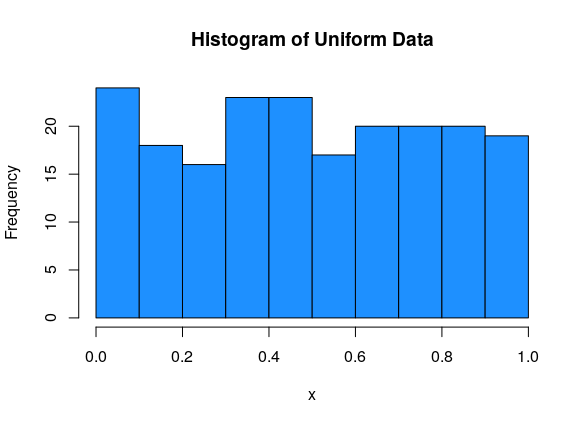
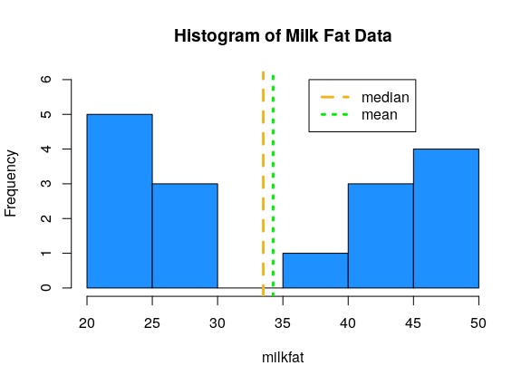
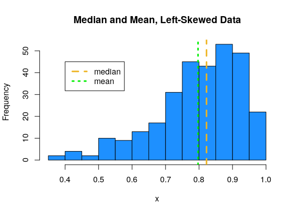

# Descriptive Statistics

```{r,echo=F, out.height="400px", fig.align="center"}
knitr::include_graphics("figs/comics/ch2.png")
```

Descriptive statistics are tools we use to summarize a set of data.  It is usually an "exploratory" step that we perform before a more formal statistical method.  Descriptive summaries can be graphical, or numeric.

## Histograms

Sixteen dairy cows were fed a diet supplemented with a vitamin concentrate.  Here is the milk fat concentration (g/kg) in a sample from each cow:
$$20, 38, 44, 49, 42, 21, 48, 47, 21, 22, 23, 26, 26, 44, 48, 29$$ 
What information about this data do we want to know?

:::: {.infobox .deff data-latex=""}
A good visual tool for numeric data is the **histogram**. The data is divided into bins, and then a bar is drawn such that the height of the bar corresponds to the number of observations in that bin.
::::

```{r}
milkfat <- c(20, 38, 44, 49, 42, 21, 48, 47, 21, 22, 23, 26, 26, 44, 48, 29)

hist(milkfat, main = "Histogram of Milk Fat Data", col = "dodgerblue")
```

When building a histogram, our main choice is how wide the bins should be.  We can make them very wide, or very narrow.

```{r}
par(mfrow = c(1, 2)) # View 2 plots at once

hist(milkfat, main = "Histogram of Milk Fat Data", col = "dodgerblue",
     breaks = 4)
hist(milkfat, main = "Histogram of Milk Fat Data", col = "dodgerblue",
     breaks = 50)

par(mfrow = c(1, 1))
```

We want to have a "happy medium".  Bins that are too wide summarize too much, and are not very informative.  Bins that are too narrow are more difficult to read and interpret.

We can set the histogram breaks with R's `seq()` function.  `breaks = seq(14, 49, 7)` means we want the breakpoints to go from 14 to 49, and we want the bins to be 7 units wide.  The breaks are 14, 21, 28, etc.

```{r}
par(mfrow = c(1, 2))

# Bins of width 5, from 20 to 50
hist(milkfat, main = "Histogram of Milk Fat Data",
     col = "dodgerblue", breaks = seq(20, 50, 5))

# Bins of width 7, from 14 to 49
hist(milkfat, main = "Histogram of Milk Fat Data",
     col = "dodgerblue", breaks = seq(14, 49, 7))
```

The choice of bins can have a substantial effect on the shape of the histogram.

---

Histograms allow us to view the shape of our data.

:::: {.infobox .deff data-latex=""}
- **Unimodal** data has a single peak, and **bimodal** data has two.

- **Normal** data has an approximate "bell-curve" shape, where most of the data is in the middle of the graph, and a small amount of data is at the edges.

- **Uniform** data is roughly flat.

- Data can be either **symmetric**, **left-skewed**, or **right-skewed**.
::::

This data is normal, bimodal and symmetric:

```{r, echo=F}
knitr::include_graphics("figs/desc/normal_hist.png")
```

This data is uniform (and so it must be symmetric):

```{r, echo=F}

```

The milk fat data is a good example of bimodal data.  There is some sort of process going on that makes the data split into two groups.

```{r, echo=F}
knitr::include_graphics("figs/desc/milkfat_hist.png")
```

For asymmetric data, we always refer to the direction of the *tail*.  So left-skewed data has most of the values on the right side of the graph, with a tail going off to the left:

```{r, echo=F}
knitr::include_graphics("figs/desc/left_skew.png")
```

And right-skewed data has most of the values on the left side of the graph, with a tail going off to the right:

```{r, echo=F}
knitr::include_graphics("figs/desc/right_skew.png")
```


## Location

Now, let's start looking at how we can define numbers that summarize our data in a meaningful way.  There are two types of numeric summaries that are commonly used: measures of location and measures of spread.

:::: {.infobox .deff data-latex=""}
- **Location** is the "middle" or the "center" of the data.

- **Spread** is how much variability there is in the data.
::::

```{r, echo=F}
knitr::include_graphics("figs/desc/location_vs_spread.png")
```

Many measures of center are concerned with how much data is to the left or to the right of a certain point. 

:::: {.infobox .deff data-latex=""}
The **median** is the point that divides the data in half.  50% of the data is to the left of the median, and 50% is to the right of the median.
::::

The specific definition depends on whether we have an even or odd number of observations.

- If the data has an odd number of observations, the median is the middle value in the sorted data. 

- If the data has an even number of observations, the median is halfway between the two middle values of the sorted data.

---

:::: {.infobox .deff data-latex=""}
**Quartiles** are a generalization of the median that divide the data into four equal-sized groups.
::::

- The 1st quartile is the observation such that 25% of observations are smaller, and 75% are larger.

- The second quartile is the 50/50 point of the data, which is exactly the same as the median.

- The 3rd quartile is the observation such that 75% of observations are smaller, and 25% are larger.

Suppose we know the median, so we know how to divide the data in half.  The 1st quartile is the median of the first half of the data, and the 3rd quartile is the median of the second half of the data.

We can visualize quartiles with a histogram.  Since the area of the histogram bars is proportional to the number of obesrvations, the quartiles divide the histogram area into four roughly equal pieces.  In this example, Q1 = 0.231, Q2 = 0.455, Q3 = 0.718.

```{r, echo=F}
knitr::include_graphics("figs/desc/hist_quartiles.png")
```

---

:::: {.infobox .deff data-latex=""}
**Percentiles** or **quantiles** are a generalization of the idea of a median or quartiles.  They can divide up the data into any percentage.  

Percentiles are always defined in terms of how much data is below.
::::

The 35th percentile is the value such that 35% of the observations are smaller, and 65% are greater.  An equivalent way of defining median the is the 50th percentile.

The two extreme cases are the minimum of the data, which is the 0th percentile, and the maximum of the data, which is the 100th percentile.

In R, we use functions called `median` and `quantile`.  When using the `quantile` function, the `probs` argument lets us specific which specific percentile we want.  The default behavior is to give the quartiles.

```{r}
median(milkfat)

quantile(milkfat)

quantile(milkfat, probs = c(0.32, 0.58, 0.97))
```

While the definition of a quantile is consistent, different sources might use different algorithms for computing them.  For our purposes, it's fine to just use the default R quantile calculations.

---

The **mean** is a different types of location measure.  Instead of looking at percentages of data, it represents the average of our data.   It is the sum of the observations, divided by the sample size. 

If our data is [13, 16, 12, 20, 17] then the mean is 
$$\frac{13 + 16 + 12 + 20 + 17}{5} = 15.6.$$

In general, we use the greek letter Sigma to represent a sum of numbers.  Let's let variables $x_1, x_2, \ldots , x_n$ refer to $n$ numeric data points.  The sum of all the $x$ values from 1 to $n$ is 
$$\sum_{i=1}^n x_i \quad = \quad x_1 + x_2 + \cdots + x_n.$$
$i$ acts as an index that counts from 1 to $n$.

:::: {.infobox .deff data-latex=""}
The mean of $x_1, x_2, \ldots , x_n$ is the sum divided by the sample size $n$.
$$\bar{x} \quad = \quad \frac{\sum_{i=1}^n x_i}{n} \quad = \quad \frac{1}{n}\sum_{i=1}^n x_i$$
::::

The mean is extremely useful in statistics, so it has its own special name, $\bar{x}$ ("x - bar").  In general, putting a bar over a variable represents taking the average of whatever that variable represents.

The mean and median are considered good ways of summarizing data, but can sometimes be misleading.

:::: {.infobox .exer data-latex=""}
Consider some roughly symmetric, bimodal data (like the milk fat!) Find the mean and median of the milk fat data:
$$20, 38, 44, 49, 42, 21, 48, 47, 21, 22, 23, 26, 26, 44, 48, 29$$

```{r}
mean(milkfat); median(milkfat)
```

<span style="color:#8601AF">
According to R, the milkfat data has mean 34.25 and median 33.5.  This can also be done by hand. The mean and median are similar, because the milkfat data is roughly symmetric. 
</span>

::::

If we plot these summary values against the data histogram, we see that they aren't close to the actual data values!

```{r, echo=F}

```

Remember that whenever we make a summary, we are losing information.  It's important to use a combination of graphical and numeric summaries to fully understand a set of data.

---

Now, let's talk about the relationship between the median and mean.  This has to do with the shape of the data.

For symmetric data, the mean and median are about the same.

```{r, echo=F}
knitr::include_graphics("figs/desc/symmetric_med_mean.png")
```

For left-skewed data, the mean tends to be smaller than the median.

```{r, echo=F}

```

For right-skewed data, the mean tends to be larger than the median.

```{r, echo=F}
knitr::include_graphics("figs/desc/right_med_mean.png")
```

The extreme values in the skewed datasets "pull" the mean in the direction of the tail.  We say that the mean is sensitive to extreme values, or outliers.  The median, which only cares about the middle values in the data, is more stable, or robust.

:::: {.infobox .deff data-latex=""}
Measures or methods that are **sensitive** to outliers might change drastically depending on whether or not an outlier is present.  Measures that are **robust** to outliers will not chznge very much if an outlier is present.
::::

:::: {.infobox .pond data-latex=""}
Why might it be advantageous to use a sensitive measure?
::::

:::: {.infobox .exer data-latex=""}
Suppose in the milk fat data, the value 49 is mistakenly recorded as 94. 
$$20, 38, 44, \mathbf{94}, 42, 21, 48, 47, 21, 22, 23, 26, 26, 44, 48, 29$$
How do the mean and median change?  Compare with the original mean of 34.25 and the original median of 33.5.

```{r}
milkfat_error <- c(20, 38, 44, 94, 42, 21, 48, 47, 21,
           22, 23, 26, 26, 44, 48, 29)

mean(milkfat_error)
median(milkfat_error)
```

<span style="color:#8601AF">
The mean is much higher now, since the very large value of 94 skews the average of the data points.  The median, however, does not change.  The median is only concerned with the middle values, so if we take the maximum of the data and change it into a bigget number, the median doesn't change.
</span>
::::

:::: {.infobox .pond data-latex=""}
Try to define your own numeric summary of a dataset's location.  What is it measuring?  Is it robust or sensitive to outliers?
::::

## Spread

Descriptive statistics about location are most useful when paired with information about spread.  Location and spread are both useful and very different characteristics of a dataset.

```{r, echo=F}
knitr::include_graphics("figs/desc/location_vs_spread.png")
```

Consider two sets of data:
$$\{-1, 0, 1\},\quad\quad \{-30, 0, 30\}$$

Both datasets have the same center - the mean and median of both are 0.  But we get a sense that the second is much more "spread out" than the first. There are a number of ways to formally quantify this spread.

:::: {.infobox .deff data-latex=""}
The most basic of spread is the **range**, which is the difference between the maximum and minimum values in a dataset.
::::

We can also think of this as the "footprint" of how much space the entire dataset takes up on the number line.  The range is very sensitive to extreme values, because by definition it is calculated with the two most extreme values. Consider the following data:
$$3, 45, 47, 48, 50, 51, 53, 56, 58$$
The value 3 is a very noticeable outlier, and the rest of the data is clustered pretty close together.  The range is $58-3 = 55$.

---

The inter-quartile range (IQR) is similar to the range.  Instead of considering the two extreme ends, it is concerned with the middle 50% of the data.  

:::: {.infobox .deff data-latex=""}
The **inter-quartile range** is defined as the difference between the 75th and 25th percentile (3rd quartile - 1st quartile).
::::

The IQR is much less sensitive to outliers.
$$3, 45, 47, 48, 50, 51, 53, 56, 58$$ 
The example above has a range of 55 and an IQR of 6 (according to R).

Let's find the IQR and range of the milkfat data.

```{r}
IQR(milkfat)

range(milkfat)
```

The IQR is $22$ and the range is $49-20 = 29$.  For this data, the IQR and range are somewhat similar, since there aren't a lot of extreme values in the milkfat data.

---

The most common measure of spread in statistics is the **standard deviation** (sd). This measure doesn't look at finding the range across differnt values.  Instead, it's concerned with whether the data is close to its mean. The sd tells us how far apart the observations are from the mean, on average.  

Suppose we have data $x_1, x_2, \ldots , x_n$ that have mean $\bar{x}$.  The distance from point $x_1$ to the mean is $x_1 - \bar{x}$.  We want the average distance, so the sensible thing to do is to add up all of the distances, and divide by $n$.

$$\frac{1}{n}\sum_{i=1}^n(x_i - \bar{x})$$

But there's a problem here.  From the definition of the mean, we have that the sum of the direct distances $\sum(x_i - \bar{x})$ must always be 0.  These distances are either positive or negative, depending on whether the point is above or below the mean, and they all cancel each other out.  The measure defined above is equal to 0 for any set of data, so it is not terribly useful.

:::: {.infobox .pond data-latex=""}
Try to calculate $\sum(x_i - \bar{x})$ for the dataset {-5, -1, 3, 6} and see what happens.
::::

Instead of working with direct distances, we look at *squared* distances.  The squared distance from $x_1$ to the mean is $(x_1 - \bar{x})^2$.  This quantity is always positive, so when we add it all up and divide by $n$:

$$\frac{1}{n}\sum_{i=1}^n(x_i - \bar{x})^2$$

we get a positive number.  The last step is to "undo" the squaring we did.  So we take a square root of the entire thing.  

:::: {.infobox .deff data-latex=""}
The standard deviation of a set of data is given by 
$$s = \sqrt{\frac{1}{n}\sum_{i=1}^n(x_i - \bar{x})^2}.$$
::::

The un-rooted version is called **variance**.  

:::: {.infobox .deff data-latex=""}
The variance of a set of data is given by 
$$s^2 = \frac{1}{n}\sum_{i=1}^n(x_i - \bar{x})^2.$$
::::

So the square root of the variance is sd, and sd squared is variance.  The two measures provide the exact same information.  However, sd is in the original units of the data, and variance is in squared units.  

Standard deviation is interpreted as the average distance from the data points to their mean.  Variance is interpreted as the average squared distance from the data points to their mean.  We have R functions for each.

```{r}
sd(milkfat)

var(milkfat)
```

$11.596^2 = 134.467$.

---

:::: {.infobox .exer data-latex=""}
Which measures of spread - range, IQR, sd - will be robust to outliers?  Which ones will be more sensitive?  Check your intuition by finding these measures for the original milkfat data and the milkfat error data.
$$\text{original: }20, 38, 44, 49, 42, 21, 48, 47, 21, 22, 23, 26, 26, 44, 48, 29$$
$$\text{error: }20, 38, 44, \mathbf{94}, 42, 21, 48, 47, 21, 22, 23, 26, 26, 44, 48, 29$$

```{r}
range(milkfat); range(milkfat_error)
```

<span style="color:#8601AF">
The original data has range $49-20 = 29$, and the error data has range $94-20 = 74.$
</span>

```{r}
IQR(milkfat); IQR(milkfat_error)
```

<span style="color:#8601AF">
Both datasets have IQR 22.
</span>

```{r}
sd(milkfat); sd(milkfat_error)
```

<span style="color:#8601AF">
The original sd is 11.596, and the error sd is 18.696.  
</span>
::::

We see that the range changed drastically due to the value 49 changing to 94.  However, the IQR did not change at all.  The error had to do with the maximum value, and the IQR is not concerned with the maximum, just the middle 50%.  The standard deviation is also greater for the error data, since 94 is very far from the center, and pulls up the average distance.

:::: {.infobox .pond data-latex=""}
Try to define your own numeric summary of a dataset's spread. What is it measuring? Is it robust or sensitive to outliers?
::::

## Box plots

:::: {.infobox .deff data-latex=""}
A box plot is visualizes the quartiles of the data with a box, and shows outliers as points.
::::

```{r}
boxplot(milkfat)
```

First, a box is drawn around the IQR (1st to 3rd quartile) of the data.  We have some kind of threshold, which is usually 1.5(IQR).  Lines (or whiskers) are drawn out to
$$[Q1 - 1.5(IQR),\; Q3 + 1.5(IQR)].$$
Anything outside of this interval is considered to be an outlier, and it is drawn as a point.  Notice the boxplot above has no points, so there are no outliers.

Here's another way to make a boxplot.

```{r}
boxplot(milkfat, horizontal = TRUE, xlab = "Milk Fat")
```

Note that R will not draw lines past where the data actually is.  The upper whisker extends to 49, which is less than Q3 + 1.5(IQR). That's because 49 is the maximum value in the data and it would be misleading for the line to go beyond that point.  The exact cutoff for an outlier can also be set by hand.

This is an example of what it would look like if a dataset did have an outlier:

```{r, echo=F}
boxplot(trees$Volume, horizontal = T)
```

---

Box plots are useful for summarizing multiple groups of data.  Suppose researchers are studying the effectiveness of 3 different academic programs. Ten students from each program are evaluated on an exam, and produce the following scores

\begin{align*}
\text{Program A}:&\quad 67, 78, 88, 65, 77, 72, 73, 82, 85, 90 \\
\text{Program B}:&\quad 77, 61, 85, 75, 77, 73, 81, 74, 83, 89 \\
\text{Program C}:&\quad 84, 82, 79, 76, 88, 90, 91, 85, 82, 94
\end{align*}

We can make side-by-side boxplots by putting all three sets of data into the `boxplot` function.  It's also good to include helpful labels.

```{r}
A <- c(67, 78, 88, 65, 77, 72, 73, 82, 85, 90)
B <- c(77, 61, 85, 75, 77, 73, 81, 74, 83, 89)
C <- c(84, 82, 79, 76, 88, 90, 91, 85, 82, 94)

boxplot(A, B, C, main = "Exam Scores by Program",
        col = c("#D81B60", "#1E88E5", "#FFC107"),
        names = c("A", "B", "C"))
```

With this plot, we can get a very good overall summary of the differences in the programs. A and B are pretty similar, and C has a higher center.

## Multiple datasets

Now that we're familiar with tools for summarizing data, let's consider the problem of comparing two sets of data.  In addition to the 16 cows that received the vitamin supplement, suppose the researchers also observed 17 milk fat values on cows at the same farm that did not receive the supplement.

$$20, 21, 22, 22, 23, 24, 18, 27, 25, 25, 19, 21, 28, 18, 17, 21, 23$$

Let's compare this data with our original milk fat data.  Let's see what happens if we make default histograms of the data.

```{r}
milkfat_supp <- milkfat
milkfat_nosupp <- c(20, 21, 22, 22, 23, 24, 18, 27, 25,
                    25, 19, 21, 28, 18, 17, 21, 23)

par(mfrow = c(1, 2))  # View 2 plots at once
hist(milkfat_supp, main = "Supplement Milk Fat",
     col = "dodgerblue")

hist(milkfat_nosupp, main = "No Supplement Milk Fat",
     col = "dodgerblue")
```

This is very misleading!  Both x axes cover a different range of values, and the bin widths are different.  We need to manually specify the bins for each histogram to keep things consistent.  Let's make bins of size 3, going from 16 to 49.

```{r}
par(mfrow = c(1, 2))  # View 2 plots at once
hist(milkfat_supp, main = "Supplement Milk Fat",
     col = "dodgerblue", ylim = c(1, 8),
     breaks = seq(16, 49, 3))

hist(milkfat_nosupp, main = "No Supplement Milk Fat",
     col = "dodgerblue", ylim = c(1, 8),
     breaks = seq(16, 49, 3))
```

With these plots, we can much more easily see that the center of the no supplement data is below that of the supplemented milk fat data.  The no supplement histogram is also less spread out.

---

We can also build comparative boxplots.  As we saw in the academic program example, we don't need to use the `boxplot` function multiple times, we just need to specify both of our data sets.

```{r}
boxplot(milkfat_supp, milkfat_nosupp, main = "Milk Fat",
        names = c("Supplement", "No Supplement"))
```

Finally, we can also compare numeric summaries.  It's useful to be thorough and calculate measures of center and spread for both sets of data.

```{r}
mean(milkfat_supp); mean(milkfat_nosupp)
median(milkfat_supp); median(milkfat_nosupp)
```

The mean and median are much lower for the no supplement data, which is also visually apparent in the histograms and boxplots.

```{r}
sd(milkfat_supp); sd(milkfat_nosupp)
```

The no supplement data also has considerably less spread.  Milk fat percentage is more consistent for cows that are not given a vitamin supplement.

---

Finally, there are some cases where we want to combine two or more sets of data into one.  We can combine our two R data vectors to get one big vector with all 33 observations.

```{r}
combined <- c(milkfat_supp, milkfat_nosupp)
combined
```

From here we can create all of the usual summaries for our combined data, like `mean(combined)`, `hist(combined)`, and so on..

:::: {.infobox .pond data-latex=""}
Can we calculate the combined mean from the two individual means?  What about the combined median?
::::


