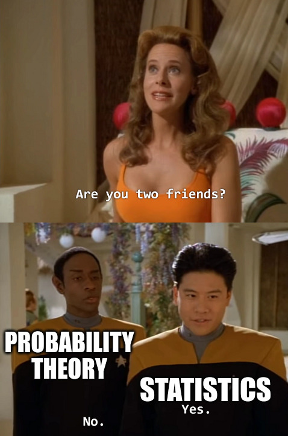

# Probability

```{r,echo=F, out.height="480px", fig.align="center"}

```

We often need to take a small sample in order to learn something about a larger population. However, sampling introduces uncertainty, since we don't know exactly which items will appear in our sample.

:::: {.infobox .deff data-latex=""}
**Probability** is the mathematics of randomness and uncertainty.
::::

By using tools from probability theory, we will have a formal, principled background for doing statistics with a random sample. In this section, we'll learn the basic fundamentals of probability.

## Sampling

How is probability related to statistics? The difference between the two sciences is subtle. In statistics, we are using an observed sample to make inference about an unkonwn population. For example: we have a six-sided die, and we don't know if it's fair or not. To figure this out, we roll the die a very large number of times, and record the results. The rolls are the random sample, and the population parameter is the true likelihood of each of the different faces.

|            | Statistics | Probability |
|:----------:|:----------:|:-----------:|
| Population | Unknown    | Known       |
| Sample     | Known      | Unknown     |

Probability is more abstract. In probability, we assume we know the full population, but we don't know the value of a random sample. For example: a deck of cards has 4/52 aces. If we shuffle a deck and draw five cards, we don't know what we are going to get, but we are interested in knowing how many aces we might draw. 4/52 is the population parameter (the likelihood of an ace) and the hand of five cards is the unknown sample.

---

There are several different ways to draw a sample from a population.  

:::: {.infobox .deff data-latex=""}
A sample is drawn **with replacement** if an item is replaced back into the population before the next element is drawn.
::::

For example, we could draw a sample of 5 from a deck of cards with replacement.  We would draw a card, and then shuffle it back into the deck, 5 times.  There are several consequences of sampling with replacement:

- We might draw the same element multiple times.
- The population stays the same at every step - it's the same deck of 52 cards.
- The item we draw won't affect the next item, since we're shuffling it back in.
- The items are **independent** of each other.

We'll define independence formally later.  Just think of independent items as having no influence or affect on each other.

---

:::: {.infobox .deff data-latex=""}
If we do not replace the element back into the population, then we are sampling **without replacement**.  Each item is set aside after it is drawn.
:::

In the card example, if we were drawing a sample without replacement, would simply draw 5 cards at once.  Nothing gets shuffled back in.  Sampling without replacement has several key differences to sampling with replacement.

- We can't draw the same element multiple times.  Every item in our samle will be distinct.
- The population is different at every step.  When we sample the second item, we're sampling from a sub-population that does not contain the first item.
- The draws affect each other.  For example, the first item influences what you can get for the second item.
- As a result, the draws from sampling without replacement are not independent.

For the first several examples, we're going to look at drawing a single object (or recording a single result) from a population.  If $n = 1$, then sampling with or without replacement doesn't matter.

## Probability basics

Let's imagine drawing a SRS of size 1 from a population.  This just means we pick any item at random, and every item is equally likely to be chosen. Probabilities come fairly directly from the population itself.

If we draw a card from a standard deck, there's a 0.25 probability that we get a spade card, since $\frac{13}{52} = 0.25$ items are spades.  In general, the probability of seeing a certain type of item is the same as the proportion of that type of item in the population.

Sometimes, we can represent populations with a histogram.  This histogram shows the MPG of 55 hybrid vehicles.  For simplicity, assume there aren't any items directly on the histogram breakpoints.

```{r, echo=F}
mpg <- c(rep(13, 1), rep(17, 4), rep(22, 3), rep(27, 15),
         rep(33, 5), rep(38, 7), rep(42, 8), rep(47, 7),
         rep(52, 3), rep(57, 2))

hist(mpg, labels = T, breaks = seq(10, 60, by = 5),
     xlab = "MPG", main = "Hybrid Vehicle MPG",
     ylim = c(0, 18), col = "white")
```

Normally, a histogram represents an observed sample from a population.  For this exercise, we're pretending that the 55 vehicles are the entire population.

:::: {.infobox .exer data-latex=""}
If we sample one vehicle at random, what is the probability that the vehicle has MPG above 30?

<span style="color:#8601AF">
The relevant number of items is the sum of the bars above 30: 5+7+8+7+3+2 = 32.  So our probability is $\frac{32}{55} = 0.582$.
</span>
::::

:::: {.infobox .deff data-latex=""}
The qualitative descrption of what we're "looking for" is called an **event**.  
::::

For example, we could define event $A$ as "MPG above 30".  Giving the event a quick name like this makes it much easier to do math related to probability.

---

Let's look at the fundamental properties of probability.

- Probability is always between 0 and 1.  0 represents impossibility, and 1 represents certainty.  For clarity, it's good to keep probabilities as decimals or fractions rather than percentages.  In more mathematical notation for any event $A$,
$$0 \le P(A) \le 1$$

- When we draw an item, the event is guaranteed to be either true, or false.  For example, a car can have MPG above 30 or below 30 (but not both).

- As a direct result of this, the probability that an event does not occur is 1 minus the probability that it does occur. This is called the "complement rule".  In more mathematical notation,
$$P(A) = 1 - P(\text{not }A)$$

For example, we saw that $\frac{32}{55}$ vehicles have MPG above 30.  $\frac{23}{55}$ vehicles *do not* have MPG above 30, and $1 - \frac{23}{55} = \frac{32}{55}$.

---

We can define multiple events for a single draw from a population.  Let's look at how those events can interact.

:::: {.infobox .deff data-latex=""}
The statement "A **AND** B" means that *both* A and B have occurred.
::::

The item we draw is described by both $A$ and $B$.  We can visualize this as the overlap between circles in a Venn diagram.

```{r,echo=F}
knitr::include_graphics("figs/probability/intersection.png")
```

In the vehicle MPG example, the probability of an item being above 30 and below 40 MPG is $P(\text{above 30 AND below 40}) = \frac{12}{55}$.

```{r, echo=F}
and <- ifelse(sort(unique(mpg)) %in% c(33, 38),
              "dodgerblue", "white")

hist(mpg, labels = T, breaks = seq(10, 60, by = 5),
     xlab = "MPG", main = "Hybrid Vehicle MPG",
     ylim = c(0, 18), col = and)
```

---

:::: {.infobox .deff data-latex=""}
The statement "A **OR** B" means that *either* A, or B, or *both* have occurred. 
::::

In a mathematical context, "OR" includes the case where both things are true.  If you are offered "cream or sugar" with your coffee, you can ask for both.

The item we draw is described by either $A$ or $B$ or both.  We can visualize this as the entire "footprint" of the A and B circles.

```{r,echo=F}
knitr::include_graphics("figs/probability/union.png")
```

The probability of a vehicle being above 50 OR below 20 is $P(\text{above 50 OR below 20}) = \frac{10}{55}$

```{r, echo=F}
or1 <- ifelse(sort(unique(mpg)) %in% c(13, 17, 52, 57),
              "dodgerblue", "white")

hist(mpg, labels = T, breaks = seq(10, 60, by = 5),
     xlab = "MPG", main = "Hybrid Vehicle MPG",
     ylim = c(0, 18), col = or1)
```

As another example, $P(\text{above 40 OR above 50}) = \frac{20}{55}$.

```{r, echo=F}
or2 <- ifelse(sort(unique(mpg)) %in% c(42, 47, 52, 57),
              "dodgerblue", "white")

hist(mpg, labels = T, breaks = seq(10, 60, by = 5),
     xlab = "MPG", main = "Hybrid Vehicle MPG",
     ylim = c(0, 18), col = or2)
```

There are 5 cars for which "above 40" and "above 50" are both true, but we have to be careful not to count those twice.

In general, the probability of $A$ OR $B$ is 
$$P(A \text{ OR } B) \;=\; P(A) + P(B) - P(A \text{ AND } B).$$
When we add the items from A and B, we have double-counted the items that are in both A and B.  So we subtract $A \text{ AND } B$ once.

---

:::: {.infobox .deff data-latex=""}
We say that $A$ and $B$ are **disjoint** or **mutually exclusive** if they have no overlap.  There are no items in the population for which $A$ and $B$ are both simultaneously true.
::::

```{r,echo=F}
knitr::include_graphics("figs/probability/disjoint.png")
```

In the vehicles example, the events "above 50" and "below 20" are disjoint.  It is impossible to have a car MPG that is both above 50 and below 20.

```{r, echo=F}
or1 <- ifelse(sort(unique(mpg)) %in% c(13, 17, 52, 57),
              "dodgerblue", "white")

hist(mpg, labels = T, breaks = seq(10, 60, by = 5),
     xlab = "MPG", main = "Hybrid Vehicle MPG",
     ylim = c(0, 18), col = or1)
```

For disjoint $A$ and $B$, we have $P(A \text{ AND }B)$ = 0.

:::: {.infobox .exer data-latex=""}
If $A$ and $B$ are disjoint, how can we simplify $P(A \text{ OR }B)$?

<span style="color:#8601AF">
In general,
$$P(A \text{ OR } B) \;=\; P(A) + P(B) - P(A \text{ AND } B).$$
But for disjoint events, the overlap between $A$ and $B$ is empty.  We can say
$$P(A \text{ OR } B) \;=\; P(A) + P(B)$$
for disjoint $A$ and $B$.
</span>
::::

---

Let's look at a new example.  We've seen how a histogram can represent a population.  Sometimes, populations are represented in a "two-way table" (or "contengency table") like the one below.  This helps us understand the wau two events interact with each other.

Many people have mammograms to screen for breast cancer.  This two-way table gives the mammogram findings and true breast cancer diagnosis for a population of 10,000 hypothetical patients:

|                | Cancer: Yes | Cancer: No | Total |
|----------------|-------------|------------|-------|
| Mamm. Positive | 97          | 594        | 691   |
| Mamm. Negative | 3           | 9306       | 9309  |
| Total          | 100         | 9900       | 10000 |

Each patient can have either a positive or negative mammogram.  Additionally, each patient either has or does not have cancer in reality.  Consider drawing one patient at random from the 10,000.

:::: {.infobox .exer data-latex=""}
- If we sample a patient at random, what is the probability that they have breast cancer?

<span style="color:#8601AF">
There are $97+3 = 100$ patients who have breast cancer, so $P(\text{Cancer: Yes})$ is $\frac{100}{100000} = 0.01$.
</span>

- What is the probability that they have breast cancer OR a positive mammogram?

<span style="color:#8601AF">
To find $P(\text{Cancer: Yes OR Mamm+})$, there are three groups we have to consider.  There are patients who just have a positive mammogram, but no cancer (594), patients who just have cancer (3), and those who have both (97).  The probability is $\frac{594+3+97}{10000} = \frac{694}{10000} = 0.07.$ We can also do 
$$P(\text{Cancer: Yes OR Mamm+}) \;=\; \frac{691}{10000} + \frac{100}{10000} - \frac{97}{10000} \;=\; \frac{694}{10000}$$
</span>

- Are the events "Cancer: Yes" and "Mamm. Negative" disjoint?

<span style="color:#8601AF">
For "Cancer: Yes" and "Mamm-" to be disjoint, that would mean there were no items in the population for which both of these are true.  However, in the lower left cell of the table, we see that there are three patients who both have cancer but received a negative mammogram.  If the events were disjoint, the cell would have to be 0.
</span>
::::

:::: {.infobox .pond data-latex=""}
Can you identify two events in the table above that actually are disjoint?
::::

## Conditional probability

Let's think about how two events can affect each other's *probabilities*.  From our table:

|                | Cancer: Yes | Cancer: No | Total |
|----------------|-------------|------------|-------|
| Mamm. Positive | 97          | 594        | 691   |
| Mamm. Negative | 3           | 9306       | 9309  |
| Total          | 100         | 9900       | 10000 |

Suppose we draw a patient that has a positive mammogram.  What is the probability that they have cancer?  This is diffeerent from the overall probability of having cancer.

In general, **conditional probability** represents how knowing one thing can potentially change the probability of a different event.  It's a bit tricky to grasp at first, but very important!

We can think of conditional probability as changing or shifting the population of interest.  For example, instead of being interested in the overall breast cancer rate, we might be interested in the breast cancer rate of patients with a positive mammogram.  The 691 individuals with Mamm+ are our new population.

Here's how we find $P(A)$ normally:

```{r,echo=F, out.width="80%"}
knitr::include_graphics("figs/probability/regular_prob.png")
```

Here's how we find $P(A)$ *given* that $B$ is true.  $B$ is our new "universe" of possibilities.

```{r,echo=F, out.width="80%"}
knitr::include_graphics("figs/probability/conditional_prob.png")
```

Formally, we write the probability of $A$ given $B$ as $P(A \;|\; B)$.  How do we calculate this?  According to the picture above, the numerator should be all of the items in $B$ for which $A$ is also true.  Then the denominator is just everything in $B$.

:::: {.infobox .deff data-latex=""}
The **conditional probability** of $A$ given $B$ is
$$P(A \;|\; B) \;=\; \frac{\mathbb{P}(A \text{ and } B)}{\mathbb{P}(B)}.$$
Likewise, the conditional probability of $B$ given $A$ is
$$P(B \;|\; A) \;=\; \frac{\mathbb{P}(A \text{ and } B)}{\mathbb{P}(A)}.$$
::::

$P(A \;|\; B)$ and $P(B \;|\; A)$ are not the same thing!

:::: {.infobox .pond data-latex=""}
What is $P(A \;|\; B)$ if $A$ and $B$ are disjoint?

What is $P(A \;|\; B)$ if all of the items in $B$ are within $A$?

```{r, echo=F, out.width="35%"}
knitr::include_graphics("figs/probability/subset.png")
```
::::

## Independence

We use conditional probability to think about how events relate to each other.  But some events ought to not affect each other at all.  What is the probability of a patient having breast cancer, given they were born on a Tuesday?  It should be the same as the overall probability of breast cancer.

:::: {.infobox .deff data-latex=""}
Two events are **independent** if they have no influence on each other's probabilities.  If $A$ and $B$ are independent, then knowing that $B$ has happened has no affect on whethre $A$ happens, and vice versa:
$$P(A \;|\; B) \;=\; P(A) \quad \text{and} \quad P(B \;|\; A) \;=\; P(B)$$
Another way of defining independence is that the probability of both $A$ and $B$ happening is just the product of their individual probabilities.  For independent $A$ and $B$,
$$P(A \text{ AND } B) \;=\; P(A)P(B)$$
::::

All three of the above equalities are equivalent definintions of independence.  For any $A$ and $B$, they are either all true, or all false.  So if we want to check if events are independent, just pick one of the equalities, and see whether it is true.

Let's reconsider our table of patients.

|                | Cancer: Yes | Cancer: No | Total |
|----------------|-------------|------------|-------|
| Mamm. Positive | 97          | 594        | 691   |
| Mamm. Negative | 3           | 9306       | 9309  |
| Total          | 100         | 9900       | 10000 |

:::: {.infobox .exer data-latex=""}
- What is the probability that a random patient actually has breast cancer, given she had a positive mammogram?  i.e., find $P((\text{Cancer: Yes } | \text{ Mamm+}))$.

<span style="color:#8601AF">
The probability $P((\text{Cancer: Yes } | \text{ Mamm+}))$ is calculated by only considering the patients who had a positive mammogram (because that is what we assume is true).  So, our population is the 691 individuals with a positive mammogram.  Out of those, 97 actually have breast cancer.  So 
$$P((\text{Cancer: Yes } | \text{ Mamm+})) \;=\; \frac{97}{691} \;=\; 0.14.$$
14% of patients with a positive mammogram actually have cancer. We can also calculate this with
$$P((\text{Cancer: Yes } | \text{ Mamm+})) \;=\; \frac{P((\text{Cancer: Yes And Mamm+}))}{P(\text{ Mamm+})}$$
</span>

- What is the probability of a positive mammogram, given that the patient actually had breast cancer?

<span style="color:#8601AF">
This is asking us to calculate $P((\text{Mamm+} | \text{Cancer: Yes}))$, which is the opposite conditional probability.  Now, our population is the 100 patients who actually have breast cancer.  Out of those, 97 had a positive test result.  So $P((\text{Mamm+} | \text{Cancer: Yes})) = 0.97$.  We can say that this mammogram test has a 97% true positive rate.
</span>

- Show that the event Mamm+ is not independent from the event Cancer: Yes.

<span style="color:#8601AF">
To show that the two events are not independent, we can compare the rate of cancer in Mamm+ patients to the rate of cancer in the general population.  Mathematically, we're checking if $P((\text{Cancer: Yes } | \text{ Mamm+})) = P(\text{Cancer: Yes})$.  We see that they are not equal:
$$P((\text{Cancer: Yes } | \text{ Mamm+})) = 0.14 \;=\; 0.01 = P(\text{Cancer: Yes})$$
</span>
::::

Patients with a positive mammogram are much more likely to actually have cancer than the general population, which should intuitively make sense.  If they actually were independent, that would mean the test would give us no information whatsoever about whether the patient has cancer!

---

:::: {.infobox .warn data-latex=""}
One very common mistake is to confuse the concepts of independence and being disjoint.  These are two completely different things, and in fact, non-empty disjoint events are never independent!
::::

- The events "Cancer: Yes" and "Born on Tuesday" are independent because each one does not influence how likely the other one is to occur.  Cancer isn't more or less prevalent based on the day of the week of birth.  $P(\text{Cancer: Yes} \;|\; \text{Born on Tues}) = P(\text{Cancer: Yes}).$

- The events "Cancer: Yes" and "Cancer: No" are disjoint because there is no patient who both has and does not have cancer.  They cannot happen simultaneously.  $P(\text{Cancer: Yes} \;|\; \text{Cancer: No}) = 0.$

"Cancer: Yes" and "Cancer: No" are certainly not independent.  If we know that a patient does not have cancer, it is impossible for them to have cancer.  Independent events give no information about each other, disjoint events give perfect information about each other.

---

"Independence" can also apply to different items in a sample.  Does the first person in the sample influence the second person?

Let's move on from talking about drawing a single item to drawing multiple items from a population.  In this case, the distinction between sampling with or without replacement is important.

Recall that a sample is drawn **with replacement** if an element is replaced back into the population before the next element is drawn. If we do not replace the element back into the population, then we are sampling **without replacement.**

---

Here is the histogram of the MPG of 55 hybrid vehicles:

```{r, echo=F}
mpg <- c(rep(13, 1), rep(17, 4), rep(22, 3), rep(27, 15),
         rep(33, 5), rep(38, 7), rep(42, 8), rep(47, 7),
         rep(52, 3), rep(57, 2))

hist(mpg, labels = T, breaks = seq(10, 60, by = 5),
     xlab = "MPG", main = "Hybrid Vehicle MPG",
     ylim = c(0, 18), col = "white")
```

:::: {.infobox .exer data-latex=""}

- Find the probability that in a sample of 2 cars, both cars have mpg above 50, both with and without replacement.

<span style="color:#8601AF">
When we sample with replacement, we are always sampling from the same original population. The probability that the first car has mpg above 50 is $\frac{5}{55}$.  Before we sample the next vehicle, we put that first vehicle back into the population, "restoring" it back to what the histogram shows.  So the probability that the second car has mpg above 50 is also $\frac{5}{55}$.  The probability that both have mpg above 50 is the product, $\frac{5}{55}\cdot\frac{5}{55}$.
</span>

<span style="color:#8601AF">
When we sample without replacement, our population changes.  The probability that the first car has mpg above 50 is still $\frac{5}{55}$.  But now, that car has been removed from the population.  There are now only 54 cars remaining, 4 of which have mpg above 50.  So, the probability that both have mpg above 50 (sampling without replacement) is $\frac{5}{55}\cdot\frac{4}{54}$.  We update the values in the fraction to represent the item being removed from the population.
</span>

- In which sampling scenario do we have independence between the two cars?

<span style="color:#8601AF">
When we sample with replacement, the result of the first car doesn't affect the second draw, since we're putting the sampled object back into the population.  So, we have independence between the two draws.  
</span>

<span style="color:#8601AF">
When we sample without replacement, we don't have independence.  The result we get for the first draw affects the probabilities of the second draw.
</span>

::::

---

In statistics, we always want to have items in our sample be independent from each other.  That way, we can avoid any confounding factors that could give us inaccurate conclusions.  

The bad news is that in practice, we almost always have to sample without replacement.  This means that the items in our sample are not independent.

The good news is that, like many things, independence doesn't have to be perfect for statistics to work.  Let's look at two examples of sampling: one from a large population and one from a small population.

---

- There are 52 cards in a deck, and 13 are hearts.  The probability that the first card is a heart is $\frac{13}{52} = 0.25$.  The probability of the second card being hearts is $\frac{12}{51} = 0.235$.  The probability changes between the two steps, which means the card draws are not independent of each other.

- Now consider a huge population of 100 decks shuffled together.  There are 5200 cards, 1300 of which are hearts.  The probability of the first card drawn being a heart is $\frac{1300}{5200} = 0.25$. The probability that the second card is also hearts is $\frac{1299}{5199} = 0.2499$.  The probabilities are still different, but the difference is extremely small.

Just removing one item out of 5200 has a small effect on such a large population.  In this case, sampling without replacement is a pretty good approximation for sampling with replacement.

So, when doing statistics in practice, we want to make sure that our sample is small relative to the size of the original population.  If that is the case, then the items in our sample are "close enough" to being independent of each other, evne if that is not exactly true.


