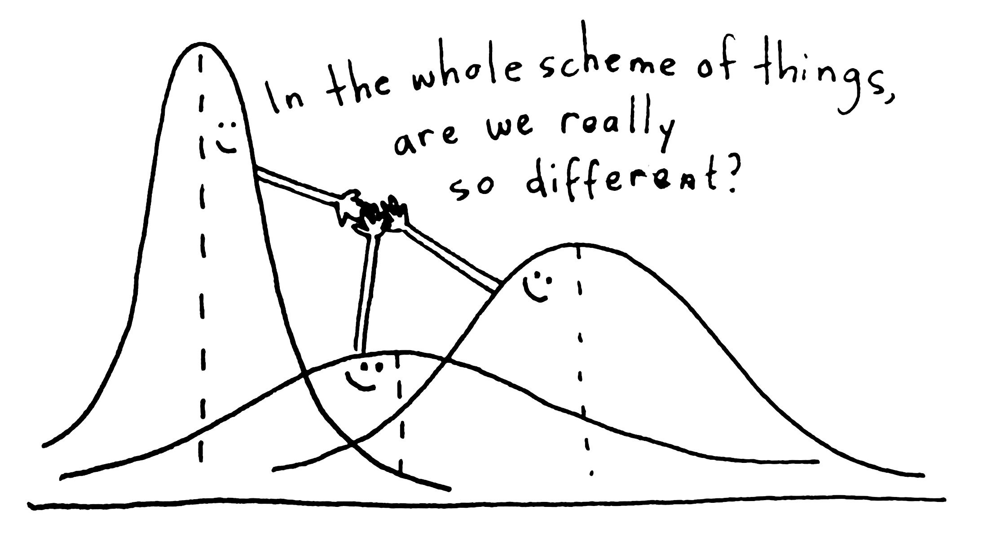
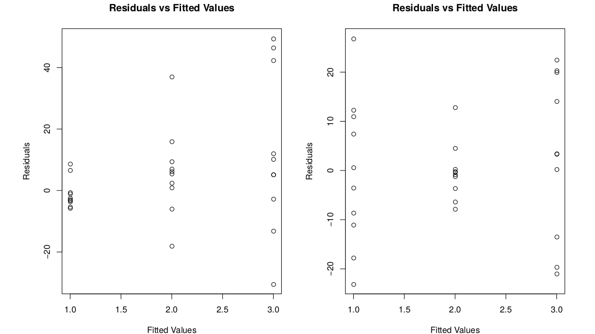

# Analysis of Variance

```{r,echo=F, out.width="300px", fig.align="center"}

```

In chapter 9, we covered the problem of comparing two independent means.  Now, we are going to generalize to the problem of comparing any number of independent means (possibly more than two).

## More than two groups

Four formulations of rat poison are being tested (1, 2, 3, 4). The poisons work by thinning the blood, so we are interested in the time it takes for blood to coagulate.  24 rats were randomly assigned the 4 poisons, and their blood was drawn and time to coagulation was measured.

| Treatment |    |    |    |    |    |    |    |    | Sample Mean |
|:----------|:--:|:--:|:--:|:--:|:--:|:--:|:--:|:--:|:-----------:|
| 1         | 62 | 60 | 63 | 59 |    |    |    |    | 61          |
| 2         | 63 | 67 | 71 | 64 | 65 | 66 |    |    | 66          |
| 3         | 68 | 66 | 71 | 67 | 68 | 68 |    |    | 68          |
| 4         | 56 | 62 | 60 | 61 | 63 | 64 | 63 | 59 | 61          |

We have four groups of data, and four means to compare, instead of the usual two.

We want to know if the poisons are equally effective, or if some of them are more effective than the others.  If $\mu_i$ is the mean coagulation time for poison $i$, then we can write hypotheses
\begin{align*}
H_0: & \; \mu_1 = \mu_2 = \mu_3 = \mu_4 \\
H_A:& \text{ At least one mean is different.}
\end{align*}

The null is a generalization of the null in the two-sample case, which is $H_0: \mu_1 = \mu_2$.  The alternative covers every case where the null is false. 

:::: {.infobox .warn data-latex=""}
Note how the alternative is stated. For the null to be false, only one of the means needs to be different from the other three.  So the alternative is "*at least one* is different", not "*all of the means* are different".
::::

---

How can we test these hypotheses?  In the two-sample case, we can come up with a T test statistic based on the observed means $\bar{X}_1$ and $\bar{X}_2$.  So if we wanted to, we could perform pairwise T tests on every individual pair of means. We'd have to test $\mu_1 = \mu_2$, and $\mu_1 = \mu_3$, and $\mu_2 = \mu_3$, and so on.

Instead of doing several pairwise tests, we are going to develop a test that will answer the hypotheses all at once.  Instead of directly comparing the means, we're going to re-think this question in terms of the *spread* of the data.

If we look at all 24 coagulation time observations, regardless of group:
$$62, 60, 63, 59, 63, 67, 71, 64, 65, 66, 68, 66$$
$$71, 67, 68, 68, 56, 62, 60, 61, 63, 64, 63, 59$$
we can see that the data has some natural variability.  We typically quantify this with the sample variance $S^2$, and we can visualize it by looking at the spread of the data points.  I've colored the observations by the group they belong to, but we're not considering the groups for now.

```{r, echo = F}
coag_time <- c(62, 60, 63, 59,
               63, 67, 71, 64, 65, 66,
               68, 66, 71, 67, 68, 68,
               56, 62, 60, 61, 63, 64, 63, 59)
poison <- c(rep("trt1", 4), rep("trt2", 6),
            rep("trt3", 6), rep("trt4", 8))

groups <- c(rep(1, 4), rep(2, 6), rep(3, 6), rep(4, 8))

colors <- c(rgb(0, 0, 0, 1),
            rgb(230/256, 159/256, 0, 1),
            rgb(86/256, 180/256, 233/256, 1),
            rgb(0, 158/256, 115/256))


plot(rep(0, 24), jitter(coag_time), main = "Rat Poison Data",
        ylab = "", xaxt = "n", xlab = "",
        ylim = c(55, 72),
        col = colors[groups], pch = 19)
```


We're going to think about the *source* of the variability.  If $H_0$ was false, and the means were different, then we would expect there to be some noticeable patterns across groups.  One group might have a lot of small observations, and another group might have a lot of large observations.  

We can visualize this by making a similar scatterplot to the one above, but separating the data points by group.  It looks like there might be a substantial group effect for our data, since groups 1 and 4 are a bit lower on average and 2 and 3 are a bit higher on average.

```{r, echo = F}
plot(groups, coag_time, main = "Rat Poison Data by Group",
     ylab = "", xaxt = "n", xlab = "",
     ylim = c(55, 72),
        col = colors[groups], pch = 19)
```


On the other hand, if $H_0$ is true and the means are all equal, then the groups don't matter, and all of the variation would be due to random noise.  Both the "group effect" and "random noise" contribute to $S^2$, and we want to figure out if the group effect is sufficiently large to reject $H_0$.

---

Formally, we call these groups **treatments**. We test whether the four treatment means are diffrent by looking at the variability in the data.

Is the data spread out due to random chance?  Or due to systematic differences in the treatment means?  Consider the following (unrelated) example.

Let's take two sets of data, and plot them.  Initially, they seem to have the same spread.

```{r, echo = F}
par(mfrow = c(1, 2))
par(mar = c(2, 2, 2, 2))

y <- c(1, 2, 3, 4, 5, 6, 7, 8, 9, 10, 11, 12)

groups1 <- c(1, 1, 1, 2, 1, 2, 2, 3, 3, 2, 3, 3)
groups2 <- c(1, 2, 3, 1, 3, 2, 3, 1, 2, 1, 3, 2)

colors <- c(rgb(0, 0, 0, 1),
            rgb(230/256, 159/256, 0, 1),
            rgb(86/256, 180/256, 233/256, 1))

# Basic data
plot(rep(0, 12), y, yaxt = "n", xaxt = "n",
     main = "Example 1")

plot(rep(0, 12), y, yaxt = "n", xaxt = "n",
     main = "Example 2")
```

Next, we'll color the observations by group.  Each dataset has three groups.

```{r, echo = F}
par(mfrow = c(1, 2))
par(mar = c(2, 2, 2, 2))

plot(rep(0, 12), y, yaxt = "n", xaxt = "n",
     main = "Example 1",
     col = colors[groups1],
     pch = 19)

plot(rep(0, 12), y, yaxt = "n", xaxt = "n",
     main = "Example 2",
     col = colors[groups2],
     pch = 19)
```

Now, for each dataset, we'll separate out the groups.

```{r, echo = F}
par(mfrow = c(1, 2))
par(mar = c(2, 2, 2, 2))

plot(groups1, y, yaxt = "n", xaxt = "n",
     main = "Example 1",
     col = colors[groups1],
     pch = 19)

plot(groups2, y, yaxt = "n", xaxt = "n",
     main = "Example 2",
     col = colors[groups2],
     pch = 19)
```

For the first example, the groups seem to matter a lot more.  But for the second example, the groups are very similar, so the spread of the data seems to be due to random chance.

:::: {.infobox .deff data-latex=""}
The first graph has more **between-group** variability.  This is the variation in treatment means themselves.  Larger between-group variability means the treatment means are different, and we have more evidence against the null of all the means being equal.

The second graph has more **within-group** variability.  This is the variation due to random noise.  If the within-group varibility is large, we have weak evidence against the null.
::::

The formal comparison of between-group and within-group variance is called an **analysis of variance (ANOVA)**.  The core component is the variance decomposition:
$$
\text{Total variability} \; = \; \text{Between-group variability} \; + \; \text{Within-group varibility}
$$

We compare the two terms on the right side. If the between-group term is big enough compared to the within-group term, we reject $H_0$.

## Variance decomposition

To show how we decompose the variability in the data, let's decompose a single observation.  There are three things that "contribute" to the value of an observation: overall mean, treatment mean, and random noise. 

The first observation in our data is 62.  The overall mean is 64, and the mean of group 1 is 61.  Write
$$62 \;=\; 64 - 3 + 1$$ 
The -3 is the effect of treatment 1, since treatment 1 has a lower mean than the overall data.  The +1 is just extra random noise, meaning the data point is 1 higher than the average point in treatment 1.  We can do this for every observation

In general, the value of an observation can be decomposed as:
\begin{align*}
\text{Observation} \;&=\; \text{Grand Mean} \\
&+ \;\text{Treatment Effect} \\
&+ \;\text{Random Noise}
\end{align*}

Now, let's imagine subtracting the grand mean from both sides of the equation.  For the data point 62,
\begin{eqnarray*}
62 &=& 64 - 3 + 1 \\
62 - 64 &=& -3 + 1
\end{eqnarray*}

Both sides equal -2.  This means that point 62 is 2 less than the average of the data.  -3 comes from the effect of group 1, and +1 is random noise.  In general,

\begin{align*}
\text{Deviation from Overall Mean} \;&=\; \\
&+ \;\text{Treatment Effect} \\
&+ \;\text{Random Noise}
\end{align*}

Every term in this equation represents a difference.  The left side is how much the data point differs from the overall mean of the data.  Overall difference = treatment effect + random noise.

---

The key of ANOVA is to add this term for every point in our data.  We want to decompose the total varibility in the data into the overall effect of treatments, and the overall effect of random noise.  Let's bring in some notation:

- Let $i$ refer to treatments, and $j$ refer to observations. So $y_{ij}$ refers to the $j$th observation from treatment $i$.  In our data, $y_{11} = 62$.

- Let $N$ be the total number of observations. In our data, $N = 24$.

- The grand mean of the data is $\bar{y}$.  In our data, the overall mean of all 24 points is $\bar{y} = 64$.

How do we get the total variability in the entire dataset?  We introduced the concept of sample variance as *average* variability. 

$$S^2 \;=\; \frac{1}{N-1}\sum^N(y_{ij} - \bar{y})^2$$

To turn this into *total* variability, multiply by $N - 1$.

:::: {.infobox .deff data-latex=""}
In ANOVA, the total variability of our data is given by 
$$(N-1)S^2 \;=\; \sum^N(y_{ij} - \bar{y})^2.$$
This is called the *total sum of squares*, $SS_{Tot}$.  The rightmost term is adding up several squared terms.
::::

For the rat poison data, the overall variance is 14.783.

```{r}
coag_time <- c(62, 60, 63, 59,
               63, 67, 71, 64, 65, 66,
               68, 66, 71, 67, 68, 68,
               56, 62, 60, 61, 63, 64, 63, 59)

var(coag_time)
```

So the total variability is $(N - 1)14.783 = (23)14.783 = 340$.  This is a measure of spread of the entire dataset.

So $(N-1)S^2$ (340 in this case) is the quantity we are going to decompose into two parts.  This can be broken up into a treatment effect, and a random noise effect.

---

Let's look at the treatment effect.  We need a bit more notation.

- Let $t$ be the number of treatments (the number of groups).  In our data, there are $t = 4$ groups.

- Let $n_i$ be the number of observations in treatment $i$.  For example, group 1 has $n_1 = 4$ observations.

- Let $\bar{y}_i$ be the mean of group $i$.  For example, the mean of treatment 1 is $\bar{y}_1 = 61$.

We want to quantify how much the treatments matter.  That is to say, how much the treatment means differ from the overall mean of the entire data.  For example, for group 1 we would have
$$(\bar{y}_1 - \bar{y})^2.$$
We square this difference to keep it positive.  In general, we can look at this difference for group $i$.  We need to weight this difference by the number of observations in group $i$.  Groups with more observations are more important for calculating this term.  So we get
$$n_i(\bar{y}_i - \bar{y})^2$$
as the effect of treatment $i$.  Finally, to get the effects of all of the treatments, we just need to add this up over all of the groups.

:::: {.infobox .deff data-latex=""}
In ANOVA, the effect of the $t$ treatments on the overall variability is given by 
$$\sum_{i=1}^t n_i(\bar{y}_i - \bar{y})^2.$$
This is called the **treatment sum of squares**, SS_{trt}.  This is the between-group variation.
::::

So the overall variability is decomposed into 
$$(N-1)S^2 \;=\; \sum_{i=1}^t n_i(\bar{y}_i - \bar{y})^2 \;+\; \text{Effect of random noise}.$$

---

Let's look at the final piece, which is the variability due to random noise.  We usually refer to this as the "error".  It is the variation in the data that is not explained by the treatment means.

We need to look at how much the data points vary from their specific treatment mean.  For example, the variance of group 1 is 
$$S^2_1 \;=\; \frac{1}{n_1 - 1}\sum_{j=1}^{n_1}(y_{1j} - \bar{y}_1)^2.$$
Remember that $(y_{1j}$ refers to the $j$th point of group 1.  As before, we want to consider the total variability of each group not just the average variability (variance).  So the total variability within group $i$ is
$$(n_i - 1)S^2_i \;=\; \sum_{j=1}^{n_i}(y_{ij} - \bar{y}_i)^2$$
where $S^2_i$ is the variance of group $i$. To get the total error contribution from all of the groups, we add this up over all of the groups.

:::: {.infobox .deff data-latex=""}
In ANOVA, the effect of random noise is given by 
$$\sum_{i=1}^t (n_i - 1)S^2_i.$$
This is called the **error sum of squares**, SS_{E}.  This is the within-group variation.
::::

---

So, we have our key variance decomposition formula that serves as the basis of our ANOVA.  We can state this many different ways.

:::: {.infobox .deff data-latex=""}
In an analysis of variance, 
\begin{align*}
\text{Total variation} \;&=\; \text{Treatment effect} \;+\; \text{Random noise} \\ \\
\text{Total variation} &= \text{Between-group variation} \;+\; \text{Within-group variation} \\ \\
SS_{Tot} &= SS_{trt} \;+\; SS_E \\ \\
(N-1)S^2 &= \sum_{i=1}^t n_i(\bar{y}_i - \bar{y})^2 \;+\; \sum_{i=1}^t (n_i - 1)S^2_i
\end{align*}
::::

Here are the individual treatment summaries for the rat poison data.

| Group   | Mean | SD   | Sample Size |
|:-------:|:----:|:----:|:-----------:|
| 1       | 61   | 1.83 | 4           |
| 2       | 66   | 2.83 | 6           |
| 3       | 68   | 1.67 | 6           |
| 4       | 61   | 2.62 | 8           |
| Overall | 64   |      | 24          |

:::: {.infobox .exer data-latex=""}
Using the summaries above, find $SS_{Trt}$ and $SS_E$ for the rat poison data.  Make sure they add up to $SS_{Tot} = 340$.

<span style="color:#8601AF">
The treatment sum of squares is given by 
$$SS_{Trt} \;=\; \sum_{i=1}^t n_i(\bar{y}_i - \bar{y})^2.$$
For our data, this is
$$SS_{Trt} \;=\; 4(61-64)^2 + 6(66-64)^2 + 6(68-64)^2 + 8(61-64)^2 \;=\; 228.$$
The error sum of squares is given by 
$$SS_E \;=\; \sum_{i=1}^t (n_i - 1)S^2_i.$$
For our data, this is
$$SS_E \;=\; (4-1)1.83^2 + (6-1)2.83^2 + (6-1)1.67^2 + (8-1)2.62^2 \;=\; 112.$$
We have 
$$SS_{Trt} + SS_E \;=\; 228 + 112 \;=\; 340 \;=\; SS_{Tot}$$
which obeys the ANOVA variance decomposition formula.  So 340, representing our total variability, can be broken up into 228 from the treatments and 112 due to random noise.
</span>
::::

## ANOVA test

Our ANOVA hypotheses are
\begin{align*}
H_0:& \text{ All groups have the same mean.} \\
H_A:& \text{ At least one mean is different.}
\end{align*}

To perform the test, we decompose the total variability in the data: 
$$SS_{Tot} \;=\; SS_{trt} \;+\; SS_E$$
If $SS_{trt}$ is large compared to $SS_E$, that is evidence against $H_0$. Let's complete this test, with $\alpha = 0.05$.

---

In the rat poison example, we found that $SS_{trt}$ (228) is larger than $SS_E$ (112).  But, this alone is not evidence against $H_0$.  We can't compare the sum of squares terms directly.

Technically, the sum of squares terms are not variances, because they represent *total* variability.  Variance is a measure of *average* variability across all of the data. To turn the total into an average, we need to divide by an appropriate constant, called degrees of freedom.

:::: {.infobox .deff data-latex=""}
The initial variance formula we learned is
$$S^2 \;=\; \frac{\sum (x_i - \bar{x})^2}{n-1}.$$
In general, variance has the following structure.
$$\text{Variance } \;=\; \frac{\text{Total variability}}{\text{Degrees of freedom}}$$
::::

Each of the sum of squares terms in our ANOVA has its own corresponding degrees of freedom.  We divide each SS term by degrees of freedom to get variance terms.

---

$SS_{Tot}$ has $N-1$ degrees of freedom, since we are taking the variance of all $N$ observations.  $SS_{trt}$ has $t-1$ degrees of freedom, since it is the variance of the $t$ treatment means.

$SS_E$ has a slightly different degrees of freedom term. The df is $N - t$, since we are pooling the variance of $N$ observations across $t$ treatments.  Recall the degrees of freedom for a two-sample T test.  It is $n_1 + n_2 - 2$, which is a specific case of $N - t$.

:::: {.infobox .deff data-latex=""}
These variance terms are called **mean squares**.  They are found by taking the sum of squares terms and dividing by the appropriate df.
$$MS_{Tot} = \frac{SS_{Tot}}{N-1},\quad\quad MS_{trt} = \frac{SS_{trt}}{t-1},\quad\quad MS_E = \frac{SS_E}{N-t}$$
::::

$MS_E$ is a generalization of pooled variance used in the two sample T test. It is an estimator of $\sigma^2$, which is the common variance across all groups.

:::: {.infobox .pond data-latex=""}
What is another name for $MS_{Tot}$?
::::

---

$MS_{trt}$ represents between-group variance and $MS_E$ represents within-group variance.  Our test statistic, called $F$, directly compares these two values.
$$F \;=\; \frac{MS_{trt}}{MS_E}.$$
If $H_0$ is true and the group means are equal, then $F$ follows the F distribution.  Here is a visual of the F distribution from Wikipedia.

```{r,echo=F, out.width="300px", fig.align="center"}
knitr::include_graphics("figs/anova/f_dist.png")
```

The F distribution is a positive, continuous distribution.  We can see that it generally has a right-skewed shape, with most of the area being closer to 0.  In order to work with the F, we need to specify two degrees of freedom terms.

In ANOVA, the F degrees of freedom corresapond to the terms in the test statistic.  The first df is $df_{trt} = t-1$ and the second df is $df_E = N-t$. So, if $H_0$ is true,
$$F \;\sim\; F_{t-1,\; N-t}.$$

---

Let's think about how the value of our test statistic relates to our hypotheses.  If the group means are different, than we would expect the between-group variance $MS_{trt}$ to be large.  So, $F = \frac{MS_{trt}}{MS_E}$ should also be large.  A bigger F statistic corresponds to stronger evidence against the null.

On the other hand, if the means are all equal, then $MS_{trt}$ and ${MS_E}$ should be about the same.  An F statistic close to 1 is weak evidence against the null.

So, very large F statistics lead to rejecting $H_0$.  We calculate a p-value by finding the area on the $F_{t-1, \; N-t}$ distribution *above* (to the right of) $F$. Because of how the test statistic is constructed, the positive direction always corresponds to stronger evidence against the null. We do not need to consider the area below $F$.

---

Let's go back to the rat poison example, where we have 24 total observations across 4 treatments. Previously, we found $SS_{trt} = 228$ and $SS_E = 112$.

:::: {.infobox .exer data-latex=""}
Let's continue the ANOVA analysis.

- Find the treatment and error degrees of freedom.  Identify the null distribution in this case.

<span style="color:#8601AF">
The treatment degrees of freedom is $t-1 = 4-1 = 3$.  The error degrees of freedom is $N-t = 24-4 = 20$.  So, the null distribution for this ANOVA is an F distribution with 3 and 20 degrees of freedom.
</span>

- Calculate $MS_{trt}$, $MS_E$, and the test statistic $f_{obs}$.

<span style="color:#8601AF">
$$MS_{trt} \;=\; \frac{SS_{trt}}{df_{trt}} \;=\; \frac{228}{3} \;=\; 76.$$
$$MS_{E} \;=\; \frac{SS_{E}}{df_{E}} \;=\; \frac{112}{20} \;=\; 5.6.$$
The observed test statistic is the ratio of between-group variance and within-group variance.  This is
$$f_{obs} \;=\; \frac{MS_{trt}}{MS_E} \;=\; \frac{76}{5.6} \;=\; 13.571.$$
</span>
::::

---

There are a lot of numbers to keep track of, so it is useful to organize them in an **ANOVA table**.

| Source    | SS  | df | MS  | F      | p-value |
|:----------|:---:|:--:|:---:|:------:|:-------:|
| Treatment | 228 | 3  | 76  | 13.571 | ?       |
| Error     | 112 | 20 | 5.6 |        |         |
| Total     | 340 | 23 |     |        |         |

Each row corresponds to a different source of variability.  For each one, we can record the sum of squares, df and mean squares.  There is also a spot for the observed F statistic and the corresponding p-value.

Note that the SS and df columns are additive.  $228 + 112 = 340$ and $3 + 20 = 23$.  When we decompose the total variability, we are also decomposing the total degrees of freedom.  3 are being used to calculate between-group variance and 20 are being used to calcualte within-group variance.

:::: {.infobox .pond data-latex=""}
If the SS terms are held constant, what conditions on $N$ and $t$ make the F statistic larger?
::::

---

The p-value is the probability (area) above 13.571 on the F distribution with 3 and 20 degrees of freedom.  We can find this in R using the `pf` (probability F) function.  Remember to set `lower.tail = F` since we want to find an area to the right.

```{r}
pf(13.571, 3, 20, lower.tail = F)
```

We get a very small p-value of $4.7\times 10^{-5}$.  This is certainly small enough to reject the null with $\alpha = 0.05$.  Our completed ANOVA table is

| Source    | SS  | df | MS  | F      | p-value |
|:----------|:---:|:--:|:---:|:------:|:-------:|
| Treatment | 228 | 3  | 76  | 13.571 | $4.7\times 10^{-5}$ |
| Error     | 112 | 20 | 5.6 |        |         |
| Total     | 340 | 23 |     |        |         |

We reject $H_0$, so we have evidence that
$$\mu_1 = \mu_2 = \mu_3 = \mu_4$$
is false.  This suggests at least one of the means is different from the others, but it does not tell us which one(s).

---

:::: {.infobox .deff data-latex=""}
In general, an ANOVA table is given by 

| Source    | SS         | df    | MS                     | F                       | p-value                             |
|:---------:|:----------:|:-----:|:----------------------:|:-----------------------:|:-----------------------------------:|
| Treatment | $SS_{trt}$ | $t-1$ | $\frac{SS_{trt}}{t-1}$ | $\frac{MS_{trt}}{MS_E}$ | $P(F_{df_{trt},df_E} > F)$ |
| Error     | $SS_E$     | $N-t$ | $\frac{SS_E}{N-t}$     |                         |                                     |
| Total     | $SS_{Tot}$ | $N-1$ |                        |                         |                                     |
::::

The initial step is to calculate the sum of squares and df column for each source.  From there, the rest of the columns can be filled in.  So, it's important to understand the relationships between the different columns of the table.

---

We can perform this test in R using the `aov` function.  Before we do that, we need to load in our data carefully.  First, we enter a vector containing all 24 observations.

```{r}
coag_time <- c(62, 60, 63, 59,
               63, 67, 71, 64, 65, 66,
               68, 66, 71, 67, 68, 68,
               56, 62, 60, 61, 63, 64, 63, 59)
```

Now, we need to let R know what group each observation belongs to.  I'm going to make a second vector with labels that correspond to the group each numeric observation is in.  I repeat "treatment 1" four times, "treatment 2" six times, etc.

```{r}
treatment <- c(rep("trt1", 4), rep("trt2", 6),
               rep("trt3", 6), rep("trt4", 8))
```

Now, we can perform the ANOVA.  We use a ~ symbol within the `aov` function, and we always put the numeric observations on the left side and the groups on the right.  I'm going to save the model in an object called "poison_mod", then I'll view a summary to see the ANOVA table.

```{r}
# Run ANOVA model and save the model object
poison_mod <- aov(coag_time ~ treatment)

# View ANOVA table
summary(poison_mod)
```

The values in the table returned by R match our analysis that we did by hand.

---

Before we continue, we need to discuss the assumptions of an ANOVA test.  This test will not work on all types of data.  There are three key assumptions.

- The treatment groups and observations must all be independent.
- All of the treatment groups should be approximately normal.
- The treatment groups share a common variance $\sigma^2$.

This is a generalization of the assumptions needed for an equal variances two-sample T test.  But in this context, we have more than two groups.  It would be tedious to separately check each of these assumptions for all of the groups.

Instead, we'll perform a residual analysis.  The **residuals** refer to the error in our model when we compare it to the real-life data.  If the data obeys the assumptions above, the residuals should also obey those assumptions.

---

:::: {.infobox .deff data-latex=""}
In general, a residual is given by the difference between an actual observed value and the corresponding value in the analysis.

$$\text{Residual } = \text{ Observed Value } - \text{ Value Predicted by Model}$$

Or
$$\text{Residual } = \text{ Observed } - \text{ Fitted}$$
::::

An ANOVA is a study of the treatment means.  So our "model" is essentially made up of the four treatment means.  The residual, or error, is the difference between an observation and its group mean.

Take $y_{11} = 62$.  We expect the value of a treatment 1 observation to be 61, since that is the mean of treatment 1.  But our observed point is 62, which is 1 off of 61, giving a residual of
$$62 - 61 \;=\; 1.$$
More generally, $e_{ij}$ refers to the residual of point $ij$.
$$e_{ij} \;=\; y_{ij} \;-\; \bar{y}_{i}.$$

We've also seen the word "error" used to describe the within-group variance, $SS_E$.  As a matter of fact, $SS_E$ is equal to the sum of the squared residuals.
$$SS_E \;=\; \sum e_{ij}^2.$$
$e_{ij}$ quantifies the error for a specific point, and $SS_E$ quantifies the total error in our entire model.

---

Let's return to our assumptions.  If the groups are approximately normal, then the residuals should also have a normal shape.  Instead of making separate qq-plots for each of the four groups, we can make a single qq-plot with all of our model residuals.

In R, we can use `resid` to extract the residuals from the ANOVA object we fit before.

```{r}
qqnorm(resid(poison_mod)); qqline(resid(poison_mod))
```

In our case, the residuals seem to be normal, so the normality assumption is safe.

---

If the groups have constant variance, then that means the residuals should be about equally spread out for each group.  To check this, we make a plot with fitted values (group means) on the x-axis and the residuals on the y-axis.  The R function `fitted` will extract the fitted values for us.

```{r}
plot(fitted(poison_mod), resid(poison_mod))
```

We want the vertical spread to be about the same across the different groups.  That seems to be the case here.

We can also check this numerically by looking at the same standard deviations.  We want the smallest sd and the largest sd to be within a factor of 2.  The smallest sd is 1.67, from group 4.  The largest sd is 2.83, from group 2.  We see
$$0.5 < \frac{1.67}{2.83} < 2$$
which confirms that the constant variance assumption is appropriate. Here are a few examples of what non-constant variance might look like.

```{r,echo=F, out.width="300px", fig.align="center"}

```

In the first picture, the residuals increase as the fitted value increases.  In the second graph, there isn't really a pattern, but the middle group is just less spread out for some reason.

---

So, both of the assumptions are met for our data, which means that an ANOVA analysis is appropriate.  We can trust the conclusions from the ANOVA table we made on the rat poison data.

It seems a little weird to fit a model and *then* check the assumptions.  We can always fit a model on any data with this structure, regardless of whether it is appropriate or not.  It's important that we do the residual analysis to "validate" our model.  If the assumptions are met, then we can report the conclusions from the analysis.

## Post-hoc analysis

We have completed an ANOVA on the rat poison data, and we have a significant result.  We conclude that at least one mean is sidgnificantly different from the others.

But which means are different, in what direction, and by how much?  We don't know any of this information after the initial ANOVA.  We need to study the treatments further in a post-hoc analysis.

---

A post-hoc analysis (or post-hoc testing) is based on pairwise comparisons.  That is to say, we study every possible pair of treatments individually.  For the rat poison data, we have four groups, which corresponds to six pairs.
$$1 \text{ vs }2, \quad 1 \text{ vs } 3, \quad 1 \text{ vs } 4$$
$$2 \text{ vs } 3, \quad 2\text{ vs } 4, \quad 3 \text{ vs } 4$$

Typically, we build CIs for every pair that correspond to the difference in means.  We have seen this already, with the two-sample T test in chapter 9.

Suppose we want to compare grouops 1 and 2.  The point estimate for the CI is the difference in observed means $\bar{y}_1 - \bar{y}_2$.  In chapter 9, in the two-sammple context, we used the following formula.

$$\bar{y}_{1} - \bar{y}_{2} \;\pm\; t_{n_1+n_2-2, \alpha/2} \times s_p\sqrt{\frac{1}{n_1}+\frac{1}{n_{2}}}$$

We use a critical value from the t with $n_1 + n_2 - 2$ degrees of freedom, and we use a pooled standard deviation to get the standard error.  The formula above only uses the information from groups 1 and 2.

---

The idea with an ANOVA post-hoc analysis is that we don't need to restrict ourlseves to just looking at groups 1 and 2.  We can make use of information from all of the groups to build the CI.

To complete the ANOVA, we assume all groups have equal variance, which is a fairly powerful assumption.  This means that we can use all of the groups for the purpose of estimating the variance.  The pooled variance is given by $MS_E$ from our ANOVA table.  And when we find our t critical value, we use the error df, $N - t$.  Our new CI formula is 
$$\bar{y}_{1} - \bar{y}_{2} \;\pm\; t_{N-t, \alpha/2}\times \sqrt{MS_E\Big(\frac{1}{n_1}+\frac{1}{n_{2}}\Big)}.$$
We are making use of more information, so this method is more powerful than the two-sample T CI from chapter 9.

---

:::: {.infobox .deff data-latex=""}
The name for this procedure is **Fisher's Least Significant Difference** or just Fisher's method.  In general, to compare groups $i$ and $i'$ after an ANOVA, use CI
$$\bar{y}_{i} - \bar{y}_{i'} \pm t_{N-t, \alpha/2}\times \sqrt{MS_E\Big(\frac{1}{n_i}+\frac{1}{n_{i'}}\Big)}.$$
::::

If there are only two treatments, ANOVA is exactly equal to the two-sample equal variances T test.  The test statistics have the relationship $T^2 = F$.

:::: {.infobox .pond data-latex=""}
Think about why $MS_E$ is a generalization of pooled variance from chapter 9.
$$MS_E \;=\; \frac{\sum_{i=1}^t (n_i - 1)S^2_i}{N-t}$$
$$S^2 \;=\;  \frac{(n_{1}-1)s_{1}^2 \;+\; (n_{2}-1)s_{2}^2}{n_{1} + n_{2} - 2}$$
::::

---

Let's build a 95% CI to compare groups 1 and 2.  We have $\bar{y}_1 = 61$, $\bar{y}_2 = 66$, $n_1 = 4, n_2 = 6$, and $MS_E = 5.6$.  The critical value comes from the t with $N-t = 20$ degrees of freedom.

```{r}
qt(0.975, df = 20)
```

For 95% confidence, we use the critical value 2.086.  The CI is
\begin{align*}
\bar{y}_{1} - \bar{y}_{2} \; &\pm\; t_{N-t, \alpha/2}\times \sqrt{MS_E\Big(\frac{1}{n_1}+\frac{1}{n_{2}}\Big)} \\ \\
61 - 66 &\pm 2.086\sqrt{5.6\Big(\frac{1}{4}+\frac{1}{6}\Big)} \\ \\
&= (-8.19, -1.81)
\end{align*}

The confidence interval does not contain 0, which suggests that the means of treatments 1 and 2 are significantly different.

---

All six pairwise intervals are given by 
\begin{align*}
\text{1 vs 2: } 61 -66 \pm 2.086\sqrt{5.6(1/4 + 1/6)} &= (-8.19, -1.81)\; \bigstar \\ 
\text{1 vs 3: } 61 -68 \pm 2.086\sqrt{5.6(1/4 + 1/6)} &= (-10.19, -3.81)\; \bigstar \\
\text{1 vs 4: } 61 -61 \pm 2.086\sqrt{5.6(1/4 + 1/8)} &= (-3.02, 3.02) \\
\text{2 vs 3: } 66 -68 \pm 2.086\sqrt{5.6(1/6 + 1/6)} &= (-4.85, 0.85) \\
\text{2 vs 4: } 66 -61 \pm 2.086\sqrt{5.6(1/6 + 1/8)} &= (2.33, 7.67)\; \bigstar \\
\text{3 vs 4: } 68 -61 \pm 2.086\sqrt{5.6(1/6 + 1/8)} &= (4.33, 9.67)\; \bigstar
\end{align*}

Intervals with $\bigstar$ don't contain 0.  We conclude that 2 and 3 seem to be the same, and 1 and 4 seem to be the same, but 2 and 3 differ from 1 and 4.

It is useful to summarize the results by sorting the means in a table from highest to lowest.  We then assign letter codes based on whether or not the means are significantly different.

| Treatment | Mean | Letter Code |
|:---------:|:----:|:-----------:|
| 3         | 68   | A           |
| 2         | 66   | A           |
| 1         | 61   | B           |
| 4         | 61   | B           |

Every pair with significantly different means have different letters.  Two treatments share a letter if they are not significantly different.  Note that this might result in some means having more than one letter.

---

There is a problem with this procedure that reflects a general problem in the field of statistics.  It is considered bad practice to do several tests in a row.  Doing a large collection of tests inflates the probabilitiy of making a type I error (false positive) *at least once*.

Each test is a new opportunity to make a false positive error.  So, if we are doing lots of tests, it is unlikely that they are all done without error.

When we do a single test with probability $\alpha$, the probability that we don't make a type I error is $1 - \alpha$.  Now imagine doing two tests in a row.  Assuming the tests are independent, we would have to hit the $1-\alpha$ twice in a row to avoid making any mistakes.  This gives us
$$(1-\alpha)^2$$
We can continue doing more and more tests.  Each new test is a new case where we want to get the $(1-\alpha)$ probability.  Generally, if we are doing $m$ hypothesis tests, the probability that all tests are done *perfectly* with no type I errors is
$$(1-\alpha)^m.$$
This quantity approaches 0 as $m$ gets bigger. In this context, we want to find the probability of making at least one error in our entire analysis.  This probability is the complement of the above probability.  

:::: {.infobox .deff data-latex=""}
The **familywise error rate** is the probability of making at least one type I (false positive) error across $m$ tests.  It is given by 
$$1 - (1-\alpha)^m$$
and it approaches 1 as $m$ increases.
::::

---

Let's demonstrate with $\alpha = 0.05$. For a single test, the probability of not making an error is $0.95$.  For two tests, this probability becomes $(0.95)^2 = 0.9025.$  So the probability of making at least one error is $1 - 0.9025 = 0.0975$.  Here is a table showing how the familywise error rate (FWER) increases with $m$.

| $m$ | FWER   |
|:---:|:------:|
| 1   | 0.05   |
| 2   | 0.0975 |
| 5   | 0.2262 |
| 10  | 0.4013 |

If we are doing 10 tests, there is a 40% chance we make at least 1 error!  This is pretty bad if our original desired type I error rate is 0.05.  This problem affects our ANOVA post-hoc analysis, since we have to do multiple pairwise comparisons. If we want to do all of the pairwise comparisons for $t$ treatments, we have to do 
$$m = \frac{t(t-1)}{2}$$
comparisons.

---

We want to find a way to bound our familywise error rate so that it is comparable to our original chosen $\alpha$.  How does this work for our post-hoc CIs?  

The "riskiness" of a CI has to do with its width.  A narrow CI is less likely to cover 0, so it is more likely to give a significant result (more powerful).  But in the context of multiple comparisons, we want to sacrifice some power in order to do a more conservative test.

We need our CIs to be wider, since they are more likely to cover 0, i.e. more likely to return a non-significant result.  The way that we control this is by changing the critical value. 

:::: {.infobox .deff data-latex=""}
In general, the formula for a post-ANOVA CI to compare treatments $i$ and $i'$ is
$$\bar{y}_{i} - \bar{y}_{i'} \pm (\text{critical value})\times \sqrt{MS_E\Big(\frac{1}{n_i}+\frac{1}{n_{i'}}\Big)}.$$
::::

Fisher's method is an example where we use the regular $\alpha/2$ t critical value.  We will discuss two more methods, Bonferroni and Tukey.  Both of these methods use the same general formula, but they have different critical values.  The critical values are larger than the Fisher critical value, giving us wider intervals.

---

Bonferroni's method works by directly adjusting our $\alpha$ based on how many comparisons we are doing.  We set $\alpha$, such as 0.05, as our desired FWER.  Then the $\alpha$ that we use when building an individual CI is
$$\alpha_B \;=\; \frac{\alpha}{m}.$$
We simply take our $\alpha$ and divide by the number of comparisons.  For example, if we wanted to make three comparisons at the 10% level, each of the three CIs would use a significance level of $\frac{0.1}{3} = .0333$.

We still use a t critical value with $df_E = N-t$ degrees of freedom.  Instead of the $\alpha/2$ critical value, we use the $\alpha/2m$ critical value.

:::: {.infobox .exer data-latex=""}
In the rat poison example, the error df is 20, and we have $m = 6$ comparisons. Find the Bonferroni critical value for FWER$ = 0.05$ and compare it to the Fisher critical value of 2.086.

<span style="color:#8601AF">
If we want an overall FWER of 0.05, then we set the individual CI level as
$$\frac{0.05}{6}.$$
In R, we write 
</span>

```{r}
qt(1 - 0.05/12, df = 20)
```

<span style="color:#8601AF">
We divide by six because of the Bonferroni correction, then additionally divide by 2 since that is the usual procedure for finding critical values.  Our Bonferroni critical value is 2.927, which is considerably larger than the original value of 2.086.
</span>
::::

---

For groups 1 vs 2, the Fisher critical value is 2.086 and the CI is
$$61 -66 \pm 2.086\sqrt{5.6(1/4 + 1/6)} \;=\; (-8.19, -1.81)$$ 
The Bonferroni critical value is 2.927 and the CI is
$$61 -66 \pm 2.927\sqrt{5.6(1/4 + 1/6)} \;=\; (-9.47, -0.53)$$ 
Everything in the formula stays the same, except for the critical value.  We see that the Bonferroni CI is wider.

All of our Bonferroni pairwise CIs are given by
Our pairwise Bonferroni 95\% CIs are: \begin{align*}
\text{1 vs 2: } 61 -66 \pm 2.927\sqrt{5.6(1/4 + 1/6)} &= (-9.47, -0.53)\; \bigstar \\
\text{1 vs 3: } 61 -68 \pm 2.927\sqrt{5.6(1/4 + 1/6)} &= (-11.47, -2.53)\; \bigstar \\
\text{1 vs 4: } 61 -61 \pm 2.927\sqrt{5.6(1/4 + 1/8)} &= (-4.24, 4.24) \\
\text{2 vs 3: } 66 -68 \pm 2.927\sqrt{5.6(1/6 + 1/6)} &= (-6.00, 2.00) \\
\text{2 vs 4: } 66 -61 \pm 2.927\sqrt{5.6(1/6 + 1/8)} &= (1.26, 8.74)\; \bigstar \\
\text{3 vs 4: } 68 -61 \pm 2.927\sqrt{5.6(1/6 + 1/8)} &= (3.26, 10.74)\; \bigstar
\end{align*}

In our case, none of the conclusions change.  But Bonferroni will sometimes return a non-significant result even when Fisher's method is significant.  If we compare the CIs above to their Fisher method counterparts, we see that these ones are wider.  Thus the Bonferroni method produces intervals that are more likely to cover 0.

The Bonferroni method is not specific to the problem of post-hoc testing.  It can be used in any situation where we need to perform multiple tests/comparisons.

:::: {.infobox .pond data-latex=""}
The example above shows CIs, but the Bonferroni method also works with hypothesis tests.  If you were given a series of $p-values$ from $m$ tests, how would you use the Bonferroni method to make conclusions with $\alpha = 0.05$?
::::

---

Another method for post-ANOVA testing is Tukey's method.  This is a procedure that is specific to the problem of compraing multiple means.  The critical value comes from a distribution called the "studentized range distribution", described by $Q$.  

We don't need to know the specifics of this distribution.  You need to provide the $\alpha$, the number of treatments, and and the error df.  The critical value used in a Tukey confidence interval is
$$\frac{Q_{\alpha, t, df_E}}{\sqrt{2}}.$$
It is a percentile on this distribution, divided by $\sqrt{2}$.  We can find this with the `qtukey` function in R.  For the rat poison data, we would use

```{r}
qtukey(0.95, 4, 20) / sqrt(2)
```

Note that we don't divide $\alpha$ by 2 in this R function.  We get a critical valuue of 2.799, which is larger than our Fisher critical value, but smaller than our Bonferroni critical value.

---

Our Tukey CIs are

\begin{align*}
\text{1 vs 2: } 61 -66 \pm 2.799\sqrt{5.6(1/4 + 1/6)} &= (-9.28, -0.72)\; \bigstar \\
\text{1 vs 3: } 61 -68 \pm 2.799\sqrt{5.6(1/4 + 1/6)} &= (-11.28, -2.72)\; \bigstar \\
\text{1 vs 4: } 61 -61 \pm 2.799\sqrt{5.6(1/4 + 1/8)} &= (-4.06, 4.06) \\
\text{2 vs 3: } 66 -68 \pm 2.799\sqrt{5.6(1/6 + 1/6)} &= (-5.82, 1.82) \\
\text{2 vs 4: } 66 -61 \pm 2.799\sqrt{5.6(1/6 + 1/8)} &= (1.42, 8.58)\; \bigstar \\
\text{3 vs 4: } 68 -61 \pm 2.799\sqrt{5.6(1/6 + 1/8)} &= (3.42, 10.58)\; \bigstar \\
\end{align*}

Again, these are exactly the same as the intervals we've already made, except for the critical value.  The intervals are wider than the Fisher intervals, but narrower than the Bonferroni intervals.

---

We've seen three procedures that we can use following a significant ANOVA result. How should we choose which one to use?

- When there are more than 2 or 3 groups, Fisher's is not recommended, because of the high FWER.
- Bonferroni is straightforward to perform, but can have very low power for very large $m$.
- If we want to perform all pairwise comparisons, Tukey will always be more powerful than Bonferroni.
- If you are only doing some pairwise comparisons, Bonferroni might be more powerful than Tukey.

In problems for STAT 371, you will be told which of the three methods to use.

## Non-normal data

The ANOVA requires the normality assumption.  Let's explore another method for comparing means that does not require normality.

Several measurements of sulfur dioxide (SO$_2$) concentration are taken for four different power plants.  The data is:

| Treatment |     |      |      |     |      |     | Sample Mean |
|:---------:|:---:|:----:|:----:|:---:|:----:|:---:|:-----------:|
| 1         | 438 | 619  | 732  | 638 |      |     | 606.8       |
| 2         | 857 | 1014 | 1153 | 883 | 1053 |     | 992.0       |
| 3         | 925 | 786  | 1179 | 786 |      |     | 919.0       |
| 4         | 893 | 891  | 917  | 695 | 675  | 595 | 777.7       |

We want to test whether or not the powerplants have the same mean SO$_2$ concentration.  

---

Let's fit a regular ANOVA in R and check the normality of the residuals.

```{r}
so2 <- c(438, 619, 732, 638,
         857, 1014, 1153, 883, 1053,
         925, 786, 1179, 786,
         893, 891, 917, 695, 675, 595)
plants <- c(rep("plant1", 4), rep("plant2", 5),
            rep("plant3", 4), rep("plant4", 6))

plant_mod <- aov(so2 ~ plants)

qqnorm(resid(plant_mod)); qqline(resid(plant_mod))
```

The plot looks okay, but there are some strange patterns in the tail.  We may not want to assume normality, which means we cannot use the result of the ANOVA.

---

We can use a rank-based method called the Kruskal-Wallis test.  This is a generalization of the Wilcox rank sum test in chapter 9.  It compares the locations of several groups.  The hypotheses are
\begin{align*}
H_0: &\text{ All groups have the same distribution.} \\
H_A: &\text{ The groups have the same shape, but at least one group is} \\
& \text{  shifted relative to the others.}
\end{align*}
which is essentially a more generic version of the ANOVA hypotheses about the means.

It's not important to go into the details of this test, so we can let R do the work for us with the `kruskal.test` function.  It has the same syntax as `aov`.

```{r}
kruskal.test(so2 ~ plants)
```

We have a p-value of 0.026, which is fairly small.  Following a significant Kruskal-Wallis test, we could perform pairwise rank sum tests to investigate the data further.


