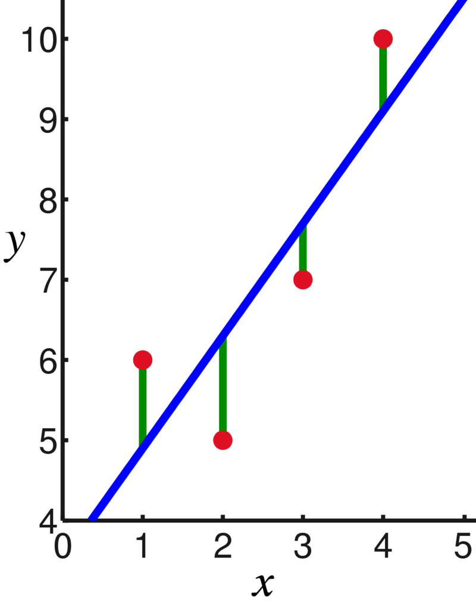

# Linear Regression

Our statistical methods so far have covered problems where we have a single numeric variable of interest (possibly across multiple groups).  Now, we will learn about a way to explore the relationship between two numeric variables.

## Correlation

Sir Francis Galton and Karl Pearson were interested in how children resemble their parents. They gathered data on the heights (in inches) of 1078 father-son pairs. We will consider a subsample of $n = 14$ pairs.

| Family | Father's Height | Son's Height |
|--------|-----------------|--------------|
| 1      | 71.3            | 68.9         |
| 2      | 65.5            | 67.5         |
| 3      | 65.9            | 65.4         |
| 4      | 68.6            | 68.2         |
| 5      | 71.4            | 71.5         |
| 6      | 68.4            | 67.6         |
| 7      | 65.0            | 65.0         |
| 8      | 66.3            | 67.0         |
| 9      | 68.0            | 65.3         |
| 10     | 67.3            | 65.5         |
| 11     | 67.0            | 69.8         |
| 12     | 69.3            | 70.9         |
| 13     | 70.1            | 68.9         |
| 14     | 66.9            | 70.2         |

Our data is arranged in pairs.  Each observation is a family unit, which has an associated father's height and son's height.  The best way to view this type of data is with a scatterplot.  We'll put the father's height on the x axis and son's height on the y.

```{r}
fathers <- c(71.3, 65.5, 65.9, 68.6, 71.4, 68.4, 65.0, 66.3,
             68.0, 67.3, 67.0, 69.3, 70.1, 66.9)
sons <- c(68.9, 67.5, 65.4, 68.2, 71.5, 67.6, 65.0, 67.0,
          65.3, 65.5, 69.8, 70.9, 68.9, 70.2)

plot(fathers, sons,
     xlab = "Father Heights", ylab = "Son Heights")
```

It is a bit difficult to tell, but there seems to be a slight positive relationship between father and son heights.  Shorter fathers tend to have shorter sons, and taller fathers tend to have taller sons, which matches our understanding of genetics.  But not all of the points obey this rule.

---

To quantify this visual relationship between our variables, we use a measure called correlation.  There are two aspects to correlation, strength and direction.  To calculate correlation, we calculate how much the x and y variables vary with each other.  Are they closely related?  We then take this quantity and divide by the variability of x and y to make it a standardized measure.

Formally, let Let $(x_1, y_1), (x_2, y_2), \ldots , (x_n, y_n)$ be a sample of $n$ points on a scatterplot and let $\bar{x}, s_x, \bar{y}, s_y$ be the sample means and standard deviations of the x and y values.

:::: {.infobox .deff data-latex=""}
The **correlation** between two variables is the strength and direction of the linear relationship. It is given by 
$$r \;=\; \frac{\sum (x_i-\bar{x})(y_i-\bar{y})}{(n-1)s_xs_y}.$$ 
The value of $r$ will always be between -1 and 1.
::::

The numerator term tells us how much x and y vary with each other.  If a small/large x value leads to a small/large y value, then the numerator will be a large positive number.  If x and y are inversely related (a small x leads to a large y and vice versa), then the numerator will be a large negative number.  If there isn't really a relationship between x and y, then the numerator will be close to 0.

The denominator term standardizes the measure so that it is always between -1 and 1.

---

Let's look at how to calculate the numerator,
$$\sum (x_i-\bar{x})(y_i-\bar{y}).$$
For each point, we are taking the x value minus the average x value, times the y value minus the average y value.  We then add this up for each point.

:::: {.infobox .pond data-latex=""}
What are some of the similarities between the numerator of correlation and the numerator of the variance of a single sample of data?
$$\sum(x_i - \bar{x})^2$$
::::

The easiest way to calculate this term is with R's element-wise computations.

```{r}
sum((fathers - mean(fathers)) * (sons - mean(sons)))
```

`fathers` enumerates over the $x_i$ values, and `mean(fathers)` is $\bar{x}$.  Then `sons` enumerates over the $y_i$ values, and `mean(sons)` is $\bar{y}$.  We see that the numerator term is equal to 35.409.  This is positive, which matches the visual positive relationship from the scatterplot.

Now we have to standardize this number.  Let's find the sample standard deviations of the fathers and sons.

```{r}
sd(fathers)
sd(sons)
```

The correlation of the father-son data is given by 

$$r \;=\; \frac{\sum (x_i-\bar{x})(y_i-\bar{y})}{(n-1)s_xs_y} \;=\; \frac{35.409}{(14-1)\cdot 2.043 \cdot 2.168} \;=\; 0.615.$$

The `cor` function in R calculates correlation automatically and confirms the result.

```{r}
cor(fathers, sons)
cor(sons, fathers)
```

---

How should we interpret the size of the correlation? The correlation is -1 or 1 when the points are in a perfect line.  This rarely happens with real-world data.

Generally, if the magnitude of the correlation $|r|$ is greater than $0.8$, we consider it to be strong correlation.  So $r = 0.9$ or $r = -0.85$ are both strong correlation.

If the magnitude is between 0.5 and 0.8, we consider it to be moderate.  The father-son data displays a moderate, positive correlation.  If the magnitude is less than $0.5$, the correlation is considered weak.  We might observe a correlation like this just by chance.

:::: {.infobox .exer data-latex=""}
For the following three scatterplots, identify the strength and direction of the correlation.

```{r, echo = F}
set.seed(371)
x <- runif(20, 0, 100)
y1 <- -3*x + rnorm(20, 0, 30)
y2 <- 0.8*x + rnorm(20, 0, 30)
y3 <- 0.5*x

plot(x, y1, main = "Example 1: r = -0.94", ylab = "y",
     xaxt = "n", yaxt = "n")
plot(x, y2, main = "Example 2: r = 0.38", ylab = "y",
     xaxt = "n", yaxt = "n")
plot(x, y3, main = "Example 3: r = 1", ylab = "y",
     xaxt = "n", yaxt = "n")

```


<span style="color:#8601AF">
The first plot shows a strong negative correlation.  The second plot shows a very weak positive correlation.  The third plot shows a perfect positive correlation.  In the case of the third plot, the value of x is determined entirely by the value of x, and there is no variation due to other sources.
</span>
::::

:::: {.infobox .warn data-latex=""}
When discussing correlation, it is important to note that correlation does not equal causation!  The correlation measures the strength of the linear relationship between two variables, but it does not tell us the reason for that relationship.

Some pairs of variables have high correlation by coincidence. Other times, they might be *confounded* with a third variable.  Ice cream sales is famously highly correlated with crime rate. But it is not the case that ice cream consumption causes crime or crime causes ice cream consumption. Both of those are correlated with high temperature. 

We cannot make conclusions about causality unless our experimental design removes possible confounders. In particular, causal inference is not possible for observational studies.  It is only possible for experimental studies that are carefully set up in a specific way.
::::

## Linear modeling

Our goal is to build a linear model, which is the straight line that does the best job of describing the relationship between x and y.

```{r, echo=F}
# Father-son height data
fathers <- c(71.3, 65.5, 65.9, 68.6, 71.4, 68.4, 65.0, 66.3,
             68.0, 67.3, 67.0, 69.3, 70.1, 66.9)
sons <- c(68.9, 67.5, 65.4, 68.2, 71.5, 67.6, 65.0, 67.0,
          65.3, 65.5, 69.8, 70.9, 68.9, 70.2)

# Plot data
plot(fathers, sons,
     xlab = "Father Heights", ylab = "Son Heights")
abline(a = 23.641, b = 0.653)
```

In general, a line has a slope and a y-intercept:
$$y \;=\; mx + b$$ 
In statistics, we use the notation
$$y \;=\; \beta_0 + \beta_1 x$$

We need to come up with an intercept and a slope that describe the relationship between $x$ and $y$.  $\beta_0$ and $\beta_1$ are the parameters of interest.  This means that we are assuming that $x$ and $y$ have a true linear relationship, and we want to make an estimate of this line.

---

```{r, echo = F}
# Father-son height data
fathers <- c(71.3, 65.5, 65.9, 68.6, 71.4, 68.4, 65.0, 66.3,
             68.0, 67.3, 67.0, 69.3, 70.1, 66.9)
sons <- c(68.9, 67.5, 65.4, 68.2, 71.5, 67.6, 65.0, 67.0,
          65.3, 65.5, 69.8, 70.9, 68.9, 70.2)

# Plot data
plot(fathers, sons,
     xlab = "Father Heights", ylab = "Son Heights")
```


What is the straight line that best describes the relationship between father's and son's heights?  There's no perfect linear model, since the correlation is not perfect.  That is to say, the points are not along a perfect straight line.  There is extra variation in the $y$ values.

To account for this extra variability, a linear model on the height data would look like
$$\text{Son's height } \;=\; \beta_0 + \beta_1 \text{ (Father's height) + Random error}$$ 
$\beta_0$ is the height of the son when the father's height is 0.
$\beta_1$ is the amount of change in the son's height for a one inch change in the father's height.  General form:
$$y_i \;=\; \beta_0 + \beta_1 x_i + \epsilon_i$$

- $y_i$ is the value of $y$ with input $x = x_i$
- $\beta_0, \beta_1$, and the error term $\epsilon_i$ are unknown parameters that must be estimated.

Note that each point $i$ has a unique error term.

How should we estimate $\beta_0$ and $\beta_1$?  We want the line to be close to our data points. The line should be able to accurately predict a son's height ($y$)if we are given a father's height ($x$).

---

A popular approach is to minimize the *vertical* distance from the points to the line. Here is another linear model example from Wikipedia:

```{r,echo=F, out.height="400px", fig.align="center"}

```

When we look at the vertical distance, we are looking at a specific $x$ value.  At the point where $x = 1$, we see that the observed value of $y$ is about 6.  However, the line has height 5.  That means that our predicted value of $y$ is off by 1.

:::: {.infobox .deff data-latex=""}
Formally, the difference between an observed and predicted value is the **residual**.
\begin{align*}
\text{Residual } &= \text{ Observed } - \text{ Fitted} \\
e_i &= y_i - \hat{y}_i
\end{align*}
$e_i$ is the residual (error) for point $i$ and $\hat{y}_i$ is the estimate for point $i$ (the height of the line).
::::

Each point has its own residual.  Collectively, the residuals represent the error in our linear model, which we want to be as small as possible.  We control this by picking "good" values of $\beta_0$ and $\beta_1$ that give us a $\hat{y}_i$ value close to the observed value $y_i$.

---

:::: {.infobox .deff data-latex=""}
If $\hat{\beta}_0$ and $\hat{\beta}_1$ are our estimates, the estimated $y$ for a given $x_i$ is 
$$\hat{y}_i \;=\; \hat{\beta}_0 + \hat{\beta}_1x_i.$$
::::

We pick the $\hat{\beta}_0$ and $\hat{\beta}_1$ that give us the smallest residuals. As is typical in statistics, we want to minimize the *squared* error.  $(y_i - \hat{y}_i)^2$ is the squared error for point $i$.

:::: {.infobox .deff data-latex=""}
The total error in a linear model is given by 
$$\sum_{i=1}^n(y_i - \hat{y}_i)^2 \; = \; \sum_{i=1}^n(y_i - (\hat{\beta}_0+\hat{\beta}_1x_i))^2.$$
Just like in an ANOVA, we call this the **error sum of squares** or $SS_E$.
::::

We use calculus to find formulas for $\hat{\beta}_0$ and $\hat{\beta}_1$ that minimize the above equation for $SS_E$.

$$\text{Pick } \; \hat{\beta_0},\; \hat{\beta}_1 \; \text{ to minimize}\quad SS_E \;=\; \sum_{i=1}^n(y_i - (\hat{\beta}_0+\hat{\beta}_1x_i))^2$$

---

The values of $\hat{\beta}_0$ and $\hat{\beta}_1$ that we use are called least squares estimates, since we are minimizing the squared error terms.  They are calculated with the correlation $r$ between $x$ and $y$ and summary values taken from our data.

:::: {.infobox .deff data-latex=""}
The **least squares** estimates for $\hat{\beta}_0$ and $\hat{\beta}_1$ are given by 
\begin{align*}
\hat{\beta}_1 \; &= \; r\Big(\frac{s_y}{s_x}\Big) \\ \\
\hat{\beta}_0 \; &= \; \bar{y} - \hat{\beta}_1\bar{x}
\end{align*}
This procedure is called **least squares linear regression** or **simple linear regression**.
::::

We use the least squares esimates as our linear model.
$$\hat{y}_i \;=\; \hat{\beta}_0 + \hat{\beta}_1x_i$$
For the father-son height data, we have $\bar{y} = 67.979$, $\bar{x} = 67.929$, $s_y = 2.168$, $s_x = 2.043$.  We calculated the correlation to be $r = 0.615$.

:::: {.infobox .exer data-latex=""}
Calculate the least-squares estimates of slope and intercept for the height data. Then state and interpret the linear model.

<span style="color:#8601AF">
The least squares estimate for slope is 
$$\hat{\beta}_1 \; = \; r\Big(\frac{s_y}{s_x}\Big) \;=\; 0.615\Big(\frac{2.168}{2.043}\Big) \;=\; 0.6526.$$
The least squares estimate for intercept is 
$$\hat{\beta}_0 \; = \; \bar{y} - \hat{\beta}_1\bar{x} \;=\; 67.979 - (0.6526)67.929 \;=\; 23.649.$$
The linear model for son's height as a function of father's height is
$$\hat{y}_i \;=\; 23.649 + 0.6526x_i$$
The estimated height of a son from a 0-inch tall father is 23.649 (which is not meaningful).  For every one inch increase in a father's height, we would expect his son's height to increase by 0.6526 inches.
</span>
::::

We have
$$\text{Son's height} \;=\; 23.621 + 0.653 \text{ (Father's height)}.$$

```{r}
# Father-son height data
fathers <- c(71.3, 65.5, 65.9, 68.6, 71.4, 68.4, 65.0, 66.3,
             68.0, 67.3, 67.0, 69.3, 70.1, 66.9)
sons <- c(68.9, 67.5, 65.4, 68.2, 71.5, 67.6, 65.0, 67.0,
          65.3, 65.5, 69.8, 70.9, 68.9, 70.2)

# Plot data
plot(fathers, sons,
     xlab = "Father Heights", ylab = "Son Heights")
abline(a = 23.641, b = 0.653)
```

In terms of the vertical distance from the points to the line, this particular line does the best job fitting the data.  Any other line would have a bigger $SS_E$ than this one.

---

We can also fit a linear model in R with the `lm` function.  We use `~` to indicate a model fit, and we put the $y$ variable on the left.  Instead of just printing it out, I'm going to save my model results in an object called `height_mod` so that I can refer to it later.

```{r}
fathers <- c(71.3, 65.5, 65.9, 68.6, 71.4, 68.4, 65.0, 66.3,
             68.0, 67.3, 67.0, 69.3, 70.1, 66.9)
sons <- c(68.9, 67.5, 65.4, 68.2, 71.5, 67.6, 65.0, 67.0,
          65.3, 65.5, 69.8, 70.9, 68.9, 70.2)

height_mod <- lm(sons ~ fathers)
height_mod
```

The output matches the slope and intercept we calculated by hand (up to rounding).  We can view a more detailed description of the model with the `summary` command.

```{r}
summary(height_mod)
```

We have an overview of the residuals, a table showing the estimated coefficients, and several more summaries at the bottom.  It's a lot to take in at first, but later on we'll discuss the most relevant parts of this summary.

## Testing slope

We've seen how to fit a linear model to describe the relationship between two numeric variables.  So far, we haven't actually done any statistics, just mathematical modeling.

The motivation for fitting a model is that we think $x$ has a linear relationship with $y$.  How can we test this formally?  Consider the slope coefficient $\beta_1$.  This is the constant that relates $x$ and $y$ in the theoretical linear model:
$$y_i \;=\; \beta_0 + \beta_1 x_i + \epsilon_i.$$
If $\beta_1 = 0$, that means $x$ and $y$ have no linear relationship.  If we remove this term from our equation:
$$y_i \;=\; \beta_0 + \epsilon_i$$
we see that the value of $y$ is given by a constant plus some random error.  The variable $x$ does not affect $y$ at all.

Therefore, $x$ and $y$ have a linear relationship exactly when $\beta_1$ is nonzero.  This gives us a set of hypotheses where $\beta_1$ is the parameter of interest.
$$H_0: \beta_1 = 0\quad\quad\text{versus}\quad\quad H_A: \beta_1 \neq 0$$
Under $H_0$, $x$ and $y$ are unrelated.  But under $H_A$, they have a significant linear relationship.

---

To answer the above hypotheses, we will perform a T hypothesis test.  Recall the general structure of a T test statistic:
$$T \;=\; \frac{\text{estimate from data} - \text{value under }H_0}{\text{estimated standard error of estimate}}$$
For testing $\beta_1$, the estimate from our data is $\hat{\beta}_1$ and the value under $H_0$ is 0.  The last piece we need is the estimated standard error.  We need to know how much uncertainty there is with using $\hat{\beta}_1$ as an estimator of the true slope.

The standard error of our estimate is in terms of $\sigma$, which is the standard deviation of the residuals.  $\sigma$ represents how spread out the points are around the line.  The standard error of $\hat{\beta}_1$ also has to do with the spread of the $x$ variable.  If our original $x$ has more spread, then $\hat{\beta}_1$ does a better job as an estimator.  The standard error is
$$se(\hat{\beta}_1) \;=\; \frac{\sigma}{\sqrt{\sum(x_i-\bar{x})^2}}.$$
We don't know the true value of $\sigma$, so we must estimate it from our data.

---

How should we estimate the variance of the points around the line?  We already have a measure, $SS_E$, that gives the *total* error of the line.  To turn it into a variance term, we need to divide it by the appropriate degrees of freedom.  The df for a simple linear model is always $n-2$.  Think of $n$ points and subtract $2$ for estimating both the slope and intercept.

:::: {.infobox .deff data-latex=""}
The variance of the observed points around a regression line is the **mean square error**, given by 
$$S^2 \;=\; MS_E \;=\; \frac{SS_E}{n-2}.$$
$MS_E$ is an estimator of $\sigma^2$ and $S = \sqrt{MS_E}$ is an estimator of $\sigma$.
::::

We can find $S$ in the R linear model summary under "Residual standard error",

```{r}
summary(height_mod)
```

So, the estimated standard error of $\hat{\beta}_1$ is 
$$\hat{se}(\hat{\beta}_1) \;=\; \frac{S}{\sqrt{\sum(x_i-\bar{x})^2}}.$$

---

The term in the denominator of the standard error is the sum of squares for the $x$ values.  This is the total variability in $x$, or the variability in the father's heights.  There is a "shortcut" to find this term.

The term we want is the *total* variability, and we have access to the *average* variability (the variance).  To get the total variabiliy, simply multiply by $n-1$.
$$\text{Variance of X: } s_X^2 \;=\; \frac{1}{n-1}\sum(x_i - \bar{x})^2$$
$$\text{Total variability of X: } (n-1)s_X^2 \;=\; \sum(x_i - \bar{x})^2$$
We can use the term $(n-1)s_X^2$ whenever we need to use the total variation of $x$. The term $s_X^2$ is a basic summary value that can be found with R.

Finally, the estimated standard error of $\hat{\beta}_1$ is given by 
$$\hat{se}(\hat{\beta}_1) \;=\; \frac{S}{\sqrt{(n-1)s_X^2}}.$$

---

So, we can write the T test statistic for testing slope as 
$$T \;=\; \frac{\hat{\beta}_1 - 0}{S\Big/\sqrt{(n-1)s_X^2}}.$$
If the null hypothesis is true and $\beta_1 = 0$, then $T$ follows a t distribution with $n-2$ degrees of freedom.  We carry out our one-sample T test as usual, using `qt` to find a critical value or `pt` for a p-value.

For the height model, we estimated slope to be $\hat{\beta}_1 = 0.6526$.  We found $s = \sqrt{MS_E} = 1.78$ from the `lm` summary output.  The variance of the father's heights is $s^2_X = 4.173$.  Finally, we are working with $n = 14$ points.

:::: {.infobox .exer data-latex=""}
Finish the test of hypotheses
$$H_0: \beta_1 = 0\quad\text{versus}\quad H_A: \beta_1 \neq 0$$
on the father-son height data.  Use $\alpha = 0.05$.

- Estimate the standard error of $\hat{\beta}_1$ (which goes in the denominator of our test statistic).

<span style="color:#8601AF">
The estimated standard error of $\hat{\beta}_1$ is
$$\hat{se}(\hat{\beta}_1) \;=\; \frac{S}{\sqrt{(n-1)s_X^2}} \;=\; \frac{1.78}{\sqrt{(14-1)4.173}} \;=\; 0.2417.$$
This is the error we incur by estimating the slope.
</span>

- Calculate the test statistic $t_{obs}$.

<span style="color:#8601AF">
Our observed T test statistic is 
$$t_{obs} \;=\; \frac{\hat{\beta}_1 - 0}{S\Big/\sqrt{(n-1)s_X^2}} \;=\; \frac{0.6526 - 0}{0.2417} \;=\; 2.7.$$
</span>

- Use the $t_{n-2}$ distribution to make a decision with $\alpha = 0.05$.

<span style="color:#8601AF">
We need to find the area outside of 2.7 on the t curve with $n-2 = 12$ degrees of freedom.  To get a two-sided p-value, we multiply this area by 2.
</span>

```{r}
2*pt(2.7, df = 12, lower.tail = F)
```

<span style="color:#8601AF">
We get a p-value of 0.019, which is sufficient to reject the null at the 5% level.  We conclude that there is a significant linear relationship between son's height and father's height.
</span>
::::

The slope test results are also contained in the R summary output.  The `fathers` line of the coefficient table gives the estimate, standar error, T test statistic, and p-value for slope.

```{r}
summary(height_mod)
```

It's important to keep in mind that this R output will always test $H_0: \beta_1 = 0$. Other slope tests are possible, but R will always do this one.  It also shows the results of testing the intercept, which is not covered in the class.

---

We can also build a T CI for $\beta_1$ that corresponds to the T test we just did.  It follows the usual confidence interval structure:
$$\text{point estimate } \pm \text{ critical value }\times \text{ standard error}.$$
To build a 95% CI, we would use the $\alpha/2 = 0.025$ critical value on the t with 12 degrees of freedom.  This is 2.179.

```{r}
qt(0.975, df = 12)
```

So, the 95% CI for slope is 
$$0.6526 \;\pm\; 2.179(0.242) \;=\; (0.125, 1.180).$$ 
This interval does not cover 0, which corresponds to the fact that we rejected $H_0: \beta_1 = 0$.

---

We tested a particular null hypothesis of $\beta_1 = 0$ but we can test other hypotheses as well.  We might be interested in testing a particular direction.  If we want to know if $x$ and $y$ have a positive relationship, we would use
$$H_0: \beta_1 \le 0\quad\text{versus}\quad H_A: \beta_1 > 0.$$
If we wanted to know if $x$ and $y$ have a negative relationship, we would use
$$H_0: \beta_1 \ge 0\quad\text{versus}\quad H_A: \beta_1 < 0.$$
We can also test a value other than 0.  Use $m_0$ to refer to the null value of the slope.

:::: {.infobox .deff data-latex=""}
In general, a T test for the slope of a regression line tests $\beta_1$:
$$H_0: \beta_1 = m_0 \quad\text{versus}\quad H_A: \beta_1 \neq m_0$$
(or a corresponding one-sided hypothesis).  The test statistic is 
$$T \;=\; \frac{\hat{\beta}_1 - 0}{S\Big/\sqrt{(n-1)s_X^2}}$$
and the null distribution is a t distribution with $n - 2$ degrees of freedom.  We can find a rejection region or calculate a p-value according to the direction of the hypotheses.

We can also build a corresponding $100(1-\alpha)\%$ T CI:
$$\hat{\beta}_1 \;\pm\; t_{\alpha/2, n-2}\times \hat{se}(\hat{\beta}_1)$$
::::

---

Our T hypothesis test for slope requires several assumptions, just like other hypothesis tests.  If these assumptions are not met, then the results are not reliable.

In this context, checking wether a T test is appropriate comes down to checking whether the linear model is a good fit.  There are four specific assumptions:

- $X$ and $Y$ have a linear relationship (not quadratic or otherwise)
- The pairs of observations are independent
- The variance around the fitted line is constant for all $x$
- The random error around the fitted line is normal

All of these assumptions can be summarized with a single mathematical statement.  Reczll that $\epsilon_i$ refers to the true random error for point $i$.  If these errors are iid normal, then the model is a good fit. Specifically, if we assume
$$\epsilon_{i} \; \sim \; N(0, \sigma^2)$$
then the four above statements are true.

---

We evaluate these assumptions by analyzing the residuals (the $e_i$), which are the observed errors in our model.  We typically build a plot with fitted values on the x axis and residuals on the y axis.  We also make a qq-plot of residuals to assess normality.

This procedure is very similar to the residual analysis for the ANOVA model in chapter 9.  We use the R functions `fitted` and `resid` to extract the fitted values and residuals of our model.

```{r}
plot(fitted(height_mod), resid(height_mod))
```

We want to see a random scatter of points with no apparent patterns, which is shown in the plot above.  Problematic patterns to look out for are a "megaphone" shape or some kind of distinct curve.

```{r}
qqnorm(resid(height_mod)); qqline(resid(height_mod))
```

The qq-plot of residuals shows that they are normal.  Both of these plots look good, so we can conclude that the linear model is a good fit for this data.  The results of a T test and other statistics will be accurate.

## Prediction

The other main type of statistics to perform on a linear model is prediction.  If a father is 71 inches tall, how tall would we expect his son to be, according to our model?

:::: {.infobox .deff data-latex=""}
In general, we let $x^*$ be the $x$ value we want to predict at.  Here $x^* = 71$.  The point estimate for $y$ given $x^*$ is found simply by plugging $x^*$ into the regression line.
$$(\text{Fitted value for }x^*) \;=\; \hat{\beta}_0 + \hat{\beta}_1 x^*$$
::::

In the father-son height example, the estimated regression line is
$$\hat{y}_i \;=\; 23.621 + 0.653 x_i.$$
We predict that a son from a 71 inch tall father would be
$$(\hat{y}_i \;|\; x^* = 71) \;=\; 23.621 + 0.653(71) \;=\; 69.984$$
inches tall.

---

A more interesting problem has to do with the uncertainty in this point estimate.  That is to say, we want to know the standard error of $(\hat{y}_i \;|\; x^*)$.  Knowing this will let us create a confidence interval for the value of $y$.

There are two slightly different types of prediction, which are subtly distinct. 

- The first type of prediction is to predict the *average* son's height for all 71 inch tall fathers.  In other words, what is the height of the line at $x^* = 71$?  Formally, this is
$$E(\hat{y} \;|\; x^*).$$

- The second type of prediction is to predict the son's height for a *single* 71 inch tall father.  Formally, this is just
$$(\hat{y} \;|\; x^*).$$

This is the difference between predicting the "typical" height versus the height for a single, specific individual.  There is less uncertainty in the first type of prediction, since we are taking an average.  Thus $se\Big(E(\hat{y} \;|\; x^*)\Big)$ is smaller than $se(\hat{y} \;|\; x^*)$.

---

:::: {.infobox .deff data-latex=""}
The standard error of $\mathbb{E}(\hat{y} \;|\; x^*)$, which is the position of the regression line at $x^*$, is given by
$$se(E(\hat{y} \;|\; x^*)) \;=\; \sigma \sqrt{\frac{1}{n} \;+\; \frac{(x^* - \bar{x})^2}{\sum(x_i - \bar{x})^2}}.$$
::::

There are a lot of terms in this equation, so let's look at them one by one.

- The standard error increases with $\sigma$. If the points are more scattered around the line, then our prediction is less reliable.  Since $\sigma$ is unknown, we use $S$ to calculate an estimated standard error.

- The standard error decreases with $n$ (since it's in the denominator).  A bigger sample size lets us make better predictions.

- The standard error increases with $(x^* - \bar{x})^2$.  This is the squared distance between our new $x$ and the center of the original $x$ values.  When we make a prediction close to the center of our original data, the prediction is more reliable.

- The standard error decreases with $\sum(x_i - \bar{x})^2$.  This is the slightly weird one.  This term corresponds to the total variability in $x$.  That means that if our $x$ data has more spread, predictions will have *less* error.  If our original $x$ data covers a lot of ground, then the model is better.

Recall the "trick" with the variance of $x$:
$$\text{Total variability of X: } (n-1)s_X^2 \;=\; \sum(x_i - \bar{x})^2.$$

:::: {.infobox .exer data-latex=""}
In the father-son example, we have $s = 1.78$, $n = 14$, $\bar{x} = 67.929$, $s^2_X = 4.173$.  Find the standard error of the predicted average son's height from 71 inch fathers.

<span style="color:#8601AF">
We need to estimate the standard error by using $s$ in place of $\sigma$. \begin{align*}
\hat{se}(E(\hat{y} \;|\; 71)) \;&=\; S \sqrt{\frac{1}{n} \;+\; \frac{(x^* - \bar{x})^2}{\sum(x_i - \bar{x})^2}} \\ 
&=\; 1.78\sqrt{\frac{1}{14} \;+\; \frac{(71 - 67.929)^2}{(14-1)4.173}} \\
&=\; 0.882
\end{align*}
</span>
::::

---

Now that we have the standard error, we can build a CI for $E(\hat{y} \;|\; 71)$.  The point estimate is the fitted value, 69.984.  The critical value is the same as the critical value used in the analysis of $\beta_1$.  We take the $\alpha/2$ critical value from the t with $n-2$ degrees of freedom.  If we want to build a 95% CI, the critical value is 2.179.

```{r}
qt(0.975, df = 12)
```

The 95\% CI for $\mathbb{E}(\hat{y} \;|\;  71))$ is
$$69.984 \;\pm\; (2.179)0.882 \;=\; (68.06, 71.91).$$
We estimate that the average height of sons from 71 inch tall fathers is between 68.06 and 71.91.  This also gives us an interval estimate for the line itself.

Note that this CI is specific to the point $x^* = 71$.  If we want to build a CI for other points, we can't use the same margin of error.  That's because the standard error term depends on how far $x^*$ is from $\bar{x}$.  The most precise CI occurs when $x^* = \bar{x}$.

:::: {.infobox .deff data-latex=""}
In general, a $100(1-\alpha)\%$ confidence interval for $E(\hat{y} \;|\;  x^*))$ on a regression line is
$$(\hat{y} \;|\;  x^*) \;\pm\; t_{n-2, \alpha/2} \times \hat{se}\Big(E(\hat{y} \;|\;  x^*))\Big).$$
::::

---

Now, we will discuss the second type of prediction, which is to predict the son's height of a single 71" tall father, which is $\hat{y} \;|\; 71$ (with no expected value).  The point estimate is the same, but there is a larger standard error.

:::: {.infobox .deff data-latex=""}
The standard error of $\hat{y} \;|\; x^*$ is
$$se(\hat{y}\;|\; x^*) \;=\; \sigma \sqrt{\;1 \;+\; \frac{1}{n} \;+\; \frac{(x^* - \bar{x})^2}{\sum(x_i - \bar{x})^2}}.$$
::::

This expression is almost exactly the same as $se\Big(E(\hat{y} \;|\; x^*)\Big)$, but there is an extra +1 term.  This represents the additional variability from using our data to predict the value of a new observation.  For the height data, the estimated standard error of $\hat{y} \;|\; 71$ is 
$$S \sqrt{\;1 \;+\; \frac{1}{n} \;+\; \frac{(x^* - \bar{x})^2}{\sum(x_i - \bar{x})^2}} \;=\; 1.78 \sqrt{\;1 \;+\; \frac{1}{14} \;+\; \frac{(71 - 67.929)^2}{(14-1)4.173}} \;=\; 1.986$$
which is considerably larger than 0.882.  There is much more error in this type of prediction.

We can follow the same steps as before to build a confidence interval for $\hat{y} \;|\; 71$.  The point estimate (69.984) and critical value (2.179) stay the same.  The only difference is in the standard error term.  In this context, the interval is called a prediction interval (PI), to differentiate it from the confidence interval we made before.

:::: {.infobox .exer data-latex=""}
Build a 95% PI of $\hat{y} \;|\; 71$ for the height data.  Comopare the PI to the CI we made earlier: (68.06, 71.91).

<span style="color:#8601AF">
The point estimate is the value of $\hat{y}$ for $x = 71$, which is 69.984. The critical value for 95% confidence is $t_{12, 0.025} = 2.178$.  Finally, we use the standard error of 1.986 that we calculated before.  We get a 95% PI of
$$69.984 \;\pm\; (2.179)1.986 \;=\; (65.66, 74.31).$$
We predict that the height of a son from a 71 inch tall father would be in this interval.
</span>

<span style="color:#8601AF">
Compared to the confidence interval of (68.06, 71.91), this prediction interval is centered at the same value, but it is much wider, representing more uncertainty.
</span>
::::

:::: {.infobox .deff data-latex=""}
In general, a $100(1-\alpha)\%$ **prediction interval** for $(\hat{y} \;|\;  x^*)$ on a regression line is
$$(\hat{y} \;|\;  x^*) \;\pm\; t_{n-2, \alpha/2} \times \hat{se}(\hat{y} \;|\;  x^*).$$
::::

---

We can replicate these results in R with the `predict` function.  By default, if we enter our model, `predict` will return the fitted values for the original 14 $x$ values.

```{r}
predict(height_mod)
```

If we want to specify a new $x$ value, we have to set it up a specific way.  We use an R object called a data frame.  I'll save it in an object called `new_fathers`.

```{r}
new_fathers <- data.frame(fathers = 71)
```

It's important that the name of the $x$ variable (in this case, `fathers`), matches exactly was given to the original linear model:

```{r, eval = F}
height_mod <- lm(sons ~ fathers)
```

Now we can plug in our new data to get the point estimate for $\hat{y}$ when $x^* = 71$.  If we want to get a CI or a PI, we have to set the `interval` argument.

```{r}
predict(height_mod, newdata = new_fathers)

predict(height_mod, newdata = new_fathers,
        interval = "confidence")
predict(height_mod, newdata = new_fathers,
        interval = "prediction")
```

The results match the ones we got by hand.  The main benefit of using R is that it is able to quickly compute multiple prediction or confidence intervals at different $x$ values.  This is tedious to do by hand, since we would need to calculate a unique standard error for each $x^*$.  In R, we can put all of the $x^*$ values in a vector.

```{r}
new_fathers <- data.frame(fathers = c(69, 70, 71))

predict(height_mod, newdata = new_fathers,
        interval = "prediction")
```

---

When we use a model for prediction, we have to be responsible about what we are predicting.  A linear model might be a good fit for our data, but that doesn't mean it can apply to all other cases.

Specifically, we can only make predictions for $x^*$ that are in the range of the observed $x$ values.  When we validated our model by performing a residual analysis, we are checking the quality of the model for the data we *have*.  We want to stay within the range of the original *x* values, $[65.0, 71.4]$.

:::: {.infobox .warn data-latex=""}
Trying to make a prediction outside of the original data is called **extrapolation**, and it should be avoided. We have no reason to believe that the model is correct outside of our data range.
::::

It would not make sense to predict the height of a son from a father who is impossibly short or tall.  Also, the model may not be appropriate for reasonable father heights outside of $[65.0, 71.4]$. So we shouldn't make a prediction for a 72 inch tall father.  If we wanted to, we would need to collect more data and expand our model.

## Coefficient of determination

When investigating the relationship between two variables, it is useful to consider how much of $y$ is explained by the $x$ variable.  In other words, how much of the variability of $y$ can be explained by our model, and how much is random noise?

For the height data, the total variability of $y$ (son's heights) is related to the sample variance.
$$\text{Total variability of }y \;=\; (n-1)s^2_Y \;=\; (14-1)4.7 \;=\; 61.1$$
We know that the total error in our model is given by $SS_E = 37.99$

```{r}
# Calculate the sum of squared residuals
sum(resid(height_mod)^2)
```

Therefore, $\frac{37.99}{61.1} = 0.622$ is the proportion of variability due to error.  $1 - 0.622 = 0.378$ is the proportion of variability explained by our $x$ variable.  We think that 37.8% of the variability in sons' heights can be explained by fathers' heights.  The remaining 62.2% is due to other factors (nutrition, mother's height, location, etc.)  These other factors are not part of our model, so they are treated as error.

:::: {.infobox .deff data-latex=""}
Generally, the **coefficient of determination** for a linear model tells us what proportion of the variability of $y$ is explained by $x$ via the linear model.  It is given by
$$R^2 \;=\; \frac{SS_{Tot} - SS_E}{SS_{Tot}}$$
::::

For the father-son height model, $R^2 = 0.378$.  We can also see this in the summary output in the bottom section under "Multiple R-squared".

```{r}
summary(height_mod)
```

---

For a simple linear model, which only has a single $x$ variable, the coefficient of determination is directly related to the correlation between the two variables.
$$r^2 \;=\; R^2$$
The father and son heights have a correlation of 0.615, and $0.615^2 = 0.378.$

We can also calculate a coefficient of determination for more complex models that have multiple $x$ variables (using $x_1, x_2, \ldots$ to explain $y$).  However, the correlation relationship only holds for simple models with a single $x$ variable.

---

While $R^2$ is a useful measure, it does have limitations.  There is no objectively "good" value of $R^2$ that we can apply to all situations.  In some contexts, $R^2 = 0.378$ would be excellent.  In others, it might be terrible.

In addition, we cannot use $R^2$ to evaluate the quality of model fit.  We can calculate $R^2$ and possibly get a large number even if the linear model is inappropriate.  The model validation must be done with a residual analysis.


