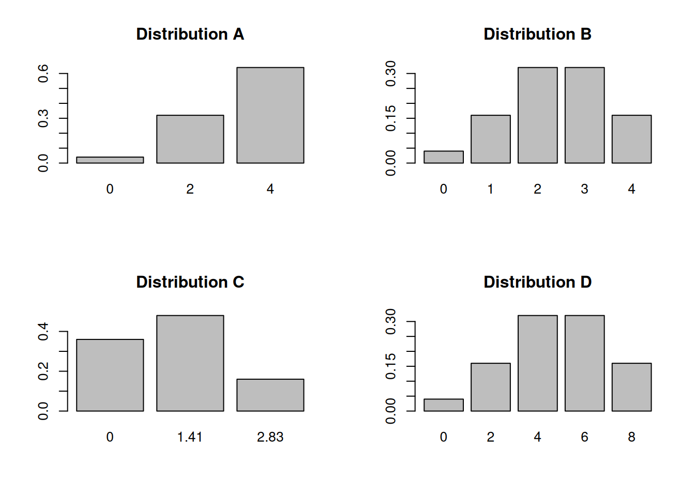
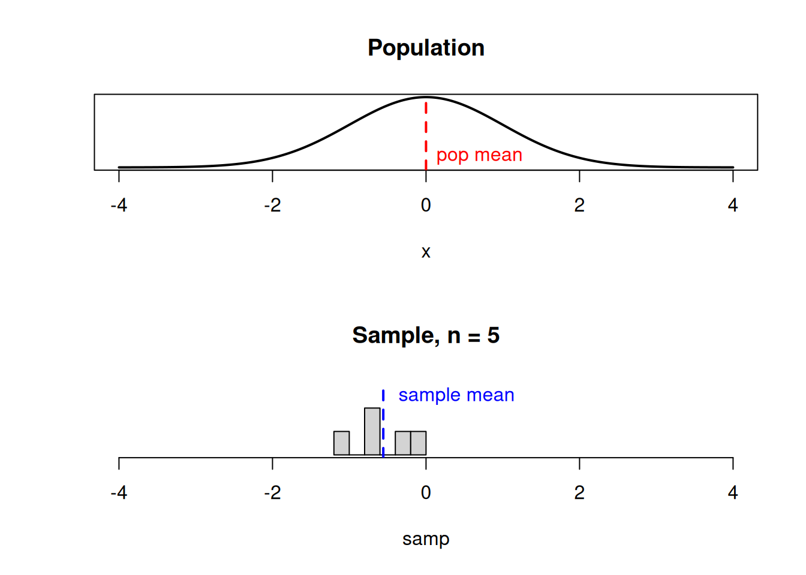
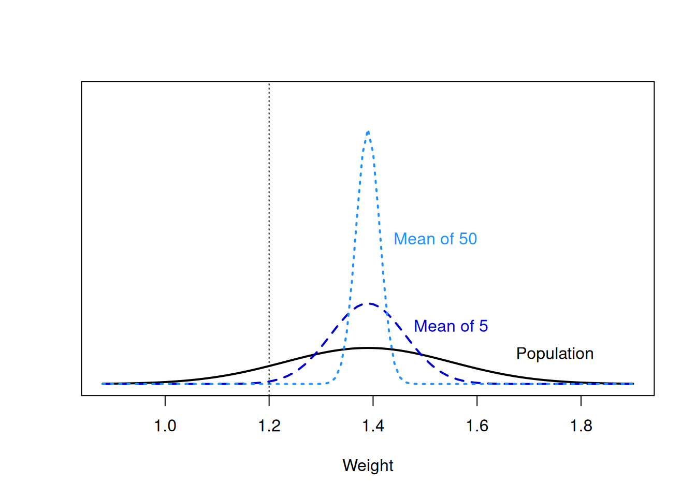
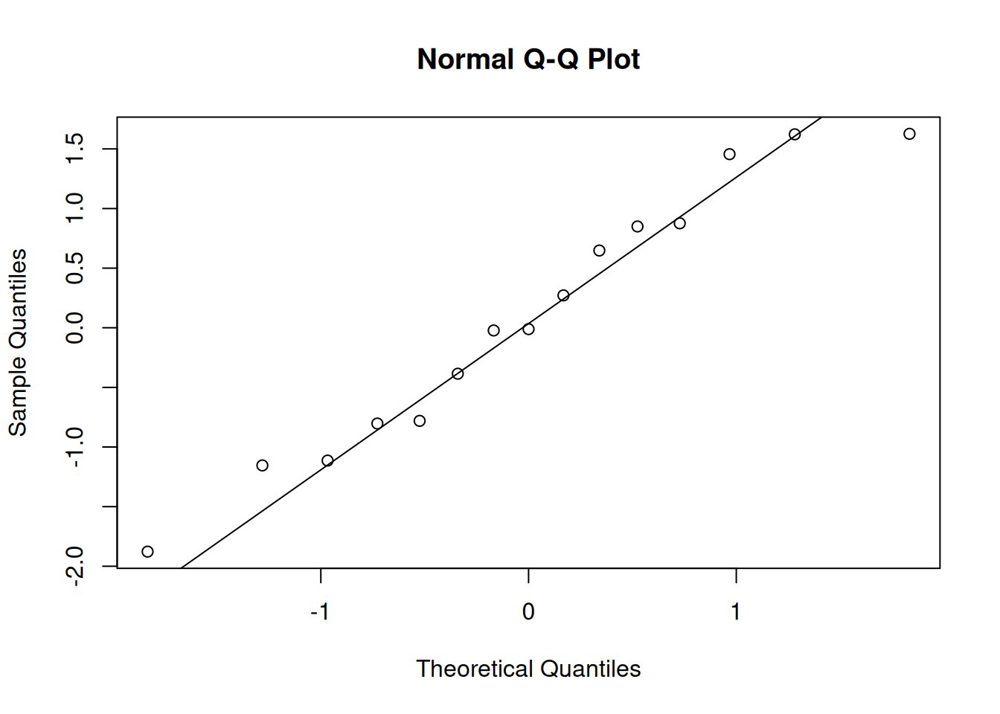
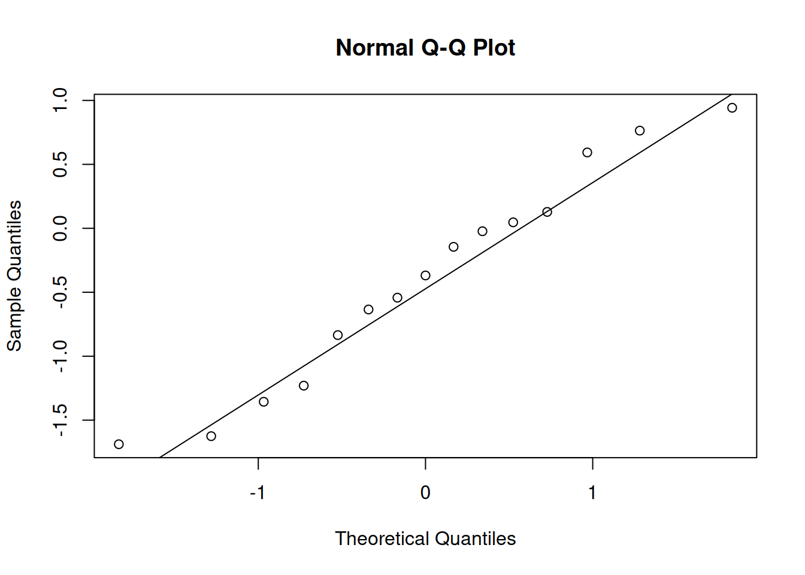
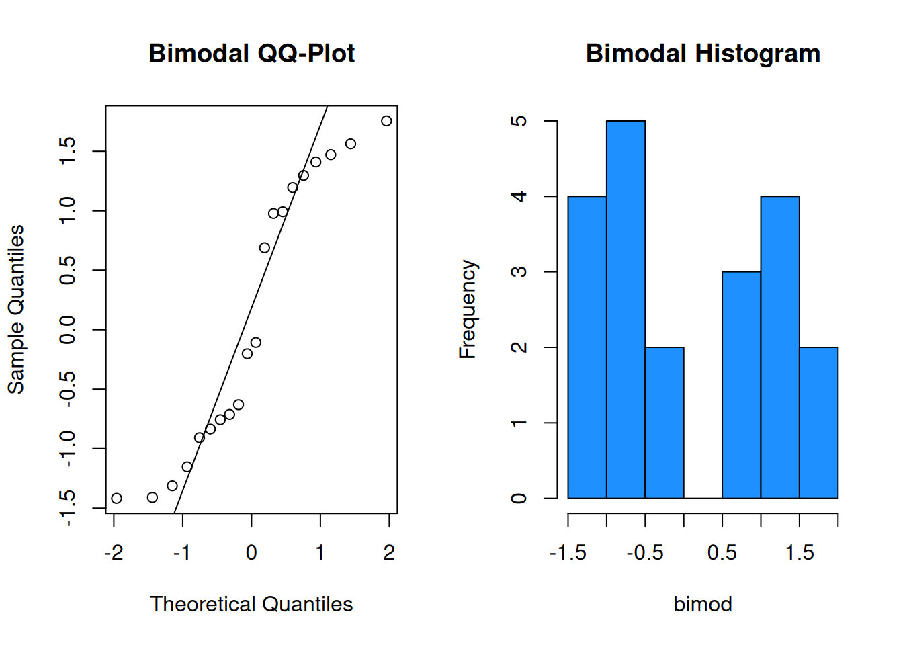
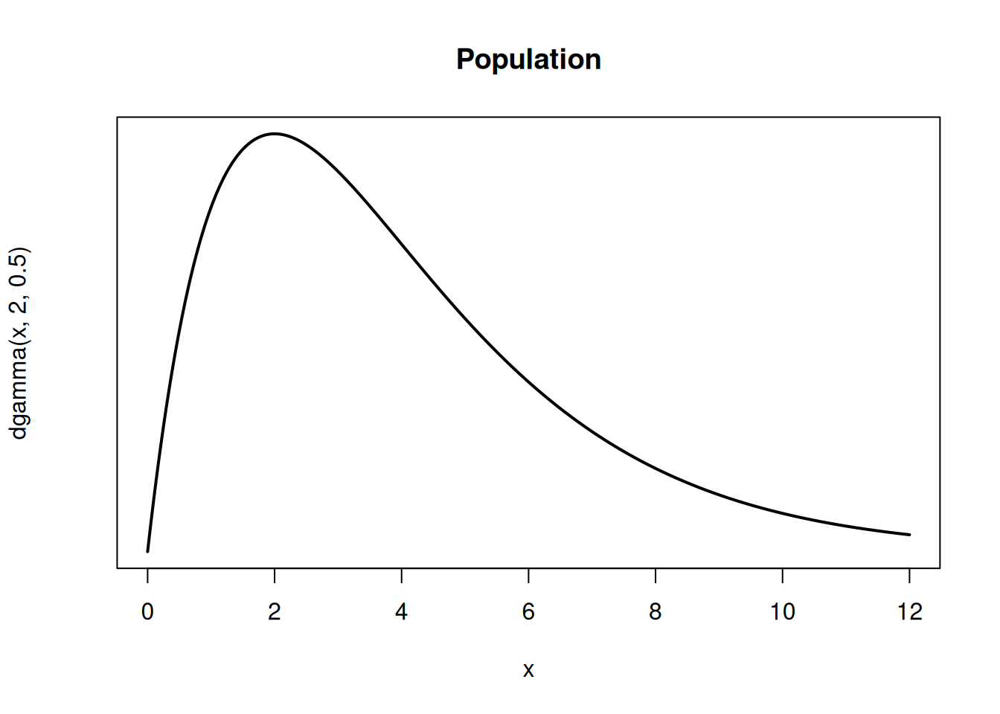
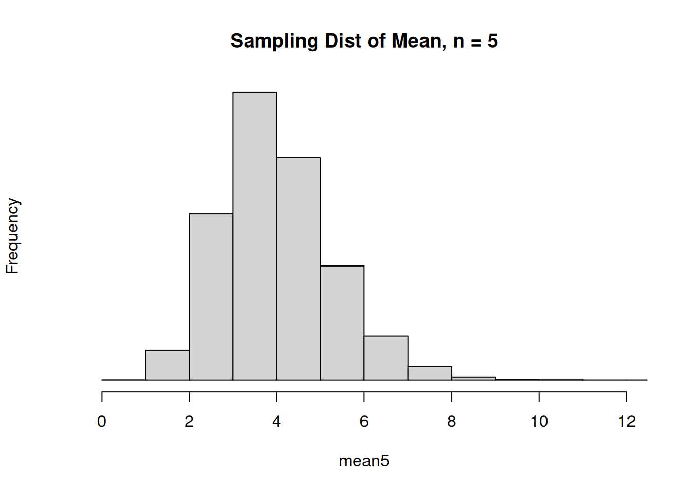

# Estimation


We study populations of interest by taking a random sample.  But because the sample is random, the sample quantities (such as sample mean or sample sd) are also random.  Studying the random behavior of these statistics helps us develop formal methods to analyze the corresponding parameters.

## Estimation

A grocery store is planning to buy 50 commercially raised chickens (broilers). The seller claims the weights of their broilers are approximately normal with mean 1.387 kg and standard deviation 0.161 kg. So, the claim is that the weight of each broiler is being sampled from $W \sim N(1.387, 0.161^2)$.

The weight of the 50 specific broilers received in the shipment had an observed mean weight $\bar{w} = 1.2$ kg with standard deviation 0.173 kg. The manager expected a mean broiler weight of 1.387.  Should he complain to the supplier, or did he just get unlucky?  What other information would we like to know? 

Let random variable $W$ represent the weights of broilers. If we plan to take a sample of 50 weights, then each item in our sample is a random variable equal to $W$.
$$W_1, W_2, W_3, \ldots , W_{50}$$
These variables are random, because the weights have some random variability.  The $W_i$ will realize to 50 constant values *after* we measure the 50 broilers we happened to get.

We assume that the $W_i$ are independent of each other and are all drawn from the exact same population.

:::: {.infobox .deff data-latex=""}
In general, when we have a sample of data, we assume that the observations are **indepenent and identically distributed** (iid) random variables. That is to say, 

- The are independent.
- They have the same distribution (given by the population).
::::

---

We are thinking about data in more abstract terms, rather than as a collection of numbers.  By treating the observations as random variables, we can use them to represent *all possible samples* of size $n$ that we might end up getting.  It's not a set of particular numbers, it's a procedure for how we're going to get our numbers.
  
When we calculate a statistic like the mean from a random sample, it is a function of random variables, and therefore is a RV itself.  The sample mean weight is
$$\bar{W} = \frac{1}{n}\sum_{i=1}^n W_i$$
We're using a capital $\bar{W}$ here to indicate that it is random.  The value of the mean depends on what we observe in our random sample.  We might get a bunch of lightweight broilers, or we might get lucky and observe a bunch of heavy broilers.

Intuitively, if the true mean weight is claimed to be 1.387, then the mean of our observed sample, $\bar{W}$, feels like it ought to be close to 1.387.

---

In general, we use a sample mean $\bar{X}$ (a statistic) to estimate a population mean $\mu$ (a parameter).  $\bar{X}$ is an estimator of the population mean $\mu$.

:::: {.infobox .deff data-latex=""}
An **estimator** is a statistic that comes from a random sample and serves as a "guess" for a parameter's value. An estimator is random.
::::

A lot of our discussion will focus on using $\bar{X}$ as an estimator for $\mu$, but there are other types of estimation for other parameters.

It's useful to figure out how we can study $\mu$ in the case of the broilers.  We might suspect that the true mean weight is not actually equal to 1.387.  So we can use our observed value of $\bar{W}$ to learn about $\mu$.

---

Let's briefly clarify the vocabulary. The formula that describes how we use sample data to approximate a parameter is an estimat**OR**, e.g. the sample mean. For the broilers,
$$\text{Estimator: }\;\; \frac{1}{50}\sum_{i=1}^{50} W_i \;=\; \bar{W}.$$ 
This is a procedure, or recipe, for how we would estimate the mean if we had a sample of size 50.

The numerical value computed from the actual observed data is an estimat**E**.
$$\text{Estimate: }\;\; \frac{w_1 + w_2 + \cdots w_{50}}{50} \;=\; 1.2 \;=\; \bar{w}.$$
This is an actual number, not a formula.  Notice that we use the lowercase $\bar{w}$ to indicate a measured value of the sample mean.  An estimator is a RV, and an estimate is a realization of that RV.

---

The seller claims each $W_i \sim N(1.387, 0.161^2)$. We expect the observed sample mean to be about 1.387, but we got $\bar{w} = 1.2$.  Is this a problem, or is it just up to chance?

In other words, is the value $\bar{w} = 1.2$ consistent with $\mu = 1.387$? To answer this quesstion, we need to know what a "typical" value of $\bar{W}$ looks like.  This is possible because $\bar{W}$ is a random variable.  Is 1.2 something that we are likely to see, or is it really out of the ordinary?

We consider all of the possible values of $\bar{W}$ and their corresponding probabilities.

## Sampling distributions

Since $\bar{W}$ is random, it has its own probability function that describes its behavior and distribution.  We might ask, "what is the probability of observing a sample mean of 1.2 or smaller?" 

:::: {.infobox .deff data-latex=""}
The probability function of an estimator is called the **sampling distribution**.
::::

This works the same way as other probability functions, but it has a special name because it applies to an estimator. The sampling distribution of $\bar{W}$ describes all of the possible mean weights we can observe, depending on our sample.

---

Let's look at a much smaller example, so we can have a concrete illustration of how sampling distributions work.  Consider a discrete population where 20% of the population has value 0, 40% has value 2, and 40% has value 4.

| $x$        | 0   | 2   | 4   |
|:----------:|:---:|:---:|:---:|
| $P(X = x)$ | 0.2 | 0.4 | 0.4 |

Imagine taking a sample of size 2 $(X_1, X_2)$ from this population.  $X_1$ and $X_2$ are independent and identically distributed (iid) RVs that can take on the value 0, 2, or 4.  So, these are all of the possible samples we might see:


| <!-- -->    | <!-- -->    | <!-- -->    | <!-- -->    | <!-- -->    | <!-- -->    | <!-- -->    | <!-- -->    | <!-- -->    | <!-- -->    |
|----------------|------|------|------|------|------|------|------|------|------|
| $X_1, X_2$     | 0, 0 | 0, 2 | 0, 4 | 2, 0 | 2, 2 | 2, 4 | 4, 0 | 4, 2 | 4, 4 |

Consider the following statistics we could calculate from our sample of 2:

- Sample mean
$$\bar{X} = \frac{X_1 + X_2}{2}$$
- Sample standard deviation 
$$S = \sqrt{\frac{1}{1}\sum(X-\bar{X})^2$$
- Sample maximum
$$\text{whichever of }X_1, X_2 \text{ is larger}$$
- Sample total
$$T = X_1 + X_2$$

The 4 statistics above are all RVs that depend on the value of $X_1$ and $X_2$.  For example, if the sample was (0, 2), the sample mean would be 1.  But if the sample was (2, 2), the sample mean would be 2.

With a fairly small example, we can exhaustively calculate the value of each statistic for every possible sample. 

| $X_1, X_2$     | 0, 0 | 0, 2 | 0, 4 | 2, 0 | 2, 2 | 2, 4 | 4, 0 | 4, 2 | 4, 4 |
|----------------|:----:|:----:|:----:|:----:|:----:|:----:|:----:|:----:|:----:|
| Mean $\bar{x}$ | 0    | 1    | 2    | 1    | 2    | 3    | 2    | 3    | 4    |
| Total $t$      | 0    | 2    | 4    | 2    | 4    | 6    | 4    | 6    | 8    |
| Max            | 0    | 2    | 4    | 2    | 2    | 4    | 4    | 4    | 4    |
| SD $s$         | 0    | 1.41 | 2.83 | 1.41 | 0    | 1.41 | 2.83 | 1.41 | 0    |

Each row in the table gives the sampling distribution of the statistic, for all possible values of ($X_1, X_2$).

:::: {.infobox .exer data-latex=""}
The four histograms below each depict a different sampling distribution from the table above.  Match the four histograms to the 4 statistics (sample mean, sample total, sample max, and sample sd).  Note that the x axes are not the same for all of the graphs.



<span style="color:#8601AF">
Distribution A describes the sample maximum.  According to the table, the maximum can be either 0, 2, or 4.  It's very rarely 0, since this only happens if $X_1$ and $X_2$ are both 0. Occasionally it has value 2, but most of the time, the sample maximum is 4.
</span>

<span style="color:#8601AF">
Distribution B describes the sample mean.  Its possible values are 0, 1, 2, 3, or 4, which match the values in the "mean" row of the table.  We see that the mean is more likely to be a middle value of 2 or 3, and less likely to be an extreme value like 0 or 4.
</span>

<span style="color:#8601AF">
Distribution C describes the sample sd.  The sample sd can be 1.41 or 2.83 depending on the values in the sample.  But if $X_1$ and $X_2$ end up being equal, then the sd is 0.
</span>

<span style="color:#8601AF">
Distribution D describes the sample total.  Its possible values are 0, 2, 4, 6, or 8.  We see that it has a similar shape to the sample mean, where the middle values are more likely.
</span>
::::

The value of each estimator depends on the items that appear in the sample.  The same principle applies to more complicated or larger examples, such as the broiler weights.

----

Let's re-focus on the sample mean $\bar{X}$ (or $\bar{W}$). We know that we can use it to estimate the population mean $\mu$, but why do we want to do this? Does this measure do a "good" job of estimating $\mu$?

We need to look at the expectation and variance properties of $\bar{X}$ to better understand how it works as an estimator.  

The expectation tells us the average value of the sample mean (across all samples).  The expected value of the sample mean is $E(\bar{X}) = \mu$. Its expected value is exactly the parameter that we are trying to estimate.  On average, the sample mean is located at the true mean. 

Some samples might have an unexpectedly large or unexpectedly small sample mean, just due to random variance.  But the value of the sample mean averages out to the true center of the population.

The variance determines the variability in the sample mean from sample to sample.  We can think of $V(\bar{X})$ as "estimation error".  The variance is $V(\bar{X}) = \frac{\sigma^2}{n}$, where $\sigma^2$ is the original population variance.  We see that as we take a bigger sample, the estimation error goes down.  

:::: {.infobox .deff data-latex=""}
In summary, $E(\bar{X}) = \mu, \quad V(\bar{X}) = \frac{\sigma^2}{n}$.
::::

---

Here are the formal derivations that show the mean and variance of $\bar{X}$.  Note that for the variance calculation, we are using the fact that the indidivudal $X_i$ are independent. \begin{align}
E(\bar{X}) &= E\Big(\frac{1}{n}\sum_{i=1}^n X_i\Big) \\
&= \frac{1}{n}E\Big(\sum_{i=1}^n X_i\Big) \\
&= \frac{1}{n}\sum_{i=1}^n E(X_i) \\
&= \frac{1}{n}\cdot n\mu \\
&= \mu
\\ \\
V(\bar{X}) &= V\Big(\frac{1}{n}\sum_{i=1}^n X_i\Big) \\
&= \frac{1}{n^2}V\Big(\sum_{i=1}^n X_i\Big) \\
&= \frac{1}{n^2}\sum_{i=1}^n V(X_i) \quad \quad \text{by independence}\\
&= \frac{1}{n^2}\cdot n\sigma^2 \\
&= \frac{\sigma^2}{n}
\end{align}

---

:::: {.infobox .deff data-latex=""}
The standard deviation of an estimator is called **standard error**.  This is to differentiate it from the standard deviation of the original population.
::::

The standard error of $\bar{X}$ is $\sqrt{V(\bar{X})} = \frac{\sigma}{\sqrt{n}}$.  This corresponds to how much uncertainty we have when we use $\bar{X}$ as a way to estimate the value of $\mu$.  Lower standard error is better!

---

So why is $\bar{X}$ considered a good estimator of $\mu$.  We saw that $E(\bar{X}) = \mu$, which means the sample mean is located at the true mean on average.  We say that $\bar{X}$ is unbiased for $\mu$.

:::: {.infobox .deff data-latex=""}
In general, an **unbiased** estimator has expected value equal to the desired parameter.  It is neither an underestimate or overestimate.  If the expected value is less than the parameter, it is **biased downward** and is an underestimate.  If the expected value is greater than the parameter, it is **biased upward** and is an overestimate.
::::

Another nice property of $\bar{X}$ is that its standard error (and variance) goes down as the sample size $n$ increases.  So by taking a bigger sample, we know that we are doing a better job of estimating $\mu$. In general, bigger samples are desirable for estimation.

---

We like to have estimators that have both low bias and low variance.  We can imagine the true parameter as the bullseye of a target and each shot being a "guess" at the parameter using our estimator.

<!-- -->

Unfortunately, there is an inherent tradeoff between the two.  With a finite sample of data, we cannot have arbitrarily low bias AND arbitrarily low variance at the same time.

---

Using bias and variance, we can also compare *different* estimation techniques for the *same* parameter.  The sample mean $\bar{X}$ has a unique quality of having the smallest variance of all unbiased estimators of $\mu$.  Let's illustrate with a sample of size 2.  If $n = 2$, 
$$\bar{X} = \frac{X_1 + X_2}{2}, \quad E(\bar{X}) = \mu, \quad V(\bar{X}) = \frac{\sigma^2}{2}.$$
Let's define a new estimator for $\mu$ called $\tilde{X}$ that is an unfairly weighted average of $X_1$ and $X_2$.
$$\tilde{X} = \frac{X_1 + 2X_2}{3}$$
We can show that $E(\tilde{X}) = \mu$, which means that both $\bar{X}$ and $\tilde{X}$ are unbiased estimators of the true mean.  However, $V(\tilde{X}) = \frac{5\sigma^2}{9}$, which is slightly larger than $V(\bar{X})$.  Because both estimators are unbiased, but $\bar{X}$ has lower variance, it is preferred.

:::: {.infobox .pond data-latex=""}
Try to come up with an estimator for $\mu$ that has more bias but less variance than $\bar{X}$.
::::

---

When trying to analyze the population mean, it is useful to know the variance of $\bar{X}$, which is $\frac{\sigma^2}{n}$.  But $\sigma^2$, the population variance, is also a parameter.  It is very rarely known.  So, we have to estimate the population spread with our data.

We have seen formulas for calculating the sample variance and sample sd of a set of data.  These are estimators for the variance and sd of the population.  Again, because these quantities are based on a random sample, we treat them as random variables.  The sample variance is
$$S^2 \;=\; \frac{1}{n-1}\sum_{i=1}^n(X_i - \bar{X})^2$$
We divide by $n-1$ because it makes $S^2$ unbiased for $\sigma^2$.  Dividing by $n$ underestimates the variance.  The sample standard deviation is just the square root of the sample variance.
$$S \;=\; \sqrt{\frac{1}{n-1}\sum_{i=1}^n(X_i - \bar{X})^2}$$
Interestingly, although $S^2$ is an unbiased estimator of $\sigma^2$, $S$ is a slightly biased estimator of $\sigma$.  However, this bias is minimal and we generally don't worry about it.

So, we have formulas to estimate the population mean, variance, and sd from some observed data.

| Definition | Statistic |           | Parameter  |
|------------|-----------|-----------|------------|
| Mean       | $\bar{X}$ | estimates | $\mu$      |
| Variance   | $S^2$     | estimates | $\sigma^2$ |
| St. dev.   | $S$       | estimates | $\sigma$   |

---

Now that we can estimate the population variance/sd, we can estimate the variance of $\bar{X}$. \pause Substituting $S$ for $\sigma$, the estimated variance and standard error of $\bar{X}$ is
$$\hat{V}(\bar{X}) \;=\; \frac{S^2}{n}, \quad \quad \hat{se}(\bar{X}) \;=\; \frac{S}{\sqrt{n}}$$
We can get both $S$ and $n$ from our data.

---

In our original example, we observed a mean broiler weight $\bar{w} = 1.2$ even though the distributor claims the population mean weight is $\mu = 1.387$.  We want to figure out if we are likely to observe a mean weight of 1.2 or less, using the distribution of the random variable $\bar{W}$.

Let's start with the nicest case, where the original population is normal.  Imagine we take a sample from a normal population, and calculate the sample mean.

We've learned about the center and spread of $\bar{X}$ (or $\bar{W}$).  But to answer our question, we need to know the specific shape of the sampling distribution. Intuituively, if we get a good spread of different values, the sample mean would end up close to the true mean $\mu$.


If we happen to get several small values in our sample, the sample mean would be a bit to the left of $\mu$.



If we happen to get several large values in our sample, the sample mean would be a bit to the right of $\mu$.


If the underlying population is normal, then the sampling distribution of $\bar{X}$ also has a normal bell-curve shape, with the same center and less spread.


The sampling distribution (dashed line) represents all possible values of the sample mean we might observe when taking a sample from the population (solid line).

---

:::: {.infobox .deff data-latex=""}
Formally, the items in our sample are iid normal:
$$X_i \sim N(\mu, \sigma^2)$$
Then the distribution of the sample mean $\bar{X}$ is also normal.  
$$\bar{X} \sim N\Big(\mu, \frac{\sigma^2}{n}\Big)$$ 
::::

We learned the mean $\mu$ and variance $\frac{\sigma^2}{n}$ of $\bar{X}$ before, and now we know the shape.  This is true because of a useful property about normal RVs.

Let $X_1, X_2, \ldots , X_n$ be independent normal RVs, and $c_1, c_2, \ldots, c_n$ be any constants. Then if we take each normal RV, multiply it by a constant, and add them up, then the RV
$$c_1 X_1 + c_2 X_2 + \cdots + c_n X_n$$
is also normal.  The sample mean is one such example of this pattern, where each $X_i$ is a draw from a normal population and each constant $c_i = \frac{1}{n}$.

$$\bar{X} \quad = \quad \frac{1}{n}\sum_{i=1}^n X_i \quad =\quad \frac{1}{n}X_1 + \frac{1}{n}X_2 + \cdots + \frac{1}{n}X_n$$

---

In the broiler example, we assume the weights of broilers have a normal distribution with mean 1.387 kg and standard deviation 0.161 kg. $W \sim N(1.387, 0.161^2)$. 

:::: {.infobox .exer data-latex=""}
- If you randomly select 1 broiler from this distribution, what is the probability that its weight is below 1.2 kg?

<span style="color:#8601AF">
We need to calculate a normal probability on the original population distribution, which is something we have done before in chapter 4.  We need $P(W \le 1.2)$, which is about 0.123.
</span>


```r
pnorm(1.2, 1.387, 0.161)
```

```
## [1] 0.1227212
```

<span style="color:#8601AF">
If we're just drawing one item from the population, it's not super unlikely for it to be less than 1.2 kg.
</span>

- What is the sampling distribution for $\bar{W}_5$, the average weight of 5 broilers randomly sampled from this distribution?

<span style="color:#8601AF">
We have seen formulas for the expectation and variance of the sample mean. $E(\bar{W}_5) = \mu  = 1.387$, and $V(\bar{W}_5) = \frac{\sigma^2}{n} = \frac{0.161^2}{5}$.  Furthermore, we know that since the original population is normal, the sampling distribution of $\bar{W}$ must also be normal.  So, $\bar{W}$ is normal with mean 1.387 and variance $\frac{0.161^2}{5}.$
$$\bar{W}_5 \sim N\Big(1.387, \frac{0.161^2}{5}\Big)$$
</span>

- If you randomly select 5 broilers, what is the probability that the mean weight of the 5 is below 1.2 kg?

<span style="color:#8601AF">
Now, we need to calculate a probability on the sampling distribution that we identified in the previous part.  We can also do this with `pnorm`, but remember that R wants the standard deviation rather than the variance.  The standard deviation of $\bar{W}_5$ (called standard error) is $\sqrt{\frac{0.161^2}{5}} = \frac{0.161}{\sqrt{5}}$  According to R, $P(\bar{W}_5 \le 1.2) = 0.005$.
</span>


```r
pnorm(1.2, 1.387, 0.161/sqrt(5))
```

```
## [1] 0.00469974
```

<span style="color:#8601AF">
This is a very small probability (a 0.5% chance).  When we take a sample of size 5, we expect the sample values to be spread out across the population, so it would be unlikely that the mean of all of the values would be less than 1.2.
</span>

- If you randomly select 50 broilers, what is the probability that the mean weight of the 50 is below 1.2 kg?

<span style="color:#8601AF">
Now, we need to find the sampling distribution of $\bar{W_{50}}$.  The expected value is $E(\bar{W}_50) = \mu = 1.387$ and the variance is $V(\bar{W}_{50}) = \frac{\sigma^2}{n} = \frac{0.161^2}{50}$.  Just like $\bar{W}_5$, $\bar{W}_{50}$ is a normal RV.  So,
$$\bar{W}_{50} \sim N\Big(1.387, \frac{0.161^2}{50}\Big).$$
According to R, the $P(\bar{W}_{50} \le 1.2) = 1.08\times 10^{-16}$.
</span>


```r
pnorm(1.2, 1.387, 0.161/sqrt(50))
```

```
## [1] 1.078833e-16
```

<span style="color:#8601AF">
That's a decimal point followed by 15 zeroes!  So, the probability is essentially 0.  If the true mean were 1.387, it would be incredibly likely to observe a mean weight of 1.2 or lower for 50 broilers.  So, this might lead us to beleive that the claim of $\mu = 1.387$ is false.
</span>

::::

Here's an illustration of the broiler population and each of the sampling distributions, with the value 1.2 marked.



---

By now, we have studied the sample mean $\bar{X}$ at length.  Another useful statistic is the sample total (or sum), $T$.  This is just the sum of all of our observations.
$$T \;=\; X_1 + X_2 + \cdots X_3 \;=\; \sum_{i=1}^n X_i$$
Because it is calculated from random quantities, $T$ is a random variable with its own mean, variance, and sampling distribution.

If the mean of a population is $\mu$, and we draw $n$ items, we intuitively expect the total to be about $n\mu$.  And it does turn out that the expected value of the total is $E(T) = n\mu$.  The variance of the total also scales with $n$: $V(T) = n\sigma^2$.  Note that, while the variability of the sample mean decreasees as $n$ gets bigger, the variability of the sample total increases with $n$.

---

Here are the formal derivations that show the mean and variance of $T$.  Note that for the variance calculation, we are using the fact that the indidivudal $X_i$ are independent. \begin{align}
E(T) &= E\Big(\sum_{i=1}^n X_i\Big) \\
&= \sum_{i=1}^n E(X_i) \\
&= n\mu 
\\ \\
V(T) &= V\Big(\sum_{i=1}^n X_i\Big) \\
&= \sum_{i=1}^n V(X_i) \quad \quad \text{by independence}\\
&= n\sigma^2 
\end{align}

---

What about the shape of the distribution of $T$?  As it turns out, if we have a normal population, then the sampling distribution of $T$ is also normal.  Remember our rule where we can add independent normal RVs and get another normal RV:
$$c_1 X_1 + c_2 X_2 + \cdots + c_n X_n$$
The total $T$ is just an example of this rule where each $c_i = 1$.

:::: {.infobox .deff data-latex=""}
Formally, the items in our sample are iid normal:
$$X_i \sim N(\mu, \sigma^2)$$
Then the distribution of the sample total $T$ is also normal.  
$$T \sim N(n\mu, n\sigma^2)$$ 
::::

The sample total is just the sample mean multiplied by $n$, so it is sensible that the two statistics should have similar behavior.

In the broiler example, we assume the weights of broilers have a normal distribution with mean 1.387 kg and standard deviation 0.161 kg. $W \sim N(1.387, 0.161^2)$. 

:::: {.infobox .exer data-latex=""}
- What is the sampling distribution for $T_{50}$, the total weight of 50 randomly selected broilers from this distribution?

<span style="color:#8601AF">
We know that the average weight of 50 broilers is $E(T_{50}) = n\mu = 50(1.387)$.  The variance of this total is given by $V(T_{50}) = n\sigma^2 = 50(0.161^2)$.  Finally, because the underlying population $W$ is normal, the sample total must also be normal.  We get
$$T_{50} \sim N\Big(50(1.387), 50(0.161^2)\Big)$$
</span>

- The distributor is trying to estimate shipping costs.  What is the 95th percentile for the total weight of 50 broilers? That is, below what weight will 95% of draws from $T_{50}$ fall?

<span style="color:#8601AF">
This question is asking us to find the 95th percentile of the sampling distribution of $T_{50}$.  This is the value such that 95% of the realizations of $T_{50}$ are less than this value.  We can find this with R's `qnorm`, either directly or by transforming the 95th percentile of a standard normal.  Note that we have to use the square root of the variance, $\sqrt{50(0.161^2)} = \sqrt{50}(0.161)$.
</span>


```r
qnorm(0.95, 50*(1.387), sqrt(50)*0.161)
```

```
## [1] 71.22257
```

```r
# or
qnorm(0.95)*sqrt(50)*0.161 + 50*(1.387)
```

```
## [1] 71.22257
```

<span style="color:#8601AF">
The 95th percentile is about 71.22 kg.  95% of the time, the total weight of 50 random broilers will be less than this value.
</span>
::::

## Central Limit Theorem

When we assume that the underlying population is normal (the "normality assumption"), we can do a lot.  This assumption tells us that the sample mean and sample sum are also both normal.

The normality assumption is fairly safe for many populations.  There are a lot of real-life processes that result in an approximately normal shape.  But, not every population is normal, and so we want some way to assess the validity of the normality assumption.

We have a sample of observed numeric data, and we want to guess whether the underlying population is normal.

---

:::: {.infobox .deff data-latex=""}
A useful visual tool for verifying normality is a **normal quantile-quantile plot**, or qq-plot.  We compare our data to a theoretical normal distribution, and plot it.  If the data is normal, the points will fall on a straight diagonal line.
::::

 Let's look at a qq-plot of some normal data.


It's not perfect, but it is certainly good enough.  There's always going to be a bit of natural variation present, even when our data is perfectly normal.

---

We can make a qq-plot in R with the `qqnorm` function, and draw a line with `qqline`.  This is the code used to make the previous plot.


```r
data <- c(1.29, 1.12, 0.88, 1.65, 1.48, 1.59, 1.04, 0.83,
          1.76, 1.31, 0.88, 1.71, 1.83, 1.09, 1.62, 1.49)

qqnorm(data); qqline(data)
```

R is a good way to let us explore what a "good" qq-plot looks like.  The `rnorm` function lets us take a sample of normal data.  Let's make some example qq-plots of normal data.


```r
set.seed(371) # set RNG

data1 <- rnorm(15)
qqnorm(data1); qqline(data1)
```



```r
data2 <- rnorm(15)
qqnorm(data2); qqline(data2)
```



```r
data3 <- rnorm(15)
qqnorm(data3); qqline(data3)
```


We see that there is some natural variation present, but the points still tend to fall along the main diagonal line.  Don't be too picky about this!

---

When data violates the normality assumption, there will generally be obvious problems in the plot.  Let's see some examples of bimodal, left-skewed, and right-skewed data in a qq-plot and corresponding histogram.



It is probably not safe to assume these three sets of data were drawn from a normal population.

---

Most of our statistical methods are based on this normality assumption.  The results of these tests should only be accurate and meaningful if our data is normal. But in practice, data does not need to be perfectly normal for these methods to work. Most pretty good" data is "good enough", especially if it is a large sample. 

This is all thanks to the **Central Limit Theorem**, or CLT.  The CLT is a powerful theorem that says that our statistical methods based on normality will still work, even if our data is not perfectly normal.

---

When we are doing statistics on the mean $\mu$, it doesn't matter if our *data* is normal.  What matters is that the *sample mean* $\bar{X}$ is normal.  And that is exactly what the CLT gives us.

Intuitively, if we take a large sample from a population, their values should "cancel out" such that the sample mean almost always ends up somewhere in the middle.  This produces a bell-curve shape, even when the underlying population does not have a bell curve.

---

Formally, let $X_1, X_2, \ldots X_n$ be independent and identically distributed RVs drawn from a population with mean $\mu$ and variance $\sigma^2$.

:::: {.infobox .deff data-latex=""}
The **Central Limit Theorem** says that, for *large enough* $n$, the distribution of $\bar{X}$ is *approximately* normal with mean $\mu$ and variance $\frac{\sigma^2}{n}$. 
$$\bar{X} \;\dot{ \sim }\; N\Big(\mu, \frac{\sigma^2}{n}\Big)$$
::::

We use $\dot{\sim}$ to indicate an approximate probability distribution.  What's key here is that we have not made any assumption about the underlying population shape.  We've only specified a population mean and variance.  But as long as the sample is large enough, we can safely assume the sample mean is normal.

---

Here's an example of a skewed population, the sampling distribution of $\bar{X}$ when $n = 5$, and the sampling distribution of $\bar{X}$ when $n = 20$.



When $n = 5$, the sampling distribution of $\bar{X}$ is still a little bit skewed.  But for $n = 20$, the sampling distribution resembles a bell curve.

---

The distribution of $\bar{X}$ is more closely approximated by a normal when $n$ is larger.  But how big does $n$ need to be before the normal approximation is safe to use? This depends on the shape of the underlying population (the $X_i$).

When the underlying population is more normal, the CLT kicks in even when we have a small sample size. For distributions that are reasonably symmetric with no outliers, we might be able to use an $n$ as small as 5.

On the other hand, for extremely skewed distributions, we might need $n$ in the hundreds.  We can assess the shape with a qq-plot.  For most real-world data, $n = 30$ is a safe cutoff.

:::: {.infobox .pond data-latex=""}
[This website](http://onlinestatbook.com/stat_sim/sampling_dist/index.html) is a great tool for experimenting with the CLT for differently shaped populations.
::::

---

The CLT also works for the sample sum.

:::: {.infobox .deff data-latex=""}
For $X_1, \ldots X_n$ iid, for large enough $n$, central limit theorem says the distribution of the sample total is approximately
$$T\;\dot{ \sim }\; N(n\mu, n\sigma^2).$$
::::

Just like with the mean, this approximation is better when $n$ is large and when the original distribution is closer to a normal.

---

*Lymantria dispar* is an invasive moth species.   A state agriculture department places traps throughout the state to detect the moths.  Based on years of data, the distribution of moth counts ($C$) is discrete, with a mean of 0.5. and a standard deviation of 0.7.

What do we know about the distribution of $C$?  The population has a lower bound of 0, and no theoretical upper bound.  This fact, along with the fact that the mean is 0.5 and the sd is 0.7, implies the distribution of $C$ is likely very right skewed.  Most traps only have a small number of moths, but a few traps have a large number of moths.

:::: {.infobox .exer data-latex=""}
The department is concerned about unusually high numbers of moths.  To test this, one state ranger takes a sample of 10 traps, and another takes a sample of 100 traps.

- What is the probability that the mean number of moths in 10 traps is above 0.75?
- What is the probability that the mean number of moths in 100 traps is above 0.75?

Which of these questions can we answer, and why?

<span style="color:#8601AF">
The first question cannot be answered.  We can figure out $E(\bar{C}_{10})$ and $V(\bar{C}_{10})$, where $\bar{C}_{10}$ is the mean number of moths in 10 traps.  However, we cannot answer any probability questions because we do not know the shape of the sampling distribution of $\bar{C}_{10}$.  We cannot safely assume it is normal, since the underlying population is very skewed and $n = 10$ is probably not big enough to use the CLT.
</span>

<span style="color:#8601AF">
The second question has a much bigger sample size of 100.  Even though the original population is skewed, the CLT says that it is probably safe to assume that the mean number of moths in 100 traps $\bar{C}_{100}$ is approximately normal.  Its expected value is $E(\bar{C}_{100}) = \mu = 0.5$ and its variance is $V(\bar{C}_{100}) = \frac{\sigma^2}{n} = \frac{0.7^2}{100}$.  So,
$$\bar{C}_{100}\;\dot{ \sim }\; N\Big(0.5, \frac{0.7^2}{100}\Big).$$
We need to find the area on this normal curve above 0.75, which can be done with R.
</span>


```r
pnorm(0.75, 0.5, 0.7/sqrt(100), lower.tail = F)
```

```
## [1] 0.0001775197
```

<span style="color:#8601AF">
The probability is about 0.0002, which is very small.  If we observed this result, that would make me worry that the population mean moth count is not actually 0.5.
</span>
::::

---

Let's discuss another type of statistic, the sample proportion.  This is similar to the sample mean, but we think about it in a slightly different way.

Our context is that we're working with a binary population.  For example, hospital reports that 7% of blood recipients contract some form of viral hepatitis.  We can think of this population as being comprised of 93% zeroes (the patients who don't have hepatitis) and 7% ones (the patients who do). Let's call it $Y$.

| $y$                 | 0    | 1    |
|---------------------|------|------|
| $\mathbb{P}(Y = y)$ | 0.93 | 0.07 |

We can assign the values 0 and 1 however we want, but we usually let the value 1 correspond to an item that meets some kind of criteria.  In this context, the parameter of interest is the population proportion $\pi = 0.07$.  Note that the population mean is $E(Y) = 0.07$, same as $\pi$.  The variance is $V(Y) = \pi(1-\pi)$.

:::: {.infobox .deff data-latex=""}
The population proportion $\pi$ corresponds to the proportion of items that have value 1 in a 0-1 binary population.  This is the same as the probability that a randomly chosen individual will have value 1.
::::

---

Let's think about how we would learn about the proportion if we didn't know the value of $\pi$.  We want to take a sample from the population, and find the proportion of items in the *sample* that have value 1.  In this example, if we take a sample of size 30, our sample proportion would be the number of patients with hepatitis divided by 30.

But recall that every item in our population is either 1 (for hepatitis) or 0 (for no hepatitis).  The count of patients with hepatitis is the same as the number of 1's in our dataset, which is the same as the sum of all of our observations.  We add a 1 for each patient who has hepatitis, and add 0 otherwise.  In this way, we count the number of observations that meet our criteria.

$$\frac{\text{count out of 30 who have viral hepatitis}}{30} \;=\; \frac{1}{30}\sum_{i=1}^{30} y_i$$

:::: {.infobox .deff data-latex=""}
In general, the sample proportion $\hat{p}$ estimates a population proportion $\pi$.
$$\hat{p} \;=\; \frac{1}{n}\sum_{i=1}^n Y_i$$
::::

Notice that the general formula for the proportion looks exactly like the formula for calculating the sample mean.  In fact, the proportion is a specific case of the sample mean, where we are taking the mean of a sample from a 0-1 binary population.

Additionally, the population proportion is the same as the population mean of a 0-1 binary population.

---

A sample proportion is a type of estimator, and it is useful to consider the expected value, variance, and sampling distribution of estimators.

:::: {.infobox .deff data-latex=""}
The expected value of $\hat{p}$ is $\mathbb{E}(\hat{p}) = \pi$. The variance of $\hat{p}$ is given by 
$$\mathbb{V}(\hat{p}) = \frac{\pi(1-\pi)}{n}.$$
::::

We see that $\hat{p}$ is an unbiased estimator for the true proportion $\pi$.  We also see that the estimation error goes down as $n$ increases.  

Here are the formal derivations that show the mean and variance of $\hat{p}$.  Note that for the variance calculation, we are using the fact that the indidivudal $X_i$ are independent. \begin{align}
E(\hat{p}) &= E\Big(\frac{1}{n}\sum_{i=1}^n Y_i\Big) \\
&= \frac{1}{n}E\Big(\sum_{i=1}^n Y_i\Big) \\
&= \frac{1}{n}\sum_{i=1}^n E(Y_i) \\
&= \frac{1}{n}\cdot n\pi \\
&= \pi
\\ \\
V(\hat{p}) &= V\Big(\frac{1}{n}\sum_{i=1}^n Y_i\Big) \\
&= \frac{1}{n^2}V\Big(\sum_{i=1}^n Y_i\Big) \\
&= \frac{1}{n^2}\sum_{i=1}^n V(Y_i) \quad \quad \text{by independence}\\
&= \frac{1}{n^2}\cdot n\pi(1-\pi) \\
&= \frac{\pi(1-\pi)}{n}
\end{align}

---

What about the shape of the sampling distribution?  The exact sampling distribution is difficult to work with.  However, since the sample proportion is a special case of the sample mean, the CLT applies to $\hat{p}$ as well.  For a large enough sample, we can use a normal approximation for $\hat{p}$.

:::: {.infobox .deff data-latex=""}
The CLT says that, for large enough $n$, the distribution of $\hat{p}$ is approximately normal with mean $\pi$ and variance $\frac{\pi(1-\pi)}{n}$. 
$$\hat{p} \;\dot{ \sim }\; N\Big(\pi, \frac{\pi(1-\pi)}{n}\Big)$$
::::

We use a slightly different criteria for checking wither $n$ is big enough to use the CLT.  The normal approximation works better when $\hat{p}$ is close to 0.5, and it is worse when $\hat{p}$ is close to 0 or 1.  So the threshold depends on both $\hat{p}$ and $n$.  

Typically, we want to have $n\hat{p} \ge 5$ and $n(1-\hat{p}) \ge 5$ in order to use the CLT. That is to say, we want to have at least five "successes" and "failures" in our sample.

---

Let's go back to the earlier example, where the proportion of blood recipients who contract hepatitis is stated to be $\pi = 0.07$.  We take a sample of size 300 and find that 8 out of 300 patients contracted hepatitis.

:::: {.infobox .exer data-latex=""}
- What is the sampling distribution of $\hat{p}$?

<span style="color:#8601AF">
We know that the mean of $\hat{p}$ is $E(\hat{p}) = \pi = 0.07$.  Furthermore, the variance is $V(\hat{p}) = \frac{\pi(1-\pi)}{n} = \frac{0.07(0.93)}{300}$.  Additionally, we have 8 "successes" and 292 "failures" in our sample, which are both larger than 5.  So, we can use the CLT to approximate $\hat{p}$ as a normal RV.
$$\hat{p} \;\dot{ \sim }\; N\Big(0.07, \frac{0.07(0.93)}{300}\Big)$$
</span>

- Using the distribution above, find 
$$\mathbb{P}\Big(\hat{p} \le \frac{8}{300}\Big) = \mathbb{P}(\hat{p} \le 0.0267)$$

<span style="color:#8601AF">
We need to find a normal probability on the distribution we just identified, which we can do with `pnorm`.
</span>


```r
pnorm(0.0267, 0.07, sqrt((0.07*0.93)/300))
```

```
## [1] 0.001644266
```

<span style="color:#8601AF">
The probability is quite small at 0.0016.  If the true hepatitis proportion is $\pi = 0.07$, then it is unlikely that only 8 or fewer patients out of 300 would have hepatitis.
</span>

::::

---

For a binary 0-1 popultion, the sample proportion is analogous to the sample mean.  The sample **count** is analogous to the sample total.  This is just counting the number of items in our sample that meet the criteria, without dividing by $n$.  If $Y$ is a binary population,

$$\text{Sample count } \;=\; \sum_{i=1}^n Y_i$$

:::: {.infobox .pond data-latex=""}
Suppose we take a sample of size $n$ from a binary population with true proportion $\pi$.  What is the expected value and variance of the sample count?
::::

---

At this point, we've developed the mathematical foundations we need to do statistics.  In the next section, we'll start discussing actual statistical methods.


