# Hypothesis Testing


Chapters 5 and 6 covered estimation, which is when we use data to make a "good guess" about a parameter, either as a point estimate or an interval estimate. Now, we will move on to **testing**, a different type of statistics.

In a statistical test, we make a guess about a parameter *before* collecting data.  Then, we analyze our observed data to see if it is consistent with our guess.

## One-sample T test

Let's revisit the pine seedlings data from chapter 6.
\begin{align*}
&2.6, 1.9, 1.8, 1.6, 1.4, 2.2, 1.2, 1.6, 1.6, 1.5, 1.4, 1.6, 2.3, 1.5, 1.1, 1.6 \\
&2.0, 1.5, 1.7, 1.5, 1.6, 2.1, 2.2, 1.0, 1.2, 1.2, 1.8, 1.7, 0.8, 1.5, 2.0, 2.2, 1.5, \\
&1.6, 2.2, 2.1, 1.6, 1.7, 1.7, 1.2
\end{align*}
For this data, we have $\bar{x} = 1.663, s = 0.387$, and $n = 40$.

Current advertising lists the average height of one-year-old seedlings as 1.5 cm.  Do these 40 observations support this claim or do they suggest that the mean height might be something different?

---

Let's think about what a theoretical sample of data would look like if the true mean height $\mu$ was actually 1.5.  If this is the case, we expect the sample mean $\bar{X}$ to be close to 1.5.  So the difference $\bar{X} - 1.5$ would be close to 0.

But, there is a lot of variability in $\bar{X}$ depending on what items we observe in our random sample.  So we also have to take into account the standard error of $\bar{X}$, which is $\frac{S}{\sqrt{n}}$.  If the true mean $\mu$ is 1.5 cm, then 
$$T \;=\; \frac{\bar{X} - 1.5}{S/\sqrt{n}}$$
should be a small number.  The value $T$ is the **test statistic**, which is the formula we use to compare our observed data to the hypothesized value of 1.5.

---

Let's state the research question more formally.  A hypothessis test always has two competing hypotheses, called the null and the alternative.

:::: {.infobox .deff data-latex=""}
The **null hypothesis** $H_0$ is the "uninteresting" or "baseline" result.

The **alternative hypothesis** $H_A$ is the "interesting" result, which covers all of the other cases not in the null.
::::

For the seedlings, our null hypothesis says that the advertising is correct and $\mu = 1.5$.  The alternative is that the advertising is actually wrong, which would mean $\mu \neq 1.5$.  We would write
$$H_0: \mu = 1.5 \quad \text{versus}\quad H_A: \mu \neq 1.5$$
The hypotheses are a statement about a parameter of interest.  We won't know which one of these is true, since we can't know the true value of $\mu$.  But we can use our observed data to evaluate the hypotheses.

---

When we perform a hypothesis test, we always begin by *assuming that the null is true*.  In other words, we assume that the true mean height is 1.5, and we see if our data suggests that the null might actually be false (and the alternative true).  If we look at our test statistic:
$$T \;=\; \frac{\bar{X} - 1.5}{S/\sqrt{n}}$$
we see that it is computed assuming the null value of $\mu_0 = 1.5$.  This formula is specific for the one-sample T test.  But all types of hypothesis tests will have their own test statistic that is computed based on the null hypothesis.

:::: {.infobox .deff data-latex=""}
A **test statistic** is a value computed from our observed data and from the value of the parameter under the null hypothesis $H_0$.  It is a numeric representation of how well our data fits with the null hypothesis.
::::

An important subtlety is that because we start by assuming the null, our hypothesis test cannot find evidence *for* the null, only *against* it.  The seedlings data will either provide enough evidence against the null, or it will not.

---

How do we evaluate this evidence?  We need to know if our observed test statistic is a "typical" value under the null hypothesis or not.
$$T \;=\; \frac{\bar{X} - 1.5}{S/\sqrt{n}}$$
The test statistic is a random variable, since it is based on observations in a random sample.  We have to consider the probability distribution of $T$ *if the null were true* and see if our data is consistent with this distribution.

If the null hypothesis were true, then the true mean is $\mu = 1.5$.  We see that our test statistic is
$$T \;=\; \frac{\bar{X} - 1.5}{S/\sqrt{n}} \;=\; \frac{\bar{X} - \mu}{S/\sqrt{n}}.$$
We've seen the quantity on the right before.  If we take the standardized version of $\bar{X}$, computed with the sample sd $S$, we get a T distribution curve with $n-1$ degrees of freedom.  If the null hypothesis is true, then 
$$T \;=\; \frac{\bar{X} - \mu}{S/\sqrt{n}} \;\sim\; T_{n-1}.$$
The T with $n-1$ degrees of freedom represents all of the possibilities in the case where $H_0$ is true.  We call this the null distribution.


```
## integer(0)
```

We think of the values in the middle of the peak as being consistent with the null hypothesis.  Values in the tails are "extreme" and not consistent with the null.

:::: {.infobox .deff data-latex=""}
The **null distribution** describes all of the possible values for the test statistic, under the assumption that $H_0$ is true.  We use this probability distribution to gather formal evidence against $H_0$.
::::

Here's what the testing procedure on the seedlings data will look like:

- We calculate an observed value of $T$ from our data.

- We check whether that value is consistent or not consistent with the $T_{n-1} = T_{39}$ curve.

- We make a decision about our hypotheses.

---

Let's complete the one-sample T test on the seedlings data.  There are a few assumptions we need to make about our data for this test to be valid.

- The observations are independent (usually by taking a SRS).

- $\bar{X}$ is normal or approximately normal by the CLT.

In fact, the assumptions for performing a one-sample T test are exactly the same as the assumptions for a T CI.  We'll talk later about the connections between hypothesis testing and CIs.

Our hypotheses about the mean height $\mu$ are
$$H_0: \mu = 1.5 \quad \text{versus}\quad H_A: \mu \neq 1.5.$$
Now we can compute our observed test statistic based on the data values.
$$t_{obs} \;=\; \frac{\bar{x} - 1.5}{s/\sqrt{n}} \;=\; \frac{1.663 - 1.5}{0.387/\sqrt{40}} \;=\; 2.664.$$
This is the quantitative evidence we have against $H_0$, based on this particular set of data.  How can we use this number to make a decision about our hypotheses?  To complete the test, we need a **significance level** $\alpha$.  We either:

- Create a **rejection region** with area $\alpha$ and reject $H_0$ if the test statistic is in that region.

- Calculate a **p-value** and compare it to our chosen $\alpha$.

Let's complete the T test with $\alpha = 0.05$.  The best practice is to choose $\alpha$ ahead of time.

---

The rejection region is a threshold to decide if we reject the null or not.  It is calculated based on the null distribution, which is $T_{39}$ in this case.  The significance level $\alpha$ is how much risk we want want to take with our test.  

:::: {.infobox .deff data-latex=""}
The **rejection region** is a region of the null distribution that has area $\alpha$.  It is the area that corresponds to the strongest evidence against the null.
::::

In the case of our T test, the rejection region is a $T_{39}$ curve, and the most extreme evidence against the null is in the tails.  So we take $\alpha$ and split it up equally into the tails.


```
## integer(0)
```

If our observed test statistic is in one of these regions, we have strong evidence against the null.  So test statistics that are far from 0 indicate that our null is probably false.

:::: {.infobox .pond data-latex=""}
Suppose the null hypothesis is actually true.  What is the probability that we find evidence against the null, by coincidence?
::::

In our case we have $\alpha = 0.05$, so each tail needs to have area $\alpha/2 = 0.025$  The region is defined by the 2.5 and 97.5 percentiles of the T distribution.


```r
qt(0.025, df = 39)
```

```
## [1] -2.022691
```

```r
qt(0.975, df = 39)
```

```
## [1] 2.022691
```

If our observed test statistic is less than -2.023 or greater than 2.023, we consider that to be strong evidence against the null.  Notice how these critical values are the same ones we would use to make a 95% T confidece interval.

---

Our observed test statistic $t_{obs} = 2.664$ is greater than 2.023, so it falls in the rejection region in the upper tail.


```
## integer(0)
```


Basically, we don't expect to see such an extreme positive test statistic under the null.  So we have evidence that the true mean seedling height is not actually 1.5 cm.

---

The other way to complete a hypothesis test is by computing a p-value.

:::: {.infobox .deff data-latex=""}
A **p-value** is the area on the null distribution that is *more extreme* than the test statistic.  It is the probability that we observe our data or something more extreme, *if the null was true*.
::::

The test statistic represents the degree of evidence we have in our data against the null hypothesis.  Anything outside of the test statistic, further into the tails, represents having stronger evidence against the null.


```
## integer(0)
```

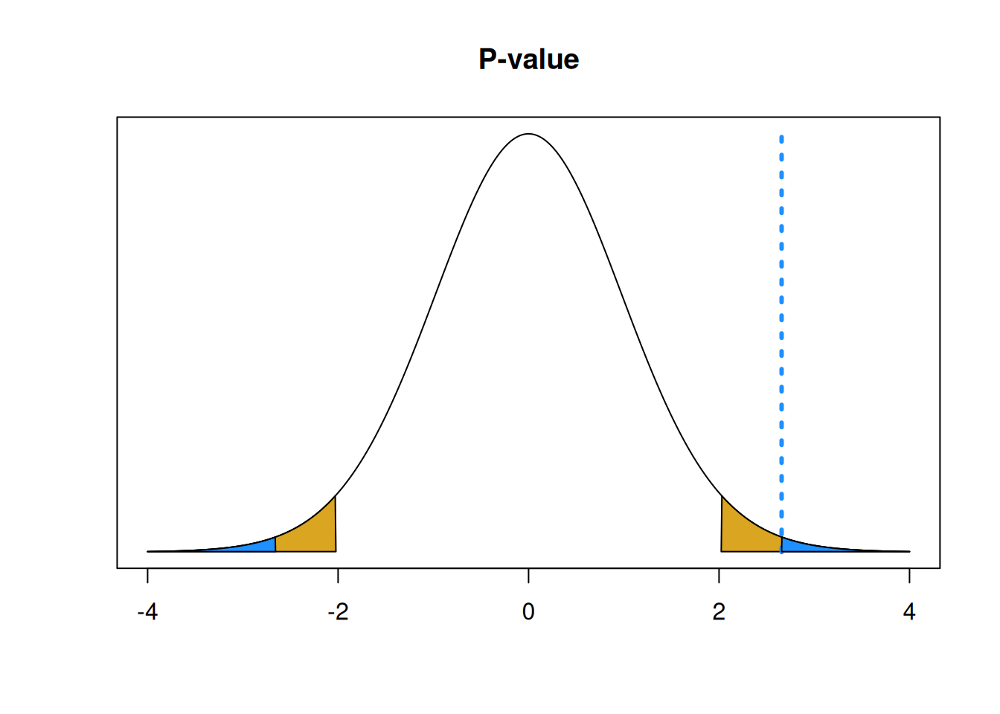

One important consideration is that we have to calculate the area in *both* tails, not just the upper tail.  So we need the area above 2.664 and the area below -2.664.  In this way, we can consider the possibility of our test statistic being far from 0 in *both* directions.


```r
x <- seq(-4, 4, by = .01)
y <- dt(x, df = 39)

plot(x, y, type = "l",
     ylab = "", yaxt = "n", xlab = "", 
     main = "P-value") +
        polygon(c(x[x>=2.023], 2.023), c(y[x>=2.023], y[x==max(x)]), col="goldenrod") +
        polygon(c(x[x<=-2.023], -2.023), c(y[x<=-2.023], y[x==max(x)]), col="goldenrod")
```

```
## integer(0)
```

```r
segments(2.657, 0, 2.657, .4, lty = 3, lwd = 3, col = "dodgerblue")
polygon(c(x[x>=2.657], 2.657), c(y[x>=2.657], y[x==max(x)]), col="dodgerblue") +
        polygon(c(x[x<=-2.657], -2.657), c(y[x<=-2.657], y[x==max(x)]), col="dodgerblue")
```


```
## integer(0)
```

We can find an area/probability on the T distribution by using the R function `pt` (probability T).  The syntax is very similar to `pnorm`, but we do need to specify the T degrees of freedom.  The seedlings p-value is 
$$pval \;=\; P(T_{39} < -2.664) \;+\; P(T_{39} > 2.664) = 0.011.$$


```r
pt(-2.664, df = 39) + 
  pt(2.664, df = 39, lower.tail = F)
```

```
## [1] 0.01116862
```

Since the T distribution is symmetric around 0, we can also find the p-value by doubling the area outside of the test statistic in the upper tail.


```r
2*pt(2.664, df = 39, lower.tail = F)
```

```
## [1] 0.01116862
```

---

To interpret a p-value, we compare it to our chosen $\alpha$.  The p-value is interpreted as the probability of seeing our data or something more extreme under the null.  So a smaller p-value means we have stronger evidence against the null.  Our p-value of 0.011 is smaller than our chosen $\alpha = 0.05$, so we have strong evidence against the null hypothesis.

This is the same conclusion we reached when we used a rejection region.  The test statistic will fall in the $\alpha$ level rejection region exactly when the p-value is less than $\alpha$.

Note that the choice of $\alpha$ is very important.  With $\alpha = 0.05$, we decided to reject the null hypothesis.  But if we chose $\alpha = 0.01$, we would come to the opposite conclusion.  It's important to chose an $\alpha$ level before seeing your data.

---

It's important to word test conclusions carefully.  If the test statistic indicates that the null is likely false (like the seedlings), we *reject* $H_0$.  If the test statistic does not offer enough evidence against the null, then we *fail to reject* $H_0$.  

:::: {.infobox .warn data-latex=""}
We cannot say that we "accept" the null hypothesis.  Since we start by assuming $H_0$ is true, our test can't find evidence for $H_0$, only against it.  The null is not guaranteed to be true regardless of our test result.
::::

---

We can use R to automatically check our with the `t.test` function.  Input the data, set a significance level, and make sure to set $\mu_0 = 1.5$.


```r
seedlings <- c(2.6, 1.9, 1.8, 1.6, 1.4, 2.2, 1.2, 1.6, 1.6,
               1.5, 1.4, 1.6, 2.3, 1.5, 1.1, 1.6, 2.0, 1.5,
               1.7, 1.5, 1.6, 2.1, 2.2, 1.0, 1.2, 1.2, 1.8,
               1.7, 0.8, 1.5, 2.0, 2.2, 1.5, 1.6, 2.2, 2.1,
               1.6, 1.7, 1.7, 1.2)

t.test(seedlings, mu = 1.5, alternative = "two.sided",
       conf.level = 0.95)
```

```
## 
## 	One Sample t-test
## 
## data:  seedlings
## t = 2.6573, df = 39, p-value = 0.01136
## alternative hypothesis: true mean is not equal to 1.5
## 95 percent confidence interval:
##  1.538808 1.786192
## sample estimates:
## mean of x 
##    1.6625
```

The results are the same as what we got by hand, up to rounding.

---

Our seedlings example specifically tested $\mu = 1.5$, so let's talk about how to use this method more generally.

:::: {.infobox .deff data-latex=""}
In general, hypotheses for a one-sample T test will look like
$$H_0: \mu = \mu_0 \quad\text{versus}\quad H_A: \mu \neq \mu_0.$$
The test statistic is 
$$T = \frac{\bar{X} - \mu_0}{S/\sqrt{n}}$$
and we complete our test with a rejection region or p-value on the T with $n-1$ degrees of freedom.
::::


Let's consider a new exmaple. Researchers are exploring methods for preventing frost damage to orchards. The mean soil heat flux for plots covered with grass is $\mu_0 = 30$ units. An alternative method is to use coal dust to cover. Heat flux measurements of 8 plots covered with coal dust yielded the following data:


```r
flux <- c(28.7, 29.9, 30.0, 31.0, 31.7, 32.4, 33.0, 35.1)
```

:::: {.infobox .exer data-latex=""}
Researchers are interested to see if the mean heat flux is different for coal dust than it is for grass. Perform a hypothesis test at $\alpha=0.05$ to answer this question. 

- Write down the null and alternative hypothesis that could be used to answer the resarchers' question.

<span style="color:#8601AF">
We want to know whether the heat flux is different than the grass, which has a heat flux of $\mu_0 = 30$.   So, we use hypotheses
$$H_0: \mu = 30 \quad\text{versus}\quad H_A: \mu \neq 30$$
where $\mu$ is the true mean heat flux for coal dust.  The alternative hypothesis represents the coal dust and grass methods being different.
</span>

- Check that the necessary assumptions for performing a T test are met.

<span style="color:#8601AF">
For the T test to be valid, we need to assume the observations are independent, which we can't check formally.  We also need to check normality, which we can do with a histogram and qq-plot of the data.
</span>


```r
par(mfrow = c(1, 2)) # View 2 plots at once

hist(flux)
qqnorm(flux); qqline(flux)
```

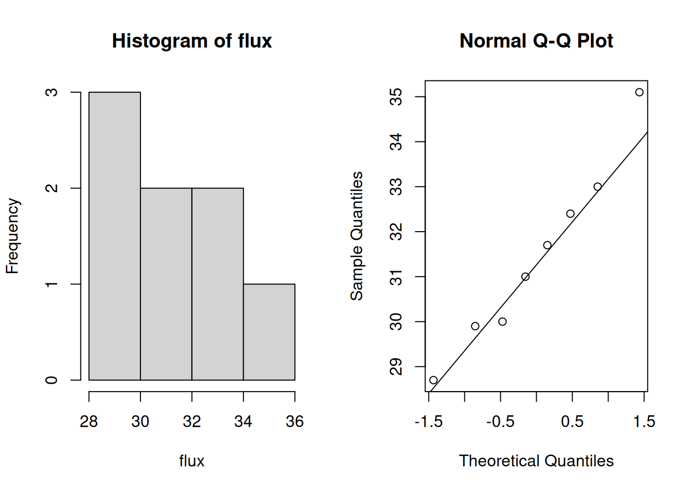

```r
par(mfrow = c(1, 1))
```

<span style="color:#8601AF">
Although the sample size is small, we don't see any serious departures from normality.  So a T test will be an appropriate test for this data.
</span>

- Calculate the observed T test statistic for this data.

<span style="color:#8601AF">
Let's first get the summary statistics from our data.
</span>


```r
mean(flux); sd(flux)
```

```
## [1] 31.475
```

```
## [1] 2.033821
```

<span style="color:#8601AF">
The observed test statistic is 
$$t_{obs} \;=\; \frac{\bar{x} - \mu_0}{s/\sqrt{n}} \;=\; \frac{31.475 - 30}{2.034/\sqrt{8}} \;=\; 2.051.$$
</span>

- Make a decision about your hypotheses using a rejection region or a p-value.

<span style="color:#8601AF">
If $H_0$ is true, then $t_{obs}$ was drawn from a T distribution with $n-1 = 7$ degrees of freedom.  We have $\alpha = 0.05$, so our rejection region will have area $\alpha$ in the tails of the $T_{n-1}$ curve.  We need to cut off area $0.025$ in each individual tail.
</span>


```r
qt(0.025, df = 7)
```

```
## [1] -2.364624
```

```r
qt(0.975, df = 7)
```

```
## [1] 2.364624
```

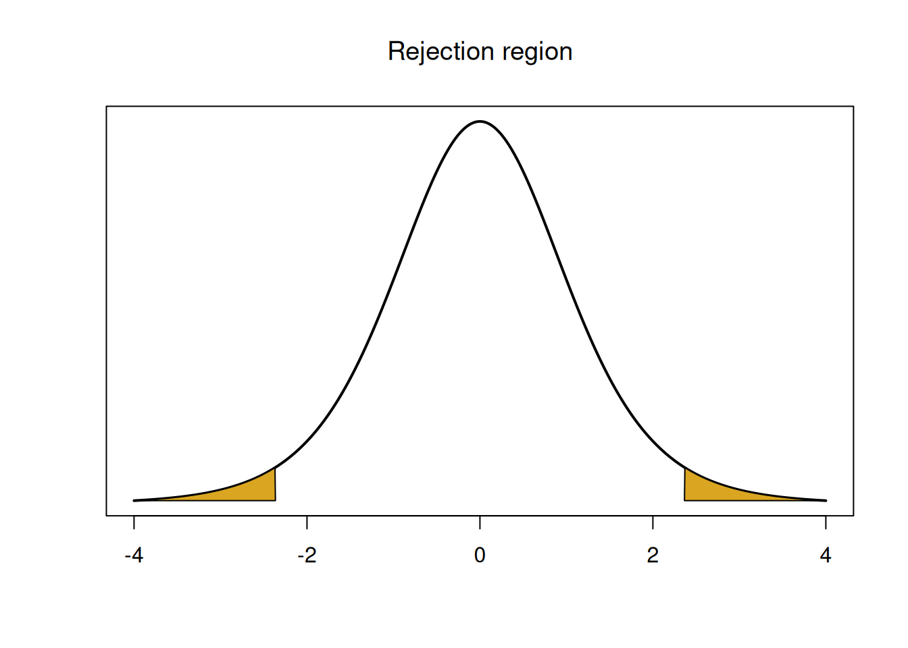

```
## integer(0)
```

<span style="color:#8601AF">
The rejection region is the area below -2.365 and the area above 2.365.  Our test statistic 2.051 is between the two values, so it falls in the middle of the $T_7$ peak, and so we do not reject the null.  We can also find a p-value by calculating the area outside of 2.051 on the $T_7$ curve, in both tails.
</span>


```r
2*pt(2.051, df = 7, lower.tail = F)
```

```
## [1] 0.07941309
```

<span style="color:#8601AF">
The p-value 0.079 is greater than our $\alpha = 0.05$ so we do not reject the null. We do not have significant evidence that the mean heat flux of coal dust is different from 30.
</span>
::::

## Errors

Consider the seedling hypotheses we tested earlier:
$$H_0: \mu = 1.5 \quad\text{versus}\quad H_A: \mu \neq 1.5$$
We can think about all of the possible outcomes that might happen when we perform a hypothesis test.  Based on our data, we either reject or fail to reject the null.  But that does not tell us the true value of $\mu$.  As a matter of fact, $\mu$ is either equal to 1.5 or not equal to 1.5.  Either the null or the alternative is actually true.  So we get a two-way table of possibilities.

|   | Fail to reject | Reject |
|:---:|:---:|:----:|
| $H_0$ true | | |
| $H_0$ false | | |

:::: {.infobox .exer data-latex=""}
Label each of the four squares above as a correct decision or an error.

<span style="color:#8601AF">
If $H_0$ is actually true, the correct decision is to fail to reject, and rejecting the null would be an error  But if $H_0$ is actually false, then the correct decision is to reject, and failing to reject would be an error.

|   | Fail to reject | Reject |
|:---:|:---:|:----:|
| $H_0$ true | Correct | Error! |
| $H_0$ false | Error! | Correct |
</span>
::::

There are two different types of errors that might occur when doing a hypothesis test.  However, these two errors are different.  

---

If $H_0$ is actually true, but we reject it, we mistakenly concluded the "interesting" result when it actually isn't there.  This is a *false positive* error.

:::: {.infobox .deff data-latex=""}
In statistics, a false positive is called a **type I error**, or $\alpha$ error.  It is the probability that we reject the null, given that it is actually true.
$$\alpha \;=\; \mathbb{P}(\text{Reject }H_0 \;|\; H_0 \text{ true})$$
::::

Since $\alpha$ is something we set ourselves, we can decide exactly what type I error rate we want.

---

If $H_0$ is actually false, but we fail to reject it, we mistakenly decided on the "uninteresting" result. This is a *false negative* error.

:::: {.infobox .deff data-latex=""}
In statistics, a false negative is called a **type II error**, or $\beta$ (beta) error.  It is the probability that we reject the null, given that it is actually true.
$$\beta \;=\; \mathbb{P}(\text{Not reject }H_0 \;|\; H_0 \text{ false})$$
::::

The probability of making a type II error cannot be set by hand, but we can calculate it with a little bit of work.  In order to do this, we must specify a specific value of the parameter under the alternative hypothesis.

The quantity $1-\beta$ is the power of our test, which is the *true positive* rate.  This is the probability that our test successfully identifies an interesting result and leads us to reject $H_0$.

:::: {.infobox .deff data-latex=""}
Formally, **power** is given by 
$$1-\beta \;=\; \mathbb{P}(\text{Reject }H_0 \;|\; H_0 \text{ false})$$
::::

---

To summarize:

| Type I | Type II |
|:------:|:-------:|
| $\alpha$ | $\beta$ |
| Reject $H_0$ but $H_0$ true | Don't reject $H_0$ but $H_0$ false |
| False positive | False negative |

There is an inherent tradeoff between $\alpha$ and $\beta$.  We want both types of errors to be small, because we like making the correct decision.  If we set $\alpha$ to be small, then we are saying that we want to avoid making a false positive error by making it more difficult to reject $H_0$.  But in order to do that, we have to make it more difficult to discover a true positive result, which makes $\beta$ larger.

On ther other hand, if we want a more powerful test that is more likely to reject $H_0$, then we also have a higher likelihood to incorrectly reject the null. We would have to have $\alpha$ be larger.

## One-sided tests

Let's start with a new example. A certain type of pumpkin seed is advertised to grow 8 lb pumpkins.   A farmer suspects the mean weight of her pumpkins of that type is larger than 8, so she weighs a sample of 20 pumpkins.  What hypotheses should she use? 

The important consideration is that she specifically wants to know if the pumkin weights are *larger* than 8 lbs, not just *different*.  We should set the alternative hypothesis to represent what we are trying to find.  If $\mu$ is the mean pumpkin weight, we would have hypotheses

$$H_0: \mu \le 8 \quad \text{versus} \quad H_A: \mu > 8.$$

These hypotheses are asymmetric, because the alternative only accounts for the positive direction.  They are one-sided.

:::: {.infobox .deff data-latex=""}
**One-sided** or **one-tailed** tests only look for an effect in one specific direction (either positive or negative).  The alternative will have either the $>$ or $<$ symbol.
::::

If we were performing a two-sided hyothesis test, we would instead use

$$H_0: \mu = 8 \quad \text{versus} \quad H_A: \mu \neq 8.$$

This pair of hypotheses is symmetric and can detect an effect in both directions.

:::: {.infobox .deff data-latex=""}
**Two-sided** or **two-tailed** tests look for an effect in both the positive and negative directions.  The alternative will have the $\neq$ symbol.
::::

---

Let's analyze the one-sided hypotheses above using a T test with $\alpha = 0.05$.   The null distribution for a one-sided test is still $T_{n-1}$, or $T_{19}$ in this case.   But the rejection region is different.

Previously, when we performed a two-sided test, we found a rejection region by taking the significance level $\alpha$ and splitting it up into two tails, each with area $\alpha/2$.

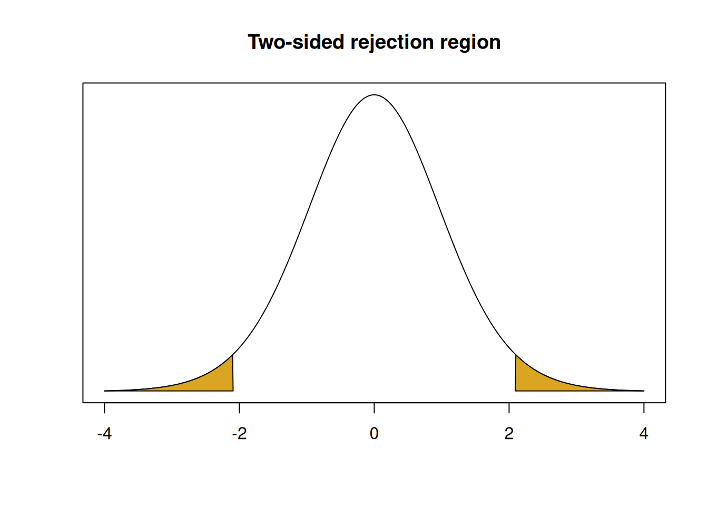

```
## integer(0)
```

But with our one-sided hypotheses, we are only looking for a positive effect.

$$H_0: \mu \le 8 \quad \text{versus} \quad H_A: \mu > 8.$$

When we build a rejection region, it will still have area $\alpha$.  But, it will be entirely in the upper tail of the null distribution.  Negative test statistics don't give us evidence that $\mu > 8$, only positive test statistics do.  So our rejection region will cut off area 0.05 in the upper tail of the $T_{19}$ curve.

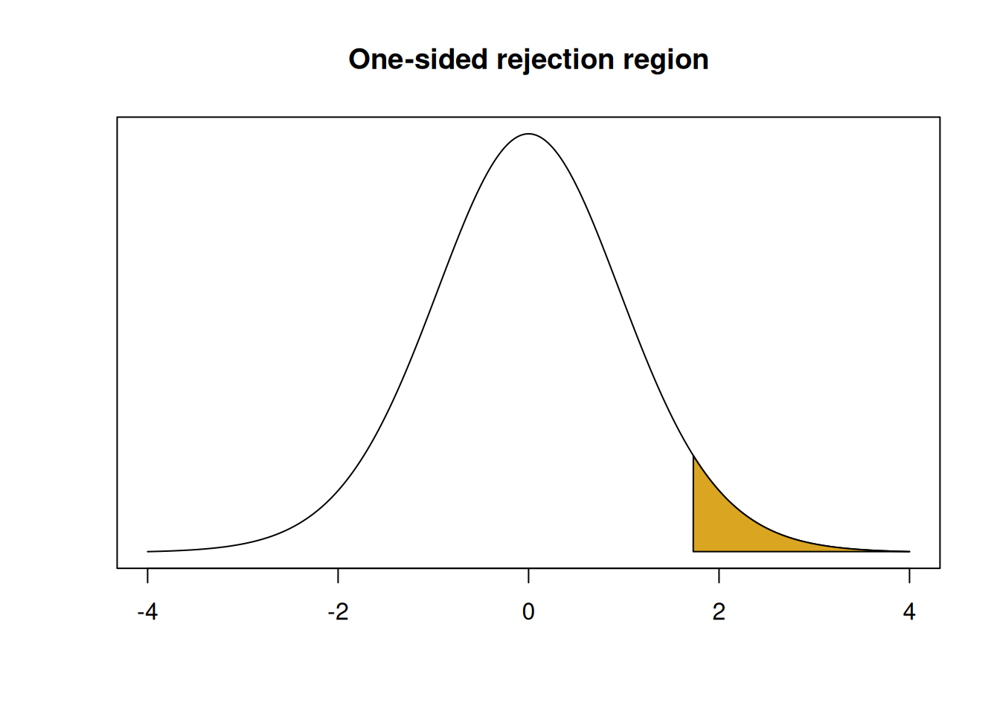

```
## integer(0)
```

Since there is 0.05 area above and 0.95 area below, this rejection region is defined by the 95th percentile of the null distribution, which can be found with `qt`.

The p-value is also calculated differently for a one-sided test.  When we did a two-sided test, we had to find the area outside of $t_{obs}$ in both tails.  For our one-sided test, which is looking for a positive result, we only need to consider the upper tail.  So we just need the area above $t_{obs}$.  Bigger positive test statistics give us stronger evidence against the null.

If our alternative said that $\mu$ is less than some $\mu_0$, our p-value would be the area below $t_{obs}$.  In this case, a more negative test statistic gives us stronger evidence against the null.

---

Back to the pumpkin example, with hypotheses
$$H_0: \mu \le 8 \quad \text{versus} \quad H_A: \mu > 8.$$
Suppose the farmer calculates the following test statistic.
$$t_{obs} \;=\; \frac{\bar{x} - 8}{s/\sqrt{n}} \;=\; 1.219$$

:::: {.infobox .exer data-latex=""}
- Find the $t_{19, 0.05}$ critical value that creates the rejection region.

<span style="color:#8601AF">
To make a 5% level rejection region in the upper tail of our null distribution, we need to find the 95th percentile of $T_{19}$.  This is 1.729, according to R.
</span>


```r
qt(0.95, df = 19)
```

```
## [1] 1.729133
```


- Complete the T test.  Do we reject or fail to reject $H_0$?

<span style="color:#8601AF">
We see that our observed test statistic 1.219 is smaller than the rejection region threshold of 1.729.  So the statistic is not in the rejection region, and it does not give us sufficient evidence against the null.
</span>

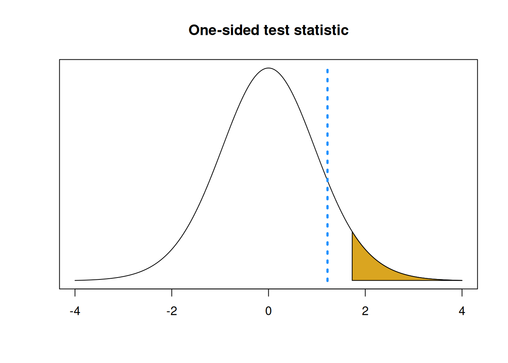

```
## integer(0)
```


- Calculate a corresponding p-value.

<span style="color:#8601AF">
Since we are specifically looking for a positive result, a bigger test statistic will give us stronger evidence against the null.  So, when calculating a p-value, we need to find the area above $t_{obs}$ on our null distribution.  This is 0.119.  Notice in the R code below, we don't multiply the probability by two.
</span>


```r
pt(1.219, df = 19, lower.tail = F)
```

```
## [1] 0.1188814
```

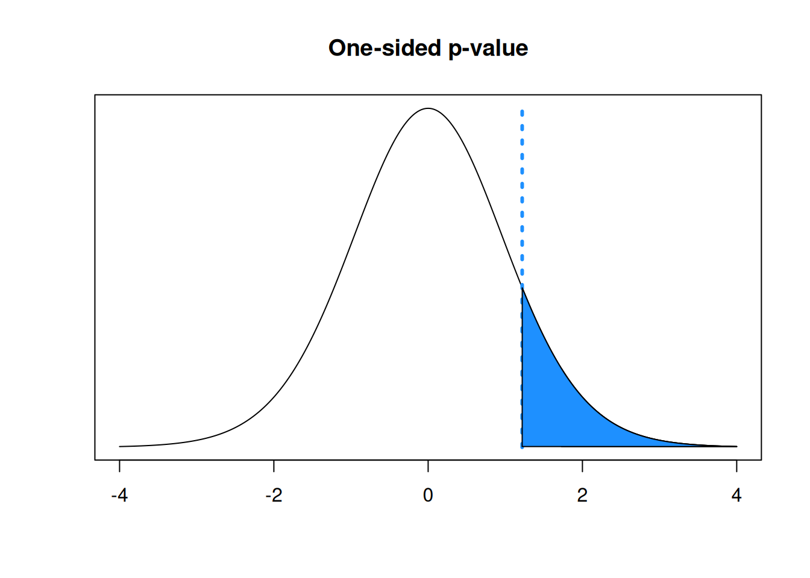

```
## integer(0)
```


We conclude that the mean pumpkin weight is not significantly greater than 8 lbs. 
::::

---

Notice that if we had done a two-sided test with $H_A: \mu \neq 8$, we would've had to find the p-value by calculating the area outside $t_{obs}$ in both tails.  This would give us a p-valuue that is twice as big as the one-sided p-value.


```
## integer(0)
```

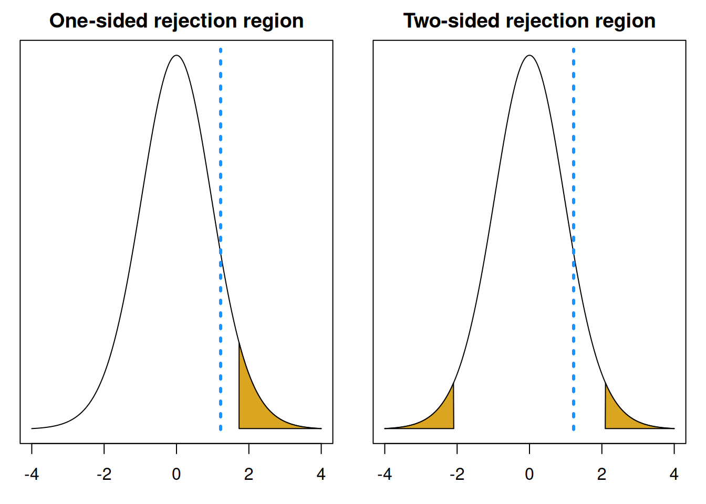

```
## integer(0)
```

```
## integer(0)
```

```
## integer(0)
```

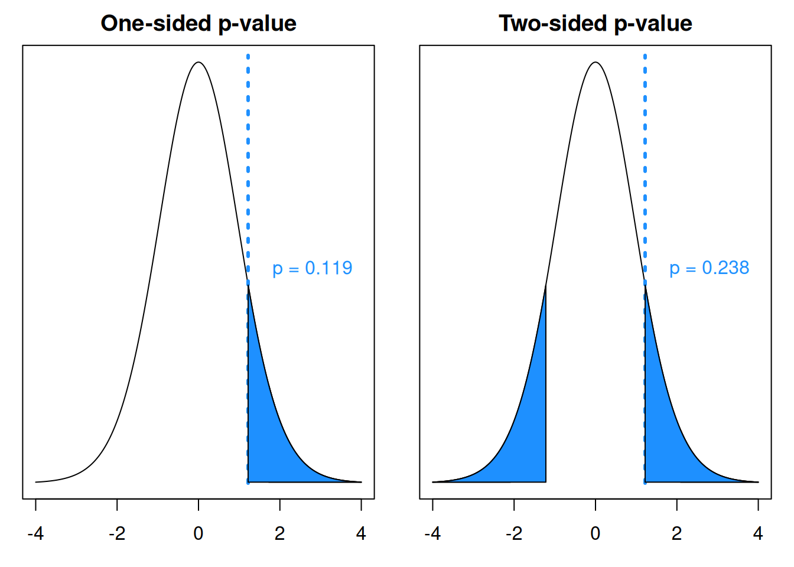

---

In general, the test statistic and null distribution are the same for a one-sided versus a two-sided test.  But the p-value calculation is different.

:::: {.infobox .deff data-latex=""}
To find a p-value: 

- If the alternative looks like $H_A: \mu < \mu_0$, the p-value is the area *below* the test statistic. 
- If the alternative looks like $H_A: \mu > \mu_0$, the p-value is the area *above* the test statistic.
- If the alternative looks like $H_A: \mu \neq \mu_0$, the p-value is $2\times$ the area *outside* of the test statistic.
::::

:::: {.infobox .pond data-latex=""}
If we do a one-sided test, will the p-value always be half as large as the two-sided p-value?
::::

## One-sample Z test

Another type of test for a population mean $\mu$ is the one-sample Z test.  Mechanically, this is extremely similar to the one-sample T test, but it uses the standard normal instead of the T as a null distribution.

When should we use this test, as opposed to a T test?  The choice of test is exactly the same as choosing between a T and Z confidence interval.  A Z test can be done when we have normal data, and $\sigma$ is known exactly or $n$ is large enough that we can use $s$ instead of $\sigma$.

We analyzed the pine seedling data with a T test and got a test statistic of 2.664 and a p-value of 0.011.  Let's analyze the same hypotheses with a large-sample Z test with $\alpha = 0.05$.  We want to know if the mean seedling height is different from 1.5.

$$H_0: \mu = 1.5 \quad \text{versus} \quad H_A: \mu \neq 1.5$$

---

The Z test statistic is very similar to the T test statistic, except it uses $\sigma$ instead of $s$.

$$Z \;=\; \frac{\bar{X} - \mu_0}{\sigma/\sqrt{n}}$$

If the true mean $\mu$ is equal to $\mu_0$, then the test statistic $Z$ has a standard normal distribution.  So we use the standard normal curve as a null distribution to evaluate our evidence against the null.  If our test statistic is far from 0 and lands in the tails of the normal curve, then we think the null hypothesis may not be true.

For the seedlings data, $n$ is probably large enough that the observed $s$ is a good estimate for the true standard deviation $\sigma$.  So, our Z test statistic is

$$z_{obs} \;=\; \frac{\bar{x} - \mu_0}{s/\sqrt{n}} \;=\; \frac{1.663 - 1.5}{0.387/\sqrt{40}} \;=\; 2.664.$$

This is the same test statistic as the one we used for the T test.  But now, we are making the assumption that the value 2.664 was drawn from a standard normal bell curve.

---

We use a rejection region or p-value to make a decision about our hypotheses.  The rejection region has area $\alpha = 0.05$ in both tails, since we're doing a two-sided test.  So each tail will have area $\alpha/2 = 0.025$.

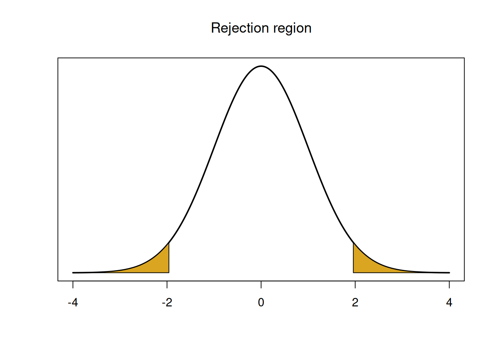

```
## integer(0)
```

We can calculate the rejection region in R by finding the 2.5 and 97.5 percentiles of the normal curve.


```r
qnorm(0.025)
```

```
## [1] -1.959964
```

```r
qnorm(0.975)
```

```
## [1] 1.959964
```

Notice that the value 1.96 is the same as the critial value we would use to build a 95% Z confidence interval.

For our test at the 5% level, we decide to reject if the test statistic is less than -1.96 or greater than 1.96.  Our test statistic of 2.664 falls in this upper rejection region.  Because the test statistic is very far in the tails, it is considered "extreme" compared to the normal curve.  So, we decide to reject the null.


```
## integer(0)
```

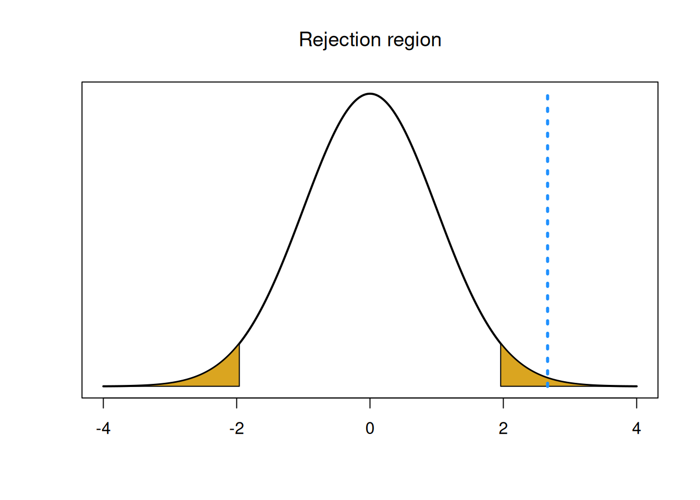

---

We can also make a decision by calculating a p-value.  The Z test p-value is calculated with the standard normal.  It is the area outside of our test statistic on the standard normal curve.  Since we're doing a two-sided test, we calculate this area in both tails.


```
## integer(0)
```

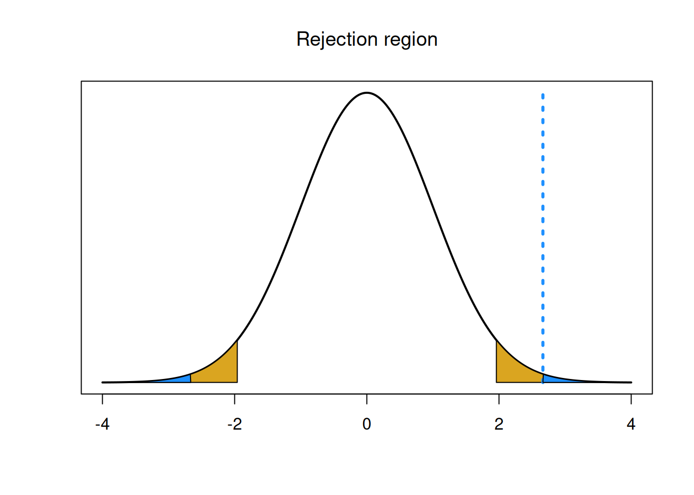

```
## integer(0)
```


```r
2*pnorm(2.664, lower.tail = F)
```

```
## [1] 0.007721756
```

We get a p-value of 0.008, which is smaller than the T test p-value.  We still come to the conclusion that we reject the null and conclude that the mean seedling height is significantly different from 1.5 cm.

This was an example of a two-sided Z hypothesis test. but we can also test one-sided hypotheses by looking at a specific direction when finding the rejection region and p-value.

---

Let's discuss the connections between hypothesis tests and confidence intervals.  For the seedlings data, the T hypothesis teset and T CI agreed with each other.

- The value $\mu_0 = 1.5$ is not in the 95% T interval (1.539, 1.787).
- We rejected $\mu_0 = 1.5$ in a T hypothesis test at the 5% level.

The same is true of the Z hypothesis test and Z CI we made on the same data.

- The value $\mu_0 = 1.5$ is not in the 95% Z interval (1.543, 1.783).
- We rejected $\mu_0 = 1.5$ in a Z hypothesis test at the 5% level.

The conclusions of the hypothesis tests correspond to those from the same type of CI, provided that we use the same $\alpha$ level.  So, rejecting $\mu_0$ with significance level $\alpha$ means that the $100(1-\alpha)$% CI will not contain the value $\mu_0$.  The methods are very similar and both of them are based on the properties of $\bar{X}$.

:::: {.infobox .deff data-latex=""}
Formally, the following 2 statements are equivalent for two-sided Z and T CIs and hypothesis tests for $\mu$:

- A $100(1-\alpha)\%$ CI will contain the hypothesized value $\mu_0$.
- A two-sided test for $H_A: \mu \neq \mu_0$ at level $\alpha$ fails to reject $H_0$.

These statements are either both simultaneously true (the non-significant result) or both simultaneously false (the significant result).
::::

## Power

In our discussion of hypothesis testing errors, we briefly covered power.  Power is the "true positive rate", which is the probability that we correctly reject a false null hypothesis.  It's the opposite of $\beta$, the "false negative rate", which is the probability that we incorrectly fail to reject a false null hypothesis.
$$\text{Power} \;=\; 1-\beta \;=\; \mathbb{P}(\text{Reject }H_0 \;|\; H_0 \text{ false})$$

We can interpret power as the ability of our test to identify an interesting result.  We can calculate the theoretical power of a hypothesis test by following a few specific steps.  Let's look at the two-sided Z hypothesis test for the seedlings data, with hypotheses
$$H_0: \mu = 1.5 \quad \text{versus} \quad H_A: \mu \neq 1.5.$$
Notice that the alternative hypothesis covers infinitely many different values of $\mu$.  So in order to calculate power, we need to specify a value of $\mu$ under the alternative, $\mu_A$.

Let's specify $\mu_A = 1.6$.  Power is the probability that we correctly reject $\mu_0 = 1.5$, if the true mean were actually 1.6.  Essentially, we are evaluating whether our hypothesis test can do a good job detecting a change of 0.1 cm.

---

A hypothesis test is based on the distribution of the test statistic (such as $Z$) under the null.  But for calculating power, it is more convenient to consider the sampling distribution of the sample mean itself, $\bar{X}.$  Our test statistic is a function of $\bar{X}$:
$$Z \;=\; \frac{\bar{X} - \mu_0}{\sigma/\sqrt{n}}.$$
There are some values of $\bar{X}$ that lead to us rejecting the null when we plug them into the test statistic formula.

What are all the possible values of $\bar{X}$?  We know that the general sampling distribution for a sample mean (assuming normality) is 
$$\bar{X} \sim N\Big(\mu, \sigma^2\Big).$$
If the null hypothesis is true, then that means $\mu = \mu_0 = 1.5$.  But if the alternative is true, then $\mu = \mu_A = 1.6$.  So the sampling distribution of $\bar{X}$ is different depending on whether the null or alternative is true.  \begin{align}
\text{Null distribution of }\bar{X}: \quad & N\Big(\mu_0,\; \frac{\sigma^2}{n}\Big) \;=\; N\Big(1.5,\; \frac{0.387^2}{40}\Big) \\
\text{Alt distribution of }\bar{X}: \quad & N\Big(\mu_A,\; \frac{\sigma^2}{n}\Big) \;=\; N\Big(1.6,\; \frac{0.387^2}{40}\Big)
\end{align}

---

Here is a visual of the null distribution of $\bar{X}$:

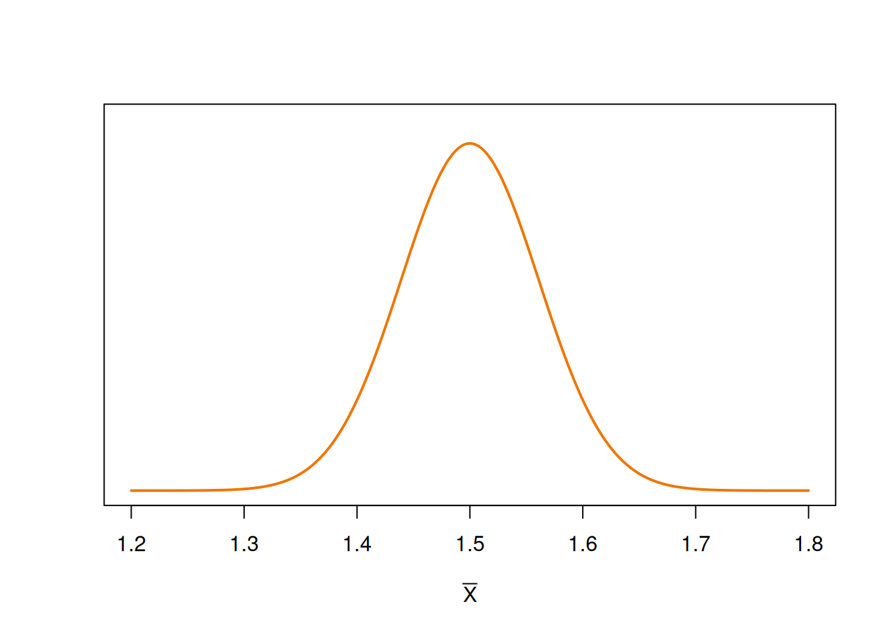

Here is the null with the alternative:


```
## integer(0)
```

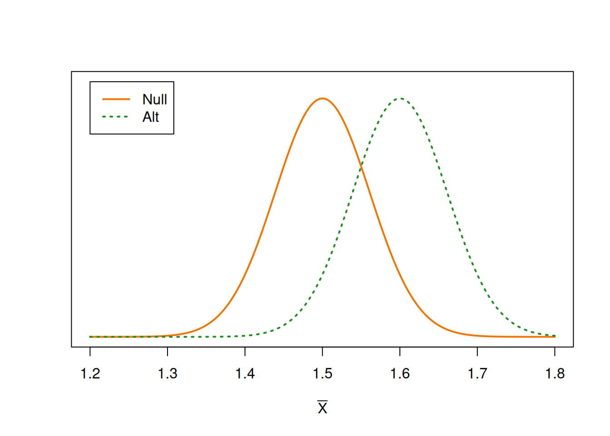

The null and alternative distributions are the same curve, shifted relative to each other.  The centers are 0.1 cm apart, which is the difference between $\mu_0$ and $\mu_A$.

---

Our goal is to calculate power, which is the probability that we correctly reject $H_0$, given that $H_A$ is true.  First, we need to identify when we reject the null.  What values of $\bar{X}$ lead us to reject the null hypothesis?  If $\bar{X}$ is far enough away from 1.5, then we will eventually reject $\mu_0 = 1.5$.

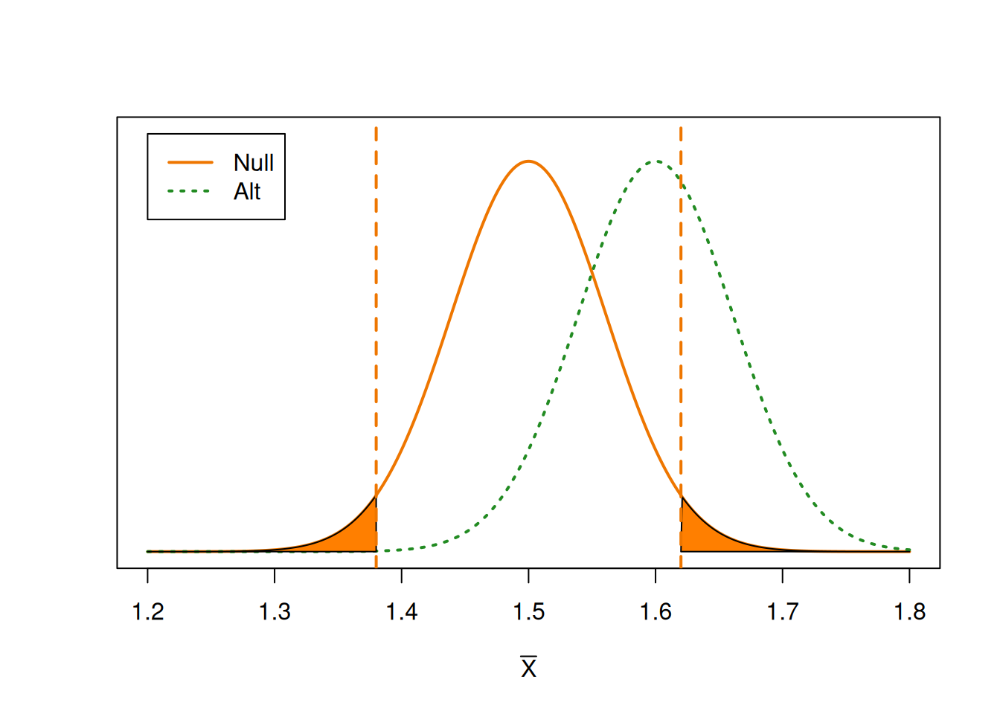

We can think of the vertical lines as "critical values" for $\bar{X}$.  It is analogous to a rejection region, but it is on the sampling distribution of $\bar{X}$ instead of the distribution of the test statistic $Z$.  

If $\bar{X}$ falls into the shaded areas, then it is considered an extreme enough result that we want to reject the null value of 1.5.  This region is on the null distribution and it has area $\alpha$.  But power is the probability that we reject the null, given the *alternative* is true.  So we need to find the probability that $\bar{X}$ falls in this region, based on the alternative curve.

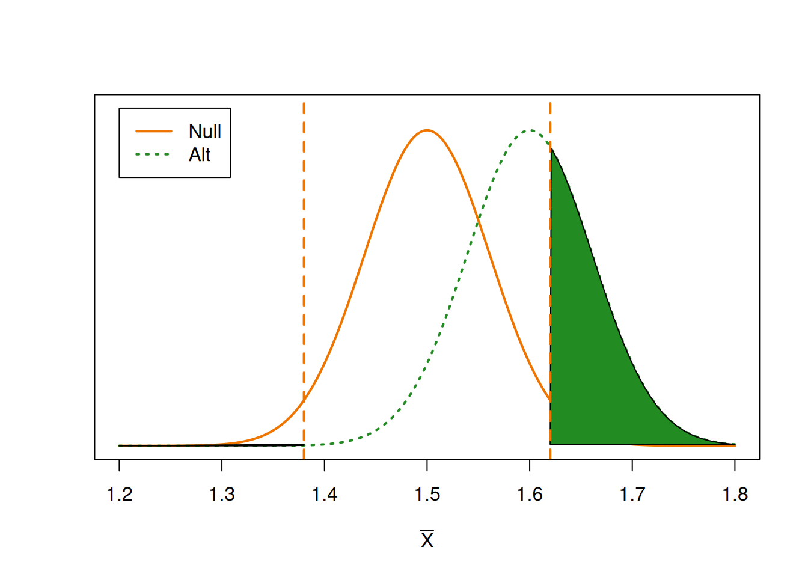

We have the same critical thresholds as before, but we are looking at the area on the alternative distribution.  This area is our power, i.e. our true positive rate.

---

Let's calculate the power of a 5% level Z test on the pine seedlings data, assuming $\mu_0 = 1.5$ and $\mu_A = 1.6$. Our first step is to find the rejection region in terms of $\bar{X}$ The rejection region of the $Z$ test statistic is 
$$Z \le -1.96,\quad Z \ge 1.96$$
$$\frac{\bar{X} - 1.5}{0.387/\sqrt{40}} \;\le\; -1.96,\quad \frac{\bar{X} - 1.5}{0.387/\sqrt{40}} \;\ge\; 1.96$$

:::: {.infobox .exer data-latex=""}
Use the Z statistic rejection region to find the rejection region in terms of $\bar{X}$.

<span style="color:#8601AF">
To find the corresponding rejection thresholds for $\bar{X}$, we need to solve for $\bar{X}$.
\begin{align*}
\frac{\bar{X} - 1.5}{0.387/\sqrt{40}} &\le -1.96 \\
\bar{X} - 1.5 &\le -1.96\cdot \frac{0.387}{\sqrt{40}} \\
\bar{X} &\le -1.96\cdot \frac{0.387}{\sqrt{40}} + 1.5 \\
\bar{X} &\le 1.38
\end{align*}
</span>

<span style="color:#8601AF">
If $\bar{X}$ is less than 1.38, then it is far enough away from 1.5 to reject $H_0$.  Following the same reasoning, we find that we would also reject if $\bar{X} \ge 1.62$.  So 1.38 and 1.62 define the "rejection region" for $\bar{X}$.
</span>
::::

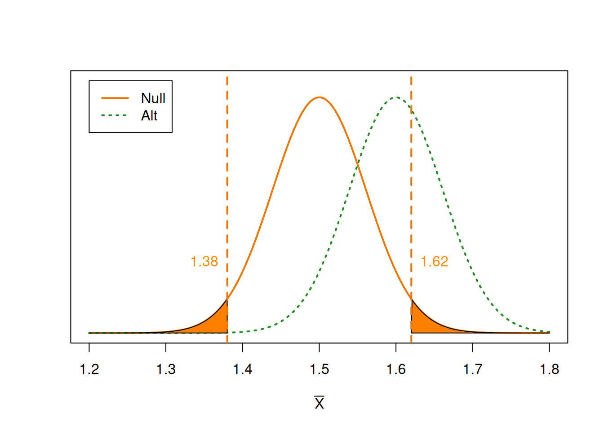

Now, we need to find 
\begin{align*}
\text{Power} &= 
\mathbb{P}(\text{Reject }H_0 \;|\; H_A) \\
&= \mathbb{P}(\bar{X} \le 1.38 \;|\; H_A) \;+\; \mathbb{P}(\bar{X} \ge 1.62 \;|\; H_A)
\end{align*}

We need to find the area outside of 1.38 and 1.62 on the alternative distribution.  This boils down to finding a normal probability on 
$$N\Big(1.6,\; \frac{0.387^2}{40}\Big).$$

:::: {.infobox .exer data-latex=""}
- Finish calculating the power of the pine seedlings Z test with $\alpha = 0.05$, $\mu_0 = 1.5$, and $\mu_A = 1.6$.

<span style="color:#8601AF">
We reject the null hypothesis if $\bar{X}$ is less than 1.38 or greater than 1.62.  Power is the probability that we reject under the alternative hypothesis, so we need to calculate the probability/area below 1.38 and above 1.62 on the alternative distribution of $\bar{X}$.
</span>


```r
pnorm(1.38, 1.6, 0.387/sqrt(40)) +
  pnorm(1.62, 1.6, 0.387/sqrt(40), lower.tail = F)
```

```
## [1] 0.3720525
```

<span style="color:#8601AF">
Our power is 0.372.  If the true mean height is 1.62, then we will only reject the null value of 1.5 37.2% of the time.  Our test has very low power for detecting a difference of 0.1 cm.
</span>

- What is the type II error rate $\beta$?

<span style="color:#8601AF">
The type II error rate is the probability that we incorrectly fail to reject the null when the null is actually false.  This is 1 - power, or $1-0.372 = 0.628$.  If the true mean height is 1.62, then we fail to reject the null value of 1.5 62.8% of the time.
</span>

::::

---

Our test has very low power.  How can we improve it?  Let's look at all of the terms that affect power.

- When $\mu_0$ and $\mu_A$ are farther apart, the test is more powerful.  The null and alternative distribution have more separation.
- When $\alpha$ is larger, the test is more powerful.  A large $\alpha$ means we are more willing to reject $H_0$.
- When $\sigma$ is smaller and $n$ is larger, the test is more powerful.  The null and alternative distributions are more concentrated around $\mu_0$ and $\mu_A$, respectively.

Which of these terms can we manipulate ourselves?  We choose $\mu_0$ and $mu_A$ based on what we want our test to do (e.g., detect a difference of 0.1 cm).  So it wouldn't make sense to change them to be further apart.

We can set $\alpha$ to be larger, but it is not good practice to set a very high false positive rate just to make our test more powerful.  We should stick with $\alpha = 0.05$ because we already decided it is appropriate.

We can't change $\sigma$, since that's a population parameter.  The last term that we can manipulate is $n$, the sample size.  Statisticians will typically choose a desired power level, and solve for the sample size required to achieve that power.

---

:::: {.infobox .deff data-latex=""}
It can be shown that the sample size required to have power $1-\beta$ for a two-sided test is 
$$n \;=\; \Big(\frac{\sigma(z_{\alpha/2}+z_{\beta})}{\mu_0 - \mu_A}\Big)^2.$$
::::

In the pine seedlings example, we are testing 
$$H_0: \mu = 1.5 \quad\text{versus}\quad H_A: \mu \neq 1.5$$
with $\alpha = 0.05$, $\mu_A = 1.6$ and $\sigma$ assumed to be 0.387.

:::: {.infobox .exer data-latex=""}
What sample size is required to have a power of at least 0.8?

<span style="color:#8601AF">
$\sigma, \mu_0$, and $\mu_A$ are already given directly.  So we just need to find the z-scores $z_{\alpha/2}$ and $z_{\beta}$.  $z_{\alpha/2}$ cuts of area $\alpha/2 = 0.025$ in upper tail of the standard normal curve.  This is 1.96.
</span>


```r
qnorm(0.975)
```

```
## [1] 1.959964
```

Since $\beta = 1-0.8 = 0.8$, $z_{\beta}$ will cut off area 0.2 in the upper tail of the standard normal curve.  This is 0.842.


```r
qnorm(0.8)
```

```
## [1] 0.8416212
```

So, the sample size required for our test to have power 0.8 is

$$n \;=\; \Big(\frac{\sigma(z_{\alpha/2}+z_{\beta})}{\mu_0 - \mu_A}\Big)^2 \;=\; \Big(\frac{0.387(1.96+0.842)}{1.5 - 1.6}\Big)^2 \;=\; 117.6.$$
Since our sample size has to be a whole number, we round up to 118 in order to get a guaranteed power of 0.8.
::::

:::: {.infobox .pond data-latex=""}
How would the power calculation and the sample size calculation change if we were doing a one-sided test instead of a two-sided test?
::::

## Bootstrap test

Just like a T and Z confidence interval, the T and Z hypothesis test methods both require the assumption that $\bar{X}$ is normal.  If we have non-normal data, then we can use the bootstrap method to approximate the sampling distribution of the T test statistic.  We are making an empirical approximation of the null distribution of
$$T = \frac{\bar{X} - \mu_0}{S/\sqrt{n}}$$
instead of using a T curve.

Here is the outline of a bootstrap hypothesis test:

1. Write a null and alternative hypothesis regarding $\mu$.

2. Compute $t_{obs}$ from the sample data.

3. Use the bootstrap to accumulate a large number ($B$) of $\hat{t}$ values and approximate the null distribution.

4. Calculate a p-value based on how many $\hat{t}$ values are more extreme than $t_{obs}$.

Steps 1 and 2 are exactly the same as the T test.  The third step, the bootstrap, is exactly the same as the bootstrap procedure for a CI.

So if we zoom in on step 3 above:

1. Collect an original sample and calculate the sample mean $\bar{x}$.

2. Draw an SRS of size $n$, *with replacement*, from the original sample. Call these observations $x_1^*, x_2^*,\ldots, x_n^*$.  Use the $*$ symbol to refer to re-sampled data.

3. Compute the mean and sd of the re-sampled data, $\bar{x}^*$ and $s^*$.

4. Compute the statistic
$$\hat{t} = \frac{\bar{x}^* - \bar{x}}{s^*/\sqrt{n}}$$

5. Repeat 2-4 many, many, times.

---

For the T and Z hypothesis tests, the null distribution was a smooth curve and we calculated a p-value based on the area under that curve.  But for the bootstrap, the null distribution is represented by a collection of discrete values.  So, our p-value calculation is based on the proportion of bootstrap $\hat{t}$ values that are more extreme than our observed test statistic.

:::: {.infobox .deff data-latex=""}
Specifically, let $m_u$ be the count of $\hat{t}$ values such that $\hat{t} > t_{obs}$, and let $m_{\ell}$ be the count of $\hat{t}$ values such that $\hat{t} < t_{obs}$.

- If $H_A: \mu < \mu_0$, then we want to look at the $\hat{t}$ values less than $t_{obs}$, so the p-value is $m_{\ell} / B$.
- If $H_A: \mu > \mu_0$, then we want to look at the $\hat{t}$ values greater than $t_{obs}$, so the p-value is $m_{u} / B$.
- If $H_A: \mu \neq \mu_0$, we are interested in both directions, so the p-value is 
$$\frac{2\cdot \min(m_u, m_{\ell})}{B}.$$ 
::::

Note that in the two-sided case, we have to calculate both one-sided p-values, and take 2 times whichever is smaller.

---

Let's perform a 5% level bootstrap test on the pine seedlings data, of the hypotheses
$$H_0: \mu = 1.5 \quad\text{versus}\quad H_A: \mu \neq 1.5.$$
Even though the seedlings data is normal, the bootstrap will still work.

Our observed test statistic is the same as before, $t_{obs} = 2.664$.  Now let's run the bootstrap code to generate 5000 $\hat{t}$ values.  You don't need to understand every bit of this code.


```r
# 1. Enter data and calculate original mean, n
seedlings <- c(2.6, 1.9, 1.8, 1.6, 1.4, 2.2, 1.2, 1.6, 1.6,
               1.5, 1.4, 1.6, 2.3, 1.5, 1.1, 1.6, 2.0, 1.5,
               1.7, 1.5, 1.6, 2.1, 2.2, 1.0, 1.2, 1.2, 1.8,
               1.7, 0.8, 1.5, 2.0, 2.2, 1.5, 1.6, 2.2, 2.1,
               1.6, 1.7, 1.7, 1.2)
x_bar <- mean(seedlings)
n <- length(seedlings)

# Create a vector to store t_hat values
t_hat <- numeric(5000)

set.seed(371)  # set RNG
# Bootstrap loop
for(i in 1:5000){
  # 2. Draw a SRS of size n from data
  x_star <- sample(seedlings, size = n, replace = T)
  
  # 3. Calculate resampled mean and sd
  x_bar_star <- mean(x_star)
  s_star <- sd(x_star)
  
  # 4. Calculate t_hat, and store it in vector
  t_hat[i] <- (x_bar_star - x_bar) / (s_star/sqrt(n))
}
```

Next, we'll use R to count how many of those $\hat{t}$ values are less than and greater than $t_{obs} = 2.664$.


```r
sum(t_hat < 2.664)
```

```
## [1] 4981
```

```r
sum(t_hat > 2.664)
```

```
## [1] 19
```

We have $m_{\ell} = 4981$ and $m_u = 19$.  So $t_{obs}$ is on the upper end of the generated null distribution.  We can visualize the bootstrap null distribution and test statistic with a histogram.

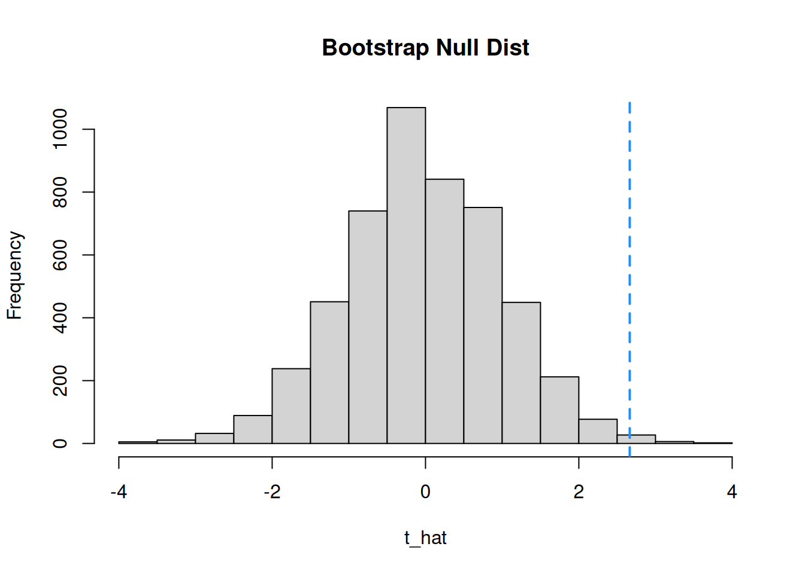

The minimum of $m_{\ell}$ and $m_u$ is $m_u = 19$.  So the bootstrap p-value is given by 
$$2 \cdot \frac{19}{5000} \;=\; 0.0076.$$
This is a small p-value that leads to us rejecting the null.  The result is very similar to the T and Z tests done on the same data.


:::: {.infobox .pond data-latex=""}
Why are the results of the T, Z, and bootstrap tests all very similar for this set of data?  Must this always be the case?
::::


