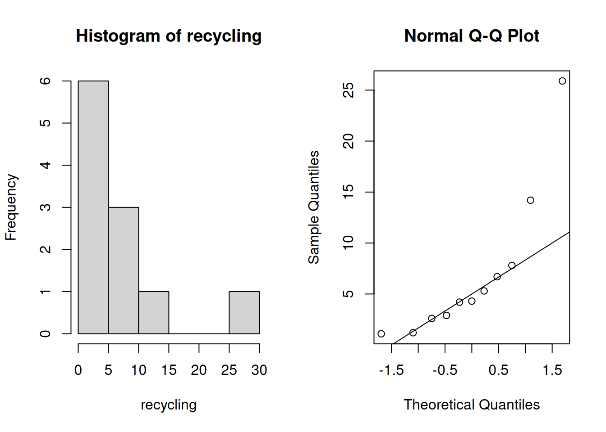
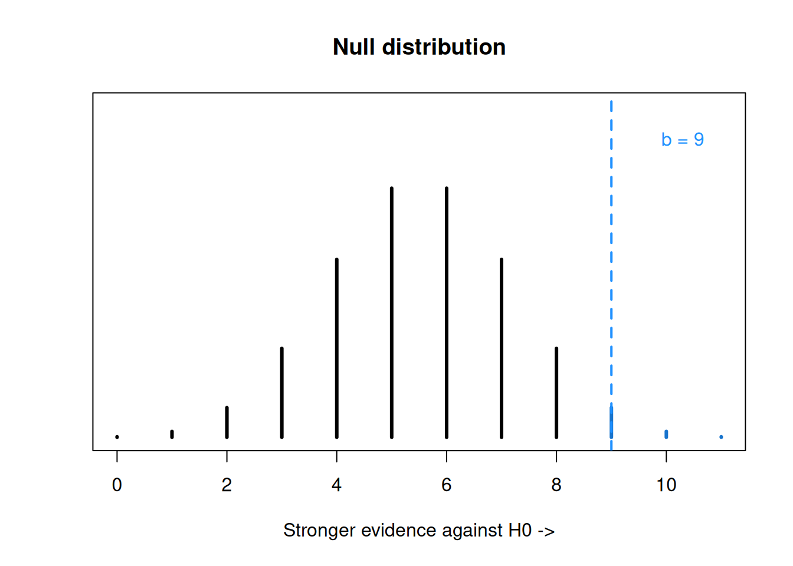

# Other ONe-Sample Tests


Chapter 7 covered three different methods (T test, Z test, and bootstrap test) for testing the value of the population mean, $\mu$.  However, we might have a different parameter of interest.  In this section, we'll cover two other tests, which can be used if we want to test a population proportion or population median.

## One-sample proportion test

How can we test a proportion parameter $\pi$? In chapter 6, we looked at ACL injury data for several athletes.  We might want to study whether ACL injuries are equally likely to occur to the left or right knee.  

We can represent this research question as formal statistical hypotheses.  Our parameter of interest is $\pi$, which is the true proportion of right knee injuries (as opposed to left).  The hypotheses are
$$H_0: \pi = 0.5 \quad \text{versus} \quad H_A: \pi \neq 0.5.$$
The null is the case where 50% of ACL injuries are to the right knee, i.e. right and left knee injuries are equally likely.  The alternative represents the case where the left and right knees are not equally likely to sustain an ACL injury.

To make inference on a population proportion $\pi$, we need to study the observed proportion $\hat{p}$.  In our data, we found that 45 out of 132 ACL injuries occurred to the right knee.  Does $\frac{45}{132}$ give us evidence against the null?  As before, we want to make a test statistic to compare $\hat{p}$ to $0.5$.  If $H_0$ is true, then we expect
$$\frac{\hat{p} - 0.5}{\text{standard error of }\hat{p}}$$
to be a small number.

---

Let's go into the details of how exactly the test statistic is calculated.  When we built a Z CI for the proportion, we used the CLT to approximate $\hat{p}$ as normal.  We'll do the same thing here, and develop a Z test for $\pi$.  For sufficiently large $n$,
$$\hat{p}\; \dot{\sim}\; N\Big(\pi, \frac{\pi(1-\pi)}{n}\Big).$$
This approximation is accurate when the number of observations in each group (right and left) are both greater than 5.  We have 45 and 87 observations, which is plenty.

When we perform a hypothesis test, we start by assuming that the null is true.  In this case, we have a null value of $\pi_0 = 0.5$.  So with $n = 132$, and assuming $H_0$, the distribution of $\hat{p}$ becomes
$$\hat{p}\; \dot{\sim}\; N\Big(0.5,\; \frac{0.5(1-0.5)}{132}\Big).$$
Remember that this specific normal distribution holds when $H_0$ is true.  We can standardize this quantity to get
$$Z \;=\; \frac{\hat{p} - 0.5}{\sqrt{\frac{0.5(1-0.5)}{132}}} \;\dot{\sim}\; N(0, 1^2),$$
If $H_0$ is true, then the statistic $Z$ follows a standard normal distribution.  So, we calculate an observed value of $Z$ from our data, and use the standard normal curve as our null distribution.  If our observed $Z$ is far enough in the tails of the normal curve, then we have evidence against $H_0$.

This test is approximate, but it still gives accurate results about $\pi$.

---

In the ACL injuries data, we have $n = 132$ and $\hat{p} = \frac{45}{132}$ for the observed proportion of right knee injuries.  We are trying to test the hypotheses
$$H_0: \pi = 0.5 \quad \text{versus} \quad H_A: \pi \neq 0.5$$
where $\pi$ is the true proportion of right knee injuries.

:::: {.infobox .exer data-latex=""}
Complete the Z hypothesis test on the ACL injuries data with $\alpha = 0.1$.

- Find the observed test statistic $z_{obs}$.

<span style="color:#8601AF">
Our observed proportion $\hat{p} = \frac{45}{132}$. So, the observed test statistic is 
$$z_{obs} \;=\; \frac{\frac{45}{132} - 0.5}{\sqrt{\frac{0.5(1-0.5)}{132}}} \;=\; -3.656.$$
Our test statistic is in the lower tail of the standard normal null distribution.
</span>


- Calculate the two-sided p-value using the standard normal distribution.  What conclusions do we make at the 10% level?

<span style="color:#8601AF">
The p-value is the area outside of our test statistic on the null $N(0, 1^2)$ distribution.  We also have to multiply this area by 2, to get the area outside the test statistic in both tails (since we're doing a two-sided test).
</span>


```r
2*pnorm(-3.656)
```

```
## [1] 0.0002561814
```

<span style="color:#8601AF">
R returns a very small p-value of 0.0003.  This p-value is much smaller than our chosen $\alpha$ of 0.1, so we reject $H_0$.  We have evidence that $\pi$ is not equal to 0.5, so we conclude that the left and right knees are not equally likely to sustain ACL injuries.
</span>

::::

:::: {.infobox .deff data-latex=""}
In general, to test hypotheses
$$H_0: \pi = \pi_0 \quad \text{versus} \quad H_A: \pi \neq \pi_0$$
we use a Z test statistic
$$Z = \frac{\hat{p} - \pi_0}{\sqrt{\frac{\pi_0(1-\pi_0)}{n}}}.$$
We complete our test by calculating a rejection region or p-value on the $N(0, 1^2)$ distribution.
::::

We can also perform a one-sided proportion Z test.  In this case, the test statistic formula is the same, but we calculate a p-value according to the direction of our alternative hypothesis.

---

Let's discuss the relationship between a proportion Z test and a proportion Z CI.  There is an important subtlety that we need to pay attention to.

When working with a population mean $\mu$, the conclusions from a hypothesis test will always correspond exactly to the conclusions from a CI.  For example, if a 95% T CI contains the value $\mu_0$, then a 5% level T test would fail to reject $\mu_0$.

:::: {.infobox .warn data-latex=""}
This is not exactly true when working with a proportion.  The proportion test and CI will almost always agree with each other, but that is not necessarily the case.  This is because the standard error is computed differently.
::::

When we are testing $H_0: \pi = \pi_0$, the standard error (the denominator of our test statistic) is
$$\sqrt{\frac{\pi_0(1-\pi_0)}{n}}.$$
This is because we are making the initial assumption that the true proportion is $\pi_0$.  But for the proportion CI, we are not making any initial assumptions about the true parameter value.  The standard error for a proportion Z CI is
$$\sqrt{\frac{\hat{p}(1-\hat{p})}{n}}.$$

So it is theoretically possible for a proportion test and CI to disagree, even with the same $\alpha$ value.


## Median test

When the population of interest is a population median (the middle value of the population), we have a technique called the sign test.  The sign teset is a bit different than the hypothesis tests we've covered so far, but it has the same general structure.  We calculate a test statistic from our data, then find a p-value based on a null distribution.

---

A city is considering starting a recycling program. If at least half of the households in the city produce 4.6 lbs or more recycleables per week, this program is worthwhile. \pause \\~\\ A sample of 11 households yields the following data for pounds of recycleables in the trash:
$$14.2,\; 5.3,\; 2.9,\; 4.2,\; 1.2,\; 4.3,\; 1.1,\; 2.6,\; 6.7,\; 7.8,\; 25.9$$

Let's explore this data visually by looking at a histogram and qq-plot.


```r
recycling <- c(14.2, 5.3, 2.9, 4.2, 1.2, 4.3,
               1.1, 2.6, 6.7, 7.8, 25.9)

par(mfrow = c(1, 2)) # View 2 plots at once

hist(recycling)
qqnorm(recycling); qqline(recycling)
```



```r
par(mfrow = c(1, 1))
```

The data appears to be very right-skewed, and the sample size is so small that the CLT probably won't help us with normality.  We've learned one method for analyzing non-normal data, the bootstrap. The bootstrap test is for a population mean $|mu$.

However, our research question is more appropriately stated in terms of the population median, $M$.  The statement, "at least half of the households in the city produce 4.6 lbs or more recycleables per week" is equivalent to the mathematical statement that the median recycables is greater than 4.6.

So, in formal statistical hypotheses, we want to perform the one-sided test of 
$$H_0: M \le 4.6\quad\quad\text{versus}\quad\quad H_A: M > 4.6$$
where $M$ is the true population median of weekly recyclables.  $H_0$ represents the case where the recycling program isn't worthwhile, and $H_A$ represents the case that it is worthwhile.

---

We use a tool called the sign test to analyze the hypotheses above.  Let's do this on the recycling data, with significance level $\alpha = 0.05$.  The test statistic for the sign test is not calculated directly based on the values of the data.  Instead, we are only concerned with whether the data points are above or below 4.6.

We start by assuming that our null hypothesis is true and the true median is 4.6.  What would the data look like, under this assumption.  We would expect about half of our 11 observations to be below 4.6, and about half of them to be above.  This is based on the assumption that 4.6 divides the population exactly in half.  

:::: {.infobox .deff data-latex=""}
In the sign test for the median, the test statistic $B$ is the count of all observations greater than the hypothesized median.
::::

In our recycling data:
$$14.2,\; 5.3,\; 2.9,\; 4.2,\; 1.2,\; 4.3,\; 1.1,\; 2.6,\; 6.7,\; 7.8,\; 25.9$$
we see that there are five values above 4.6 and six below, so the value of the observed test statistic is $b_{obs} = 5$.

The null distribution that we use to calculate a p-value is the binomial distribution.  Recall that a binomial RV is the count of successes in a fixed number of independent, binary trials.

We treat each of the 11 observations as a binary trial.  Each observation is either greater than 4.6, or less than 4.6.  They are independent and identical, since they are assumed to be iid draws from a population. So for our binomial null distribution, we use $n = 11$.

Now consider the success probability.  We consider a "success" to be an observation greater than 4.6.  What is the probability of this happening, under the null hypothesis?  The null says that 4.6 is the median, which means each observation has a 50-50 chance of being above or below.  So the success probability is $\pi = 0.5$.  

Our null distribution is $Binom(11, 0.5)$.

:::: {.infobox .warn data-latex=""}
Each data point must either be below or above the hypothesized median.  If there is a data point that is exactly equal to the null median (4.6 in this case), then it cannot be used for the test.  The data point must be ignored, and $n$ is adjusted accordingly.

For example, if we had 11 observations, and one of them was 4.6, we would use $Binom(10, 0.5)$ as the null distribution.
::::

---

We observed $b = 5$, but a sample of 11 could have anywhere fro 0 to 11 values greater than 4.6.  Under the null hypothesis, the probabilities of the different values follow a binomial distribution.


For the recycling data, 5 households have recyclable weight over 4.6, so our observed test statistic is $b_{obs} = 5$. 


```
## integer(0)
```

We cannot easily define a rejection region based on $\alpha = 0.05$, since the binomial probabilities are discrete and we cannot section off a specific amount of area.  However, we can still calculate a p-value based on the binomial probabilities.

What values are "more extreme" in this case?  Our alternative is $M > 4.6$, so if we see more values above 4.6, that gives us stronger evidence for the alternative and against the null.  In our case, test statistic value greater than 5 give us stronger evidence against the null.


```
## integer(0)
```

Our p-value is the probability that $B \sim Binom(11, 0.5)$ realizes to a value greater than or equal to 5.  So we need to add the probabilities for $b = 5, b = 6, \ldots, b = 11$ on the $Binom(11, 0.5)$ distribution.

:::: {.infobox .exer data-latex=""}
Complete the sign test by finding a p-value.  Decide whether to reject or fail to reject the null with $\alpha = 0.05$.

<span style="color:#8601AF">
Our test statistic is 5, and our null distribution is $B \sim Binom(11, 0.5)$.  For our hypotheses, larger values of the test statistic give us stronger evidence against the null, so the p-value is $P(B \ge 5)$.  We can use R `dbinom` to calculate and add several binomial probabilities.
</span>


```r
sum(dbinom(5:11, 11, 0.5))
```

```
## [1] 0.7255859
```

<span style="color:#8601AF">
We have a large p-value of 0.726.  We have very weak evidence against the null so we would fail to reject.  There is not sufficient evidence that the recycling program would be worthwhile.
</span>

::::

---

Let's compare this non-significant result to a more extreme example.  Suppose we have the same hypotheses about the median recyclables per week:
$$H_0: M \le 4.6\quad\quad\text{versus}\quad\quad H_A: M > 4.6$$
but our data looked different:
$$15.8,\; 13.2,\; 9.9,\; 4.9,\; 1.1,\; 1.3,\; 5.1,\; 12.6,\; 5.6,\; 8.2,\; 22.9$$

In this example, there are 9 observations greater than 4.6, so our observed test statistic is $b_{obs} = 9$.  Now, our one-sided p-value is $P(B \ge 9)$, where $B \sim Binom(11, 0.5)$.



```
## integer(0)
```

R gives us a p-value of 0.033, so we would decide to reject the null hypothesis at the 5% level.  This second set of data is not consistent with the idea that $M \le 4.6$.


```r
sum(dbinom(9:11, 11, 0.5))
```

```
## [1] 0.03271484
```

---

Lastly, let's look at what we would do if we had two-sided hypotheses.  If our hypotheses were
$$H_0: M = 4.6\quad\quad\text{versus}\quad\quad H_A: M \neq 4.6$$
then we would not be looking specifically in the positive direction.  So, the p-value calculation would have to consider both sides (above and below the test statistic).  The final p-value would depend on which of the two is "more extreme".

To find a two-sided p-value for the sign test, find *both* $P(B \le b_{obs})$ and $P(B \ge b_{obs})$.  The final p-value is $2\times$ whichever of the two is smaller.  For example, if we observed 5 observations greater than 4.6 out of 11 total observations, we would need to find $P(B \le 5)$ and $P(B \ge 5)$.

The test statistic is still $b_{obs} = 5$ since the test statistic calculation does not change according to the direction of our hypotheses.  It is still the count of values above 4.6.


```r
sum(dbinom(0:5, 11, 0.5))
```

```
## [1] 0.5
```

```r
sum(dbinom(5:11, 11, 0.5))
```

```
## [1] 0.7255859
```

$P(B \le 5) = 0.5$ and $P(B \ge 5) = 0.726$.  So, our p-value is $2\times 0.5 = 1$.  This is the largest a p-value can be!

:::: {.infobox .deff data-latex=""}
In general, a sign test will test the value of the true population median $M$ against a null median $M_0$.  The test statistic $b_{obs}$ is the count of observations above $M_0$, and the null distribution is $Binom(n, 0.5)$.  The p-value calculation depends on the direction of the hypotheses.

- If the alternative is $M < M_0$, the p-value is $P(B \le b_{obs})$.

- If the alternative is $M > M_0$, the p-value is $P(B \ge b_{obs})$. 

- If the alternative is $M \neq M_0$, the p-value is 
$$2\times \min\Big(P(B \le b_{obs}), \;P(B \ge b_{obs})\Big).$$
::::


