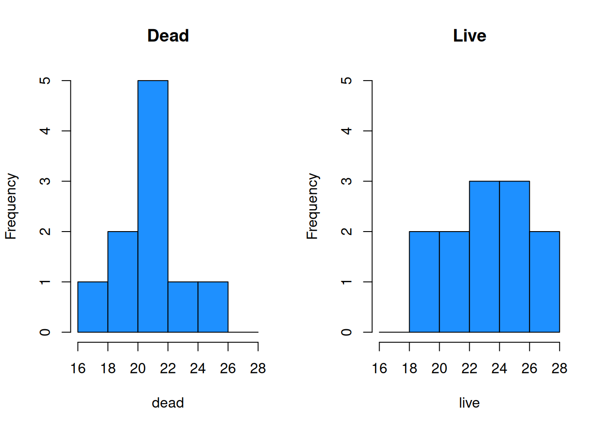
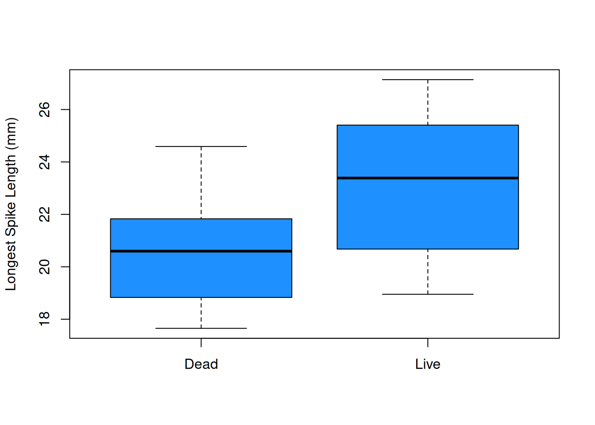
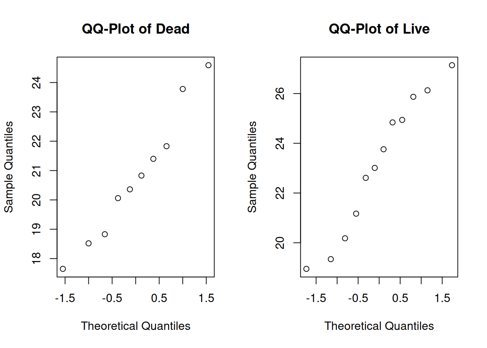

# Two-Sample Testing


We have learned several techniques for comparing a parameter of interest to a fixed value, such as comparing the mean $\mu$ to $\mu_0 = 1.5$.  These tests all apply to a single sample.  

It is also common to have *two* populations of interest that we want to compare them to each other.  In this chapter, we'll cover different techniques for analyzing a difference in two populations.

## Equal variances T test

The T test from chapter 7 is a population technique for analyzing a single population mean $\mu$.  Now, we will generalize the concepts of a basic T hypothesis test to the problem of comparing two means.  Generally, we are interested in looking at the difference in two population means, $\mu_1 - \mu_2$.

he horned lizard has a frill of spikes around its head which are thought to provide protection from predators.  Researchers want to compare the spikes of lizards killed by predators to live lizards from the same area.  The live and dead lizards make up two separate populations.

Samples were taken from each group, and the longest spike on each lizard was measured in mm.  Our research question is, "Is there any difference in the mean length of the longest spike between the dead and live lizard populations?" 

---

The lizard data is given below.  Let's perform a quick exploratory analysis.

\begin{eqnarray*}
\text{Dead: }&17.65, 20.83, 24.59, 18.52, 21.40, 23.78, \\ & 20.36, 18.83, 21.83, 20.06 \\ \\
\text{Alive: }&23.76, 21.17, 26.13, 20.18, 23.01, 24.84, \\ & 19.34, 24.94, 27.14, 25.87, 18.95, 22.61
\end{eqnarray*}


```r
dead <- c(17.65, 20.83, 24.59, 18.52, 21.40, 23.78,
          20.36, 18.83, 21.83, 20.06)
live <- c(23.76, 21.17, 26.13, 20.18, 23.01, 24.84,
           19.34, 24.94, 27.14, 25.87, 18.95, 22.61)
```

Let's calculate the numeric summary measures for each group.

|      | $n$ | $\bar{x}$ | $s$  |
|:----:|:---:|:---------:|:----:|
| Dead | 10  | 20.78     | 2.22 |
| Live | 12  | 23.16     | 2.76 |

The mean of the live group is larger, which suggests they tend to have larger spikes than the dead lizards.  We also see that both groups have a fairly similar standard deviation.

We can also make some visual summaries of the groups.   Comparative histograms and boxplots are useful as are qq-plots of each group.


```r
bin_breaks <- c(16, 18, 20, 22, 24, 26, 28)

par(mfrow = c(1, 2)) # View 2 plots at once
# Set xlim, ylim, and breaks to be the same
hist(dead, main = "Dead", ylim = c(0, 5),
     breaks = bin_breaks, col = "dodgerblue")
hist(live, main = "Live", ylim = c(0, 5),
     breaks = bin_breaks, col = "dodgerblue")
```



```r
par(mfrow = c(1, 1))

boxplot(dead, live, ylab = "Longest Spike Length (mm)",
        col = "dodgerblue", names = c("Dead", "Live"))
```



The plots visually confirm the slight shift in center between the two groups.


```r
par(mfrow = c(1, 2)) # View 2 plots at once

qqnorm(dead, main = "QQ-Plot of Dead")
qqnorm(live, main = "QQ-Plot of Live")
```



```r
par(mfrow = c(1, 1))
```

Additionally, groups appear to be normal.

---


