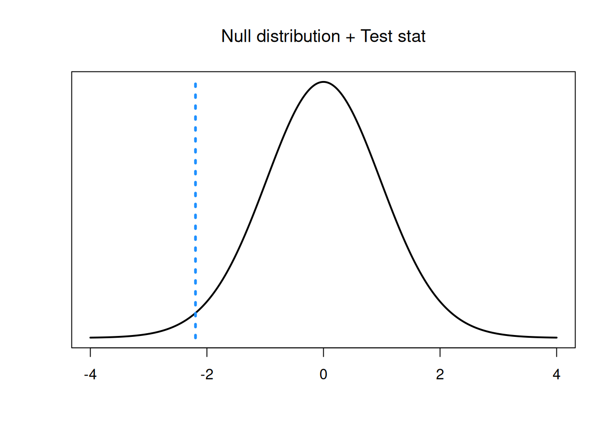
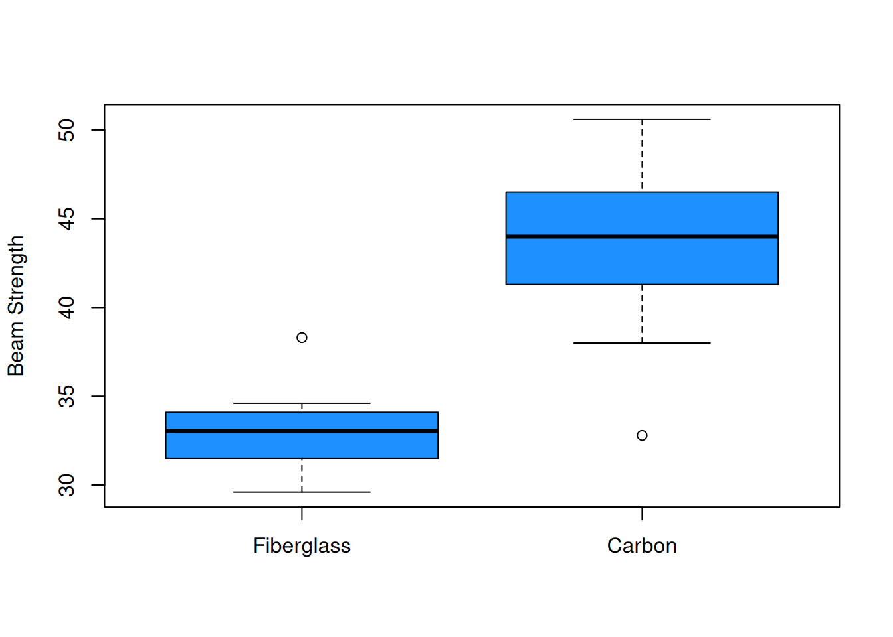

# Two-Sample Testing


We have learned several techniques for comparing a parameter of interest to a fixed value, such as comparing the mean $\mu$ to $\mu_0 = 1.5$.  These tests all apply to a single sample.  

It is also common to have *two* populations of interest that we want to compare them to each other.  In this chapter, we'll cover different techniques for analyzing a difference in two populations.

## Equal variances T test

The T test from chapter 7 is a population technique for analyzing a single population mean $\mu$.  Now, we will generalize the concepts of a basic T hypothesis test to the problem of comparing two means.  Generally, we are interested in looking at the difference in two population means, $\mu_1 - \mu_2$.

he horned lizard has a frill of spikes around its head which are thought to provide protection from predators.  Researchers want to compare the spikes of lizards killed by predators to live lizards from the same area.  The live and dead lizards make up two separate populations.

Samples were taken from each group, and the longest spike on each lizard was measured in mm.  Our research question is, "Is there any difference in the mean length of the longest spike between the dead and live lizard populations?" 

---

The lizard data is given below.  Let's perform a quick exploratory analysis.

\begin{eqnarray*}
\text{Dead: }&17.65, 20.83, 24.59, 18.52, 21.40, 23.78, \\ & 20.36, 18.83, 21.83, 20.06 \\ \\
\text{Alive: }&23.76, 21.17, 26.13, 20.18, 23.01, 24.84, \\ & 19.34, 24.94, 27.14, 25.87, 18.95, 22.61
\end{eqnarray*}


```r
dead <- c(17.65, 20.83, 24.59, 18.52, 21.40, 23.78,
          20.36, 18.83, 21.83, 20.06)
live <- c(23.76, 21.17, 26.13, 20.18, 23.01, 24.84,
           19.34, 24.94, 27.14, 25.87, 18.95, 22.61)
```

Let's calculate the numeric summary measures for each group.

|      | $n$ | $\bar{x}$ | $s$  |
|:----:|:---:|:---------:|:----:|
| Dead | 10  | 20.78     | 2.22 |
| Live | 12  | 23.16     | 2.76 |

The mean of the live group is larger, which suggests they tend to have larger spikes than the dead lizards.  We also see that both groups have a fairly similar standard deviation.

We can also make some visual summaries of the groups.   Comparative histograms and boxplots are useful as are qq-plots of each group.


```r
bin_breaks <- c(16, 18, 20, 22, 24, 26, 28)

par(mfrow = c(1, 2)) # View 2 plots at once
# Set xlim, ylim, and breaks to be the same
hist(dead, main = "Dead", ylim = c(0, 5),
     breaks = bin_breaks, col = "dodgerblue")
hist(live, main = "Live", ylim = c(0, 5),
     breaks = bin_breaks, col = "dodgerblue")
```


```r
par(mfrow = c(1, 1))

boxplot(dead, live, ylab = "Longest Spike Length (mm)",
        col = "dodgerblue", names = c("Dead", "Live"))
```


The plots visually confirm the slight shift in center between the two groups.


```r
par(mfrow = c(1, 2)) # View 2 plots at once

qqnorm(dead, main = "QQ-Plot of Dead")
qqnorm(live, main = "QQ-Plot of Live")
```


```r
par(mfrow = c(1, 1))
```

Additionally, the two groups appear to be normal.

---

Now, let's write hypotheses.  We want to know if the live and dead lizard groups have the same spike length.  The null (uninteresting) result is that the two groups are the same.  This gives hypotheses

$$H_0: \mu_{dead} = \mu_{live}\quad\quad\text{versus}\quad\quad H_A: \mu_{dead} \neq \mu_{live}.$$

Conventionally, we write the hypotheses in terms of a difference in parameters, so that both parameters are on the same side of the equals sign.  An equivalent pair of hypotheses is 

$$H_0: \mu_{dead} - \mu_{live} = 0\quad\quad\text{versus}\quad\quad H_A: \mu_{dead} - \mu_{live} \neq 0.$$ 

So we are testing the difference $\mu_{dead} - \mu_{live}$ againat a null value of 0.  A null hypothesis won't always have the value 0, but it is common.

The test statistic will be based on the difference in the observed means, $\bar{X}_{dead} - \bar{X}_{live}$.  If the null hypothesis is true, then the difference will be close to 0.

---

To formalize the test statistic, let's actually review the test statistic we used for the one-sample T test.  For testing $\mu = \mu_0$, we use
$$T \;=\; \frac{\bar{X} - \mu_0}{S/\sqrt{n}}.$$

Our two-sample T test statistic will have the same structure, but the specific formula will be different since we are dealing with two groups instead of 1.

:::: {.infobox .deff data-latex=""}
The general formula for a T test statistic is 
$$T \;=\; \frac{\text{estimate from data} - \text{value under }H_0}{\text{estimated standard error of estimate}}$$
::::

In the one-sample case, the estimate is $\bar{X}$, the value under $H_0$ is $\mu_0$, and the standard error is $S/\sqrt{n}$.

For the lizard example, the estimated difference from the data is $\bar{X}_{dead} - \bar{X}_{live}$.  The value of the difference under the null is 0.  So, we need to find a formula for the estimated standard error of $\bar{X}_{dead} - \bar{X}_{live}$ to be the denominator of our test statistic.

---

To estimate the standard error, we are going to make a specific assumption about our data.  Suppose the two groups have equal population variance.  That is to say $\sigma^2_{dead}$ and $\sigma^2_{live}$ are both equal to some common variance $\sigma^2$.
$$\sigma^2_{dead} \;=\; \sigma^2_{live} \;=\; \sigma^2.$$
This tells us that
$$\mathbb{V}(\bar{X}_{dead}) = \frac{\sigma^2}{n_{dead}}, \quad \quad \mathbb{V}(\bar{X}_{live}) = \frac{\sigma^2}{n_{live}}.$$
When we assume the groups have a common variance, the variance of the difference is given by 
$$\mathbb{V}(\bar{X}_{dead} - \bar{X}_{live}) \;=\; \frac{\sigma^2}{n_{dead}} + \frac{\sigma^2}{n_{live}} \;=\; \sigma^2\Big(\frac{1}{n_{dead}} + \frac{1}{n_{live}}\Big).$$

:::: {.infobox .pond data-latex=""}
Why are the two variance terms being added instead of subtracted?
::::

The standard error is the square root of this quantity.  

$$se(\bar{X}_{dead} - \bar{X}_{live}) \;=\; \sigma\sqrt{\frac{1}{n_{dead}} + \frac{1}{n_{live}}}$$ 

The value $\sigma$ is the common standard deviation for both groups.  This is a parameter, and we need to estimate it from our data in order to estimate the standard error.  The esimated version uses $s_p$, the pooled standard deviation..

$$\hat{se}(\bar{X}_{dead} - \bar{X}_{live}) \;=\; s_p \sqrt{\frac{1}{n_{dead}} + \frac{1}{n_{live}}}.$$ 

The pooled standard deviation is computed by combining measures of spread from both groups. First, we can get the pooled variance, which is a weighted average of the individual group variances.

:::: {.infobox .deff data-latex=""}
The **pooled variance** of two groups of data is given by 
$$s_p^2 \;=\; \frac{(n_{1}-1)s_{1}^2 \;+\; (n_{2}-1)s_{2}^2}{n_{1} + n_{2} - 2}.$$
The **pooled standard deviation** is
$$s_p \;=\; \sqrt{s_p^2} \;=\; \sqrt{\frac{(n_{1}-1)s_{1}^2 \;+\; (n_{2}-1)s_{2}^2}{n_{1} + n_{2} - 2}}.$$
::::

The weights we use are based on the number of observations in each group: $n_1 - 1$ for the first group, and $n_2 - 1$ for the second group.  So if one group has more observations, it will be more "important" for the purpose of calculating $s^2_p$ and $s_p$.


:::: {.infobox .exer data-latex=""}
Assuming the live and dead lizard groups have the same population variance, find an estimate for the pooled variance and pooled standard deviation from the lizard data.  Here are the summary statistics for the lizard data:

|      | $n$ | $\bar{x}$ | $s$  |
|:----:|:---:|:---------:|:----:|
| Dead | 10  | 20.78     | 2.22 |
| Live | 12  | 23.16     | 2.76 |

<span style="color:#8601AF">
The pooled variance is found by taking a weighted average of the two individual sample variances, where the weights are the number of observations minus 1.
$$s_p^2 \;=\; \frac{(10-1)2.22^2 + (12-1)2.76^2}{10 + 12 - 2} \;=\; 6.407.$$
The pooled standard deviation is the square root of the pooled variance.
$$s_p \;=\; \sqrt{6.407} \;=\; 2.531.$$
</span>
::::

---

The formula for the estimated standard error goes in the denominator of our test statistic.  We have to take into account the uncertainty of $\bar{X}_1 - \bar{X}_2$ when testing $\mu_1 - \mu_2$.  Our two-sample T test statistic is 
$$T \;=\; \frac{\bar{X}_{dead} - \bar{X}_{alive} \;-\; 0}{s_p\sqrt{\frac{1}{n_{dead}} + \frac{1}{n_{alive}}}}.$$
If $H_0$ is true and $\mu_{live} - \mu_{dead} = 0$, then the test statistic $T$ will have a t distribution with $n_{dead} - n_{live} - 2$ degrees of freedom.

A one-sample T test has $n - 1$ degrees of freedom.  So the df for a two-sample test is $(n_1 - 1) + (n_2 - 1) = n_1 + n_2 - 2$.

In the lizard example, we have 10 dead observations and 12 live observations, so we have 20 degrees of freedom.  To complete our test, we calculate an observed test statistic and check whether it is consistent with the $t_{20}$ curve.

---

Before we complete our test, we should check that the necessary test assumptions are met.  The two-sample T test has three assumptions: independence, normality, and constant variance.

The independence assumption says that each of our observations are independent.  In the two-sample case, we additionally need to assume that the two groups are independent and do not affect each other.  We do not know exactly, but we can probably assume this to be true for the lizard data.

For normality, we need to make sure that each of the two individual groups are normal.  Based on the qq-plots we made before, this assumption seems to be well met for the lizard data.

The constant variance assumption is why we were able to calculate a pooled standard deviation $s_p$.  For this assumption to be reasonable, the two groups need to be similarly spread out.  We can check this visually with a histogram or boxplot.  We can also check this numerically.  Typically, for the constant variance assumption to be reasonable, we want the sample SDs to be within a factor of 2.  We need to have

$$0.5 \;<\; \frac{s_1}{s_2} \;<\; 2.$$
Equivalently, we can check if the variances are within a factor of 4.

For the lizard data, the ratio of standard deviations is $\frac{2.22}{2.76} = 0.804$, which is in our acceptable range.  So, the three assumptions for an equal variances T test are met for this data.

:::: {.infobox .exer data-latex=""}
Complete the two-sample T test on the lizard data of the hypotheses
$$H_0: \mu_{dead} = \mu_{live}\quad\quad\text{versus}\quad\quad H_A: \mu_{dead} \neq \mu_{live}.$$

- Use $s_p = 2.531$ to calcualte $t_{obs}$.

<span style="color:#8601AF">
The observed test statistic is 
$$\frac{\bar{X}_{dead} - \bar{X}_{alive} \;-\; 0}{s_p\sqrt{\frac{1}{n_{dead}} + \frac{1}{n_{alive}}}} \;=\; \frac{20.78 - 23.16 \;-\; 0}{2.531\sqrt{\frac{1}{10} + \frac{1}{12}}} \;=\; -2.196.$$
This value lies in the lower tail of our $t_{20}$ null distribution.
</span>




- Find a p-value on the $t_{20}$ distribution and draw a conclusion at the 5% level.


<span style="color:#8601AF">
Since we are doing a two-sided test, the p-value is $2\times$ the area outside of our test statistic.  Our test statistic is negative, and thus in the lower tail, so we compute a lower-tail area on the t with 20 degrees of freedom.
</span>


```r
2*pt(-2.196, df = 20)
```

```
## [1] 0.04005361
```

<span style="color:#8601AF">
We have a p-value of 0.04.  This is not a super small p-value, but it is less than $\alpha = 0.05$, so we do have sufficient evidence to reject $H_0$ at the 5% level.  We conclude that the mean longest spike length is different for the dead and live lizards.
</span>

::::

---

The one-sample T test has a corresponding one-smaple T confidence interval.  Many types of statistical tests have a corresponding CI, and the same is true of the two-sample T test. 

CIs can be built quickly if we remember the general formula for a confidence interval:
$$\text{point estimate } \pm \text{ critical value }\times \text{ standard error}.$$
In the two-sample case, the point estimate is $\bar{X}_1 - \bar{X}_2$.  The standard error is $s_p(\frac{1}{n_1} + \frac{1}{n_2})$.  And the critical value is the $\alpha/2$ value from the t with $n_1 + n_2 - 2$ degrees of freedom.  In the lizard example, the critical value for 95% confidence is 2.086.


```r
qt(0.975, df = 20)
```

```
## [1] 2.085963
```


A 95% CI for $\mu_{dead} - \mu_{live}$ in the lizards example is
\begin{align*}
& \bar{X}_{live} - \bar{X}_{dead} \;\pm\; t_{20, 0.025} \times s_p\sqrt{\frac{1}{n_{live}} + \frac{1}{n_{dead}}} \\
&= 20.78 - 23.16 \;\pm \; 2.086\times 2.531\sqrt{\frac{1}{10}+\frac{1}{12}} \\
&= (-4.64, -0.12)
\end{align*}

Notice that this interval does not contain 0, which corresponds to us rejecting $H_0: \mu_{dead} - \nu_{live} = 0$.

---

:::: {.infobox .deff data-latex=""}
In general, an **equal variances T test** can test for any difference in means:
$$H_0: \mu_1 - \mu_2 = \mu_0\quad\quad\text{versus}\quad\quad H_A: \mu_1 - \mu_2 \neq \mu_0$$
(or a corresponding one-sided hypothesis).  The test statistic is 
$$T \;=\; \frac{\bar{X}_1 - \bar{X}_2 \;-\; \mu_0}{s_p\sqrt{\frac{1}{n_1} + \frac{1}{n_2}}}$$
and the null distribution is a t distribution with $n_1 + n_2 - 2$ degrees of freedom.  We can find a rejection region or calculate a p-value according to the direction of the hypotheses.
::::

We can also use the `t.test` function in R to automatically perform a two-sample T test.  We put both groups of data into the function, and specify the value of the difference under the null.  To make the equal variance assumption, we must specify `var.equal= T`.


```r
dead <- c(17.65, 20.83, 24.59, 18.52, 21.40, 23.78,
          20.36, 18.83, 21.83, 20.06)
live <- c(23.76, 21.17, 26.13, 20.18, 23.01, 24.84,
           19.34, 24.94, 27.14, 25.87, 18.95, 22.61)

t.test(dead, live, mu = 0,
       var.equal = T,
       conf.level = 0.95)
```

```
## 
## 	Two Sample t-test
## 
## data:  dead and live
## t = -2.192, df = 20, p-value = 0.04038
## alternative hypothesis: true difference in means is not equal to 0
## 95 percent confidence interval:
##  -4.6383563 -0.1149771
## sample estimates:
## mean of x mean of y 
##  20.78500  23.16167
```

## Unequal variances T test

The equal variances T test has some fairly strict assumptions, so we might want to know how to relax some of these assumptions.  What if the data is normal, but the two group variances seem to be different?  We can perform a different type of two-sample T test.

Let's look at a new example.  Concrete beams are often reinforced with another material.  Eight concrete beams with fiberglass reinforcement and eleven concrete beams with carbon reinforcement were poured, and the breaking strength of each beam was measured.

We want to know whether the two reinforcement materials are equally strong, or whether the strength differs between the two types of beams.  So, we would set up one-sided hypotheses for a difference in means, similar to the ones we had in the lizard example.

$$H_0: \mu_{fiber} - \mu_{carbon} = 0\quad\quad\text{versus}\quad\quad H_A: \mu_{fiber} - \mu_{carbon} \neq 0$$

The data and summaries are as follows (a larger number means greater strength).


```r
fiber <- c(38.3, 29.6, 33.4, 33.6, 30.7, 32.7, 34.6, 32.3)
carbon <- c(48.8, 38.0, 42.2, 45.1, 32.8, 47.2, 50.6,
            44.0, 43.9, 40.4, 45.8)
```

|        | $n$ | $\bar{x}$ | $s$  |
|:------:|:---:|:---------:|:----:|
| Fiber  | 8   | 33.15     | 2.63 |
| Carbon | 11  | 43.53     | 5.06 |

The mean for the carbon group looks higher, but so does the standard deviation.  Let's also explore the data visually.


```r
boxplot(fiber, carbon, ylab = "Beam Strength",
        col = "dodgerblue", names = c("Fiberglass", "Carbon"))
```



```r
par(mfrow = c(1, 2)) # View 2 plots at once

qqnorm(fiber, main = "QQ-Plot of Fiberglass")
qqnorm(carbon, main = "QQ-Plot of Carbon")
```


```r
par(mfrow = c(1, 1))
```

Let's think about what the summaries tell us about the three assumptions for the equal variances T test.  The independence and normality assumptions are probably safe.  However, we might have some concerns about the equal variance assumption.  Visually, the carbon group is more spread out.  If we look at the ratio of sample standard deviations, we see that it is just barely within our acceptable range.
$$\frac{s_{fiber}}{s_{carbon}} = \frac{2.63}{5.06} = 0.52$$

So, we might not feel comfortable assuming that the true variances of the fiberglass and carbon groups are equal.  In this situation, we would perform a different type of T test, called the unequal variances T test or the Welch T test.

The Welch T test still requires the normality and independence assumptions, but it relaxes the equal variance assumption.

---

The test statistic for this type of test follows the same general structure of a T test statistic:
$$T \;=\; \frac{\text{estimate from data} - \text{value under }H_0}{\text{estimated standard error of estimate}}$$
The estimate of $\mu_{fiber} - \mu_{carbon}$ is $\bar{X}_{fiber} - \bar{X}_{carbon}$ and the value under the null is $\mu_0$ (which is 0 for this example).  But the standard error we use is different than the one for the equal variances T test.

The standard error for equal variances assumes the two populations share a common variance: $\sigma^2_1 = \sigma^2_2 = \sigma$.
$$se(\bar{X}_{1} - \bar{X}_{2}) \;=\; \sigma\sqrt{\frac{1}{n_{1}} + \frac{1}{n_{2}}}$$ 
We estimated $\sigma$ with a pooled standard deviation based on both samples.  But if we want to relax the equal variance assumption and assume $\sigma^2_1 \neq \sigma^2_2$, we no longer have a common variance $\sigma^2$.  We need to use the more general form of the standard error of $\bar{X}_1 - \bar{X}_2$.

---

In the unequal variances case, we have
$$\mathbb{V}(\bar{X}_{fiber}) = \frac{\sigma_{fiber}^2}{n_{fiber}}, \quad \quad \mathbb{V}(\bar{X}_{carbon}) = \frac{\sigma_{carbon}^2}{n_{carbon}}.$$
The variance of the difference in sample means is
$$\mathbb{V}(\bar{X}_{fiber} - \bar{X}_{carbon}) \;=\; \frac{\sigma_{fiber}^2}{n_{fiber}} + \frac{\sigma_{carbon}^2}{n_{carbon}}.$$
So, the estimated standard error is given by 
$$\hat{se}(\bar{X}_{fiber} - \bar{X}_{carbon}) \;=\; \sqrt{\frac{s^2_{fiber}}{n_{fiber}} + \frac{s^2_{carbon}}{n_{carbon}}}.$$

We keep the two sample variances separate, and we do not calculate a pooled variance or sd.

---

So, the test statistic for performing a Welch T test on the concrete beam data is
$$t_{obs} \;=\; \frac{\bar{x}_{fiber} - \bar{x}_{carbon} \;-\; 0}{\sqrt{\frac{s^2_{fiber}}{n_{fiber}} + \frac{s^2_{carbon}}{n_{carbon}}}} \;=\; \frac{33.15 - 43.53 \;-\; 0}{\sqrt{\frac{2.63^2}{8} + \frac{5.06^2}{11}}} \;=\; -5.81.$$

To complete our test, we compare this observed test statistic to a t null distribution with either a rejection region or p-value.  However, the null t distribution is different from the equal variances case.

The Welch T test is only approximate.  That is to say, the test statistic $T$ has an approximate t distribution rather than an exact t distribution.  The degrees of freedom in the unequal variances case is a bit messy:
$$k \;=\; \frac{\Big(\frac{s^2_1}{n_1} + \frac{s^2_2}{n_2}\Big)^2}{\frac{(s^2_1/n_1)^2}{n_1-1} + \frac{(s^2_2/n_2)^2}{n_2-1}}$$

Don't worry about understanding this entire formula.  We can think of this as being a "penalty" on our degrees of freedom based on the fact that the variances being different.  Different variances add additional variability, so we need to use a lower df.  It can be shown that 
$$k \;<\; n_1 + n_2 - 2$$
where the left side is the unequal variances df and the right side is the equal variances df.  If the sample variances $s^2_1$ and $s^2_2$ are very similar, then $k$ is only slightly less than $n_1 + n_2 - 2$.  But if $s^2_1$ and $s^2_2$ are very different, the penalty is larger and $k$ is much less than $n_1 + n_2 - 2$.

The degrees of freedom $k$ will almost certainly not be a whole number.  But `qt` and `pt` in R can handle decimal degrees of freedom just fine.

---

For the concrete beam example, we have degrees of freedom $k = 15.7$.  This is less than $n_{fiber} - n_{carbon} = 17$.

:::: {.infobox .exer data-latex=""}
Complete the Welch T test of hypotheses
$$H_0: \mu_{fiber} - \mu_{carbon} = 0\quad\quad\text{versus}\quad\quad H_A: \mu_{fiber} - \mu_{carbon} \neq 0.$$
Use test statistic $t_{obs} = -5.81$ and a null t distribution with 15.7 degrees of freedom.  Use $\alpha = 0.01$.

<span style="color:#8601AF">
Since we are doing a two-sided test, the p-value is $2\times$ the area outside of our test statistic.  Our test statistic is negative, and thus in the lower tail, so we compute a lower-tail area on the t with 15.7 degrees of freedom.
</span>


```r
2*pt(-5.81, df = 15.7)
```

```
## [1] 2.866725e-05
```

<span style="color:#8601AF">
We have a p-value of $2.9\times 10^{-5}$.  This is much smaller than 0.01, so we reject the null hypothesis.  We conclude that there is a significant difference in strength between beams reinforced with fiberglass and carbon.
</span>
::::

The test we performed at the 1% level corresponds to a 99% confidence interval.  In this context, the standard error for the CI is
$$\sqrt{\frac{s^2_{fiber}}{n_{fiber}} + \frac{s^2_{carbon}}{n_{carbon}}}$$
and the critical value comes from the t with 15.7 degrees of freedom.  According to R, the critical value for 99% confidence is 2.928.


```r
qt(0.995, df = 15.7)
```

```
## [1] 2.928173
```

A 99% confidence interval for $\mu_{fiber} - \mu_{carbon}$ is 
\begin{align*}
& \bar{X}_{fiber} - \bar{X}_{carbon}\;\pm\; t_{15.7, 0.005} \times \sqrt{\frac{s^2_{fiber}}{n_{fiber}} + \frac{s^2_{carbon}}{n_{carbon}}} \\
&= 33.15 - 43.53 \;\pm \; 2.928\times \sqrt{\frac{2.63^2}{8} + \frac{5.06^2}{11}} \\
&= (-15.61, -5.15)
\end{align*}

This interval is entirely negative and does not cover 0.

---

:::: {.infobox .deff data-latex=""}
In general, an **unequal variances T test** or **Welch T test** can test for any difference in means:
$$H_0: \mu_1 - \mu_2 = \mu_0\quad\quad\text{versus}\quad\quad H_A: \mu_1 - \mu_2 \neq \mu_0$$
(or a corresponding one-sided hypothesis).  The test statistic is 
$$T \;=\; \frac{\bar{X}_1 - \bar{X}_2 \;-\; \mu_0}{\sqrt{\frac{s_1^2}{n_1} + \frac{s_2^2}{n_2}}}$$
and the null distribution is a t distribution.  We can find a rejection region or calculate a p-value according to the direction of the hypotheses.
::::

We can also complete this test in R with the `t.test` function.  We specify `var.equal = F`, which is the same as the default behavior.


```r
t.test(fiber, carbon, mu = 0, conf.level = 0.99,
       var.equal = F)
```

```
## 
## 	Welch Two Sample t-test
## 
## data:  fiber and carbon
## t = -5.8044, df = 15.706, p-value = 2.893e-05
## alternative hypothesis: true difference in means is not equal to 0
## 99 percent confidence interval:
##  -15.61204  -5.14251
## sample estimates:
## mean of x mean of y 
##  33.15000  43.52727
```

```r
t.test(fiber, carbon, mu = 0, conf.level = 0.99)
```

```
## 
## 	Welch Two Sample t-test
## 
## data:  fiber and carbon
## t = -5.8044, df = 15.706, p-value = 2.893e-05
## alternative hypothesis: true difference in means is not equal to 0
## 99 percent confidence interval:
##  -15.61204  -5.14251
## sample estimates:
## mean of x mean of y 
##  33.15000  43.52727
```

---

The equal variances T test and Welch T test are two similar methods for testing a difference in means, $\mu_1 - \mu_2$.  How should we decide which test to use?  The key differences is that the equal variances T makes the equal variance assumption.  The Welch T does not make this assumption, and so it is more general.

- If the variances were truly equal, but we assumed they were not equal, the Welch T test is a bit less powerful but is still accurate. 

- If the variances are truly different, but we assumed they were equal, the equal variances test can make wildly incorrect conclusions.

There is usually more to lose in the second case, so if there is doubt, it is safer to assume unequal variances.

## Two-sample proportion test

In the previous sections, we extended the concept of a T test to the two-sample case where we are testing $\mu_1 - \mu_2$.  Now, we will do the same for a proportion Z test.  The two-sample proportion test can be used if we want to test a difference in two population proportions, $\pi_1 - \pi_2$.

We want to know if handedness (being right vs left handed) is related to a person's sex.  To help answer this question, 21 females and 54 males were asked to indicate their dominant hand.  The results were:
$$\text{Female: 12 left, 9 right} \quad \quad \text{Male: 23 left, 31 right}$$
We want to know if the proportion of left-handed individuals is different for males and females.  

Let $\pi_{FL}$ be the true proportion of all females who are left handed, and $\pi_{ML}$ be the true proportion of males who are left handed.  If sex and handedness are unrelated, then being left-handed would not be more or less likely based on a person's sex.  In that case, we would have $\pi_{FL} = \pi_{ML}$.  This gives hypotheses
$$H_0: \pi_{FL} = \pi_{ML} \quad \text{versus} \quad H_A: \pi_{FL} \neq \pi_{ML}.$$
These hypotheses can equivalently be expressed in terms of a difference in proportions:
$$H_0: \pi_{FL} - \pi_{ML} = 0\quad\quad\text{versus}\quad\quad H_A: \pi_{FL} - \pi_{ML} \neq 0.$$

To answer this question, we need to look at the observed difference in left-hand proportions from our data: $\hat{p}_{FL} - \hat{p}_{ML}$.

---

We are testing whether the difference $\pi_{FL} - \pi_{ML}$ is equal to 0, so the test statistic will have the following structure.
$$Z \;=\; \frac{\hat{p}_{FL} - \hat{p}_{ML} \;-\; 0 }{\text{st. error of}\; (\hat{p}_{FL} - \hat{p}_{ML})}.$$
We comopare the difference to the value of 0, and divide by the standard error, which is the uncertainty from using $\hat{p}_{FL} - \hat{p}_{ML}$ to estimate $\pi_{FL} - \pi_{ML}$.

This is a Z test based on the CLT, just like the one-sample proportion test.  To get the exact formula for the test statistic, we need to consider the theoretical properties of $\hat{p}_{FL} - \hat{p}_{ML}$.

---

If the CLT assumptions are met, i.e. $n_{FL}$ and $n_{ML}$ are both large, then $\hat{p}_{FL}$ and $\hat{p}_{ML}$ are both approximately normal.
$$\hat{p}_{FL} \;\dot{\sim}\; N\Big(\pi_{FL}, \; \frac{\pi_{FL}(1-\pi_{FL})}{n_{FL}}\Big), \quad \quad \hat{p}_{ML} \;\dot{\sim}\; N\Big(\pi_{ML}, \; \frac{\pi_{ML}(1-\pi_{ML})}{n_{ML}} \Big)$$
The difference $\hat{p}_{FL} - \hat{p}_{ML}$ is also normal.
$$\hat{p}_{FL} - \hat{p}_{ML} \;\;\dot{\sim}\;\; N\Big(\pi_{FL} - \pi_{ML},\; \frac{\pi_{FL}(1-\pi_{FL})}{n_{FL}} + \frac{\pi_{ML}(1-\pi_{ML})}{n_{ML}}\Big).$$
The mean is the difference in true proportions.  The variance has a term for both groups.

The above is a general statement about the difference in two proportions.  Let's think about what this looks like if we assume the null hypothesis is true and $\pi_{FL} - \pi_{ML} = 0$.  This is saying that the female and male groups both share an "overall" left-handed proportion.  That is to say, $\pi_{FL} = \pi_{ML} = \pi_L$.  So if we assume $H_0$ is true, we get
$$\hat{p}_{FL} - \hat{p}_{ML} \;\;\dot{\sim}\;\; N\Big(0,\; \pi_L(1-\pi_L)\Big(\frac{1}{n_{FL}} + \frac{1}{n_{ML}}\Big)\Big)$$

$\pi_L$, the true left handed proportion, is unknown, so we need to estimate it from our data.  We do this by taking the total number of lefties in our sample, divided by the total number of people.
$$\hat{p}_L \;=\; \frac{12 + 23}{21 + 54} \;=\; 0.467.$$
So if we use $\hat{p}_L$ in place of $\pi_L$, we get 
$$\hat{p}_{FL} - \hat{p}_{ML} \;\;\dot{\sim}\;\; N\Big(0,\; \hat{p}_L(1-\hat{p}_L)\Big(\frac{1}{n_{FL}} + \frac{1}{n_{ML}}\Big)\Big).$$

---

The last thing we need to do to get our test statistic is to standardize the normal distribution.  The normal variable is $\hat{p}_{FL} - \hat{p}_{ML}$, and we are subtracting the mean of 0 and dividing by the standard deviation of $\sqrt{\hat{p}_L(1-\hat{p}_L)\Big(\frac{1}{n_{FL}} + \frac{1}{n_{ML}}\Big)}$.  If the null hypothesis is true and $\pi_{FL} = \pi_{ML} = \pi_L$, then
$$Z \;=\; \frac{\hat{p}_{FL} - \hat{p}_{ML} \;=\; 0}{\sqrt{\hat{p}_L(1-\hat{p}_L)\Big(\frac{1}{n_{FL}} + \frac{1}{n_{ML}}\Big)}} \; \dot{\sim} \; N(0, 1^2).$$
The quantity $Z$ is our Z test statistic, which can be calculated from our data.  We can then use a rejection region or a p-value on the standard normal curve to complete our test.  

This is an approximate test, based on the CLT.  The Z test is only accurate if both sample sizes are large enough.  In general, we want the number of "successes" and the number of "failures" in each group to be at least 5.

As a reminder, our data is 
$$\text{Female: 12 left, 9 right} \quad \quad \text{Male: 23 left, 31 right}$$
and we are testing hypotheses
$$H_0: \pi_{FL} - \pi_{ML} = 0\quad\quad\text{versus}\quad\quad H_A: \pi_{FL} - \pi_{ML} \neq 0.$$

:::: {.infobox .exer data-latex=""}
Complete the two-sample proportion test for the handedness data, with $\alpha = 0.05$.

- Check whether the sample sizes are large enough to use the Z test.

<span style="color:#8601AF">
For the Z test to be accurate, we want the number of right handed and left handed individuals in each group to be at least 5.  In the female group, there are 12 lefties and 9 righties.  In the male group, there are 23 lefties and 31 righties.  All four are greater than 5, so we can make use of the CLT.
</span>

- Calculate the test statistic $z_{obs}$ based on an overall left-handed proportion of $\hat{p}_L = 0.467$.

<span style="color:#8601AF">
The observed female left-handed proportion is $\hat{p}_{FL} = \frac{12}{12+9} = 0.571$.  The observed male left-handed proportion is $\hat{p}_{ML} = \frac{23}{23+31} = 0.426$.  So, our observed test statistic is
$$z_{obs} \;=\; \frac{\hat{p}_{FL} - \hat{p}_{ML} \;=\; 0}{\sqrt{\hat{p}_L(1-\hat{p}_L)\Big(\frac{1}{n_{FL}} + \frac{1}{n_{ML}}\Big)}} \;=\; \frac{0.571 - 0.426 - 0}{\sqrt{0.467(1-0.467)\Big(\frac{1}{21}+\frac{1}{54}\Big)}} \;=\; 1.13.$$
</span>

- Compare $z_{obs}$ to a 0.05-level rejection region on the $N(0, 1^2)$ distribution, or compute a p-value.

<span style="color:#8601AF">
If $H_0$ is true, then the value 1.13 was drawn from a standard normal distribution.  So, we need to compare this value to a standard normal curve to see if it is too extreme.  Since we are doing a two-sided test, the p-value is the area outside of 1.13, multiplied by 2.
</span>


```r
2*pnorm(1.13, lower.tail = F)
```

```
## [1] 0.2584762
```

<span style="color:#8601AF">
R gives us a p-value of 0.258, which is much larger than $\alpha = 0.05$.  We fail to reject the null, and we do not have sufficient evidence that the proportion of left-handed individuals is different for males and females.
</span>
::::

---

We can also build a corresponding Z CI for the difference $\pi_{FL} - \pi_{ML}$.  The point estimate is $\hat{p}_{FL} - \hat{p}_{ML}$, and the critical value is $z_{\alpha/2}$ from the standard normal curve.  However, we don't use the same standard error as the hypothesis test.

When we are testing $H_0: \pi_{FL} - \pi_{ML} = 0$, we calculate a common left-handed proportion $\hat{p}_L$.  But when building a CI, we aren't assuming that null hypothesis to be true.  So, we don't use $\hat{p}_L$ and instead use the more general form for standard error.  

$$\hat{se}(\hat{p}_{FL} - \hat{p}_{ML}) \;=\; \sqrt{\frac{\hat{p}_{FL}(1-\hat{p}_{FL})}{n_{FL}} + \frac{\hat{p}_{ML}(1-\hat{p}_{ML})}{n_{ML}}} \;=\; \sqrt{\frac{0.571(1-0.571)}{21} + \frac{0.426(1-0.426)}{54}} \;=\; 0.127$$

The Z critical value for 95% confidence is 1.96.


```r
qnorm(0.975)
```

```
## [1] 1.959964
```

So, a 95% Z CI for $\pi_{FL} - \pi_{ML}$ is 
\begin{align*}
& \hat{p}_{FL} - \hat{p}_{ML} \pm z_{0.025}\sqrt{\frac{\hat{p}_{FL}(1-\hat{p}_{FL})}{n_{FL}} + \frac{\hat{p}_{ML}(1-\hat{p}_{ML})}{n_{ML}}} \\
&= 0.571 - 0.426 \pm 1.96\sqrt{\frac{0.571(1-0.571)}{21} + \frac{0.426(1-0.426)}{54} \\
&= (-0.10, 0.39)
\end{align*}

The interval covers 0, which corresponds to us failing to reject $H_0$.  However, a two-sample proportion test and CI will not necessarily agree with each other, because they use slightly different formulas for standard error.

:::: {.infobox .deff data-latex=""}
In general, a two-sample proportion Z test can test for a difference in proportions equal to 0:
$$H_0: \pi_1 - \pi_2 = 0\quad\quad\text{versus}\quad\quad H_A: \pi_1 - \pi_2 \neq 0$$
(or a corresponding one-sided hypothesis).  The test statistic is 
$$Z \;=\; \frac{\hat{p}_1 - \hat{p}_2}{\hat{p}(1-\hat{p})\Big(\frac{1}{n_1} + \frac{1}{n_2}\Big)}$$
where $\hat{p}$ is the common observed proportion across both groups.  The null distribution is a standard normal distribution.  We find a rejection region or calculate a p-value according to the direction of the hypotheses.
::::

:::: {.infobox .pond data-latex=""}
Why does the above test statistic not work for testing a difference other than 0?  For example,
$$H_0: \pi_1 - \pi_2 = 0.2\quad\quad\text{versus}\quad\quad H_A: \pi_1 - \pi_2 \neq 0.2$$
::::

## Two-sample bootstrap test

The last few sections in this chapter will cover different techniques for two-sample testing that do not require the data to be normal.  There is the bootstrap, which is similar to the one-sample bootstrap we've discussed before.  Lastly, we will discuss the rank sum test, which is based on the relative ranks of the data.

When sage crickets mate, the male allows the female to eat part of his wings.  It is thought that the hunger level of the female may influence the desire to mate.

A group of 11 female crickets were starved for two days, and a group of 13 females were fed normally.  Each female was given a male, and the time to mating (in hours) was recorded.

The research question is, ``Do starved females attempt mating faster than normally fed females?  This can be represented as a question about the difference in average time to mate $\mu_{started}-\mu_{fed}$, and the question also implies a one-sided alternative.
$$H_0: \mu_{starved}-\mu_{fed} \ge 0\quad\quad\text{versus}\quad\quad H_A: \mu_{starved}-\mu_{fed} < 0.$$

We've looked at two methods for testing a difference in means: the equal variances T and the Welch T.  Both of these tests require independence and normality, and the equal variances T additionally requires the equal variance assumption.

---

The cricket data is as follows.


```r
starved <- c(1.9, 2.1, 3.8, 9.0, 9.6, 13.0, 14.7, 17.9,
             21.7, 29.0, 72.3)
fed <- c(1.5, 1.7, 2.4, 3.6, 5.7, 22.6, 22.8, 39.0, 54.4,
         72.1, 73.6, 79.5, 88.9)
```

|         | $n$ | $\bar{x}$ | $s$   |
|:-------:|:---:|:---------:|:-----:|
| Starved | 11  | 17.73     | 19.96 |
| Fed     | 13  | 35.98     | 33.63 |

The fed group has a considerably larger center than the starved group.  We also see that the fed group has a larger sample sd, so we might want to perform a Welch T test.  To do this, we also need to check normality.


```r
bin_breaks <- c(0, 18, 36, 54, 72, 90)

par(mfrow = c(1, 2)) # View 2 plots at once
# Set xlim, ylim, and breaks to be the same
hist(starved, main = "Starved", ylim = c(0, 5),
     breaks = bin_breaks, col = "dodgerblue")
hist(fed, main = "Fed", ylim = c(0, 5),
     breaks = bin_breaks, col = "dodgerblue")
```


```r
qqnorm(starved, main = "QQ-Plot of Starved")
qqnorm(fed, main = "QQ-Plot of Fed")
```


The histograms and qq-plots show a strong nonnormal shape.  The starved group has an outlier that gives it a strong right skew, and the fed group looks bimodal.

:::: {.infobox .pond data-latex=""}
If we removed the outlying value 72.3 from the starved group, the data would be more normal.  Why is this not advisable?  In what situations would it be appropriate to discard data?
::::

Furthermore, the sample sizes are so small that we probably shouldn't make use of the CLT.  Without normality, we cannot perform a T test, because the statistic
$$T \;=\; \frac{\bar{X}_1 - \bar{X}_2 \;-\; \mu_0}{\sqrt{\frac{s_1^2}{n_1} + \frac{s_2^2}{n_2}}}$$
does not have a t distribution in this case.  Trying to calculate a p-value with `pt` would lead to an inaccurate result.

We will show how to adapt our bootstrap methods to the two-sample case, and come up with an empirical sampling distribution of $T$ that we can use to find a bootstrap p-value.  The general structure of the bootstrap is the same, though the details are slightly different in the two-sample case.

---

When we perform a bootstrap analysis, we sample *with replacement* from the data, then calculate a value $\hat{t}$ from the re-sampled data.  We repeat this process and use the $\hat{t}$ values to apprxoimate the distribution of $T$.

:::: {.infobox .deff data-latex=""}
The bootstrapping procedure for a two-sample test is as follows.

1. Compute $\bar{x}_1$ and $s_1^2$ from the first sample, and $\bar{x}_2$ and $s_2^2$ from the second sample.  Use these summaries to find the observed test statistic 
$$t_{obs} = \frac{\bar{x}_1 - \bar{x}_2 - \mu_0}{\sqrt{\frac{s_1^2}{n_1}+\frac{s_2^2}{n_2}}}.$$ 

2. Resample from *both* sets of data. Take a SRS of size $n_1$ with replacement from the first data, and a SRS of size $n_2$ with replacement from the second data.

3. Compute the means and variances of the resampled data for each group. Call these $\bar{x}_1^*$, $s_1^{2*}, \bar{x}_2^*$, and $s_2^{2*}$.

4. Compute $\hat{t}$ based on the resampled data:
$$\hat{t} \;=\; \frac{(\bar{x}_1^* - \bar{x}_2^*) \;-\; (\bar{x}_1 - \bar{x}_2)}{\sqrt{\frac{s_1^{2*}}{n_1}+\frac{s_2^{2*}}{n_2}}}$$

5. Repeat 2-4 many, many, times.
::::

The $\hat{t}$ values approximate the sampling distribution of $T$.  We look at the proportion of $\hat{t}$ values that are more extreme than $t_{obs}$ to calculate a p-value.  Let's perform a bootstrap test on the cricket data, with $\alpha = 0.02$.


