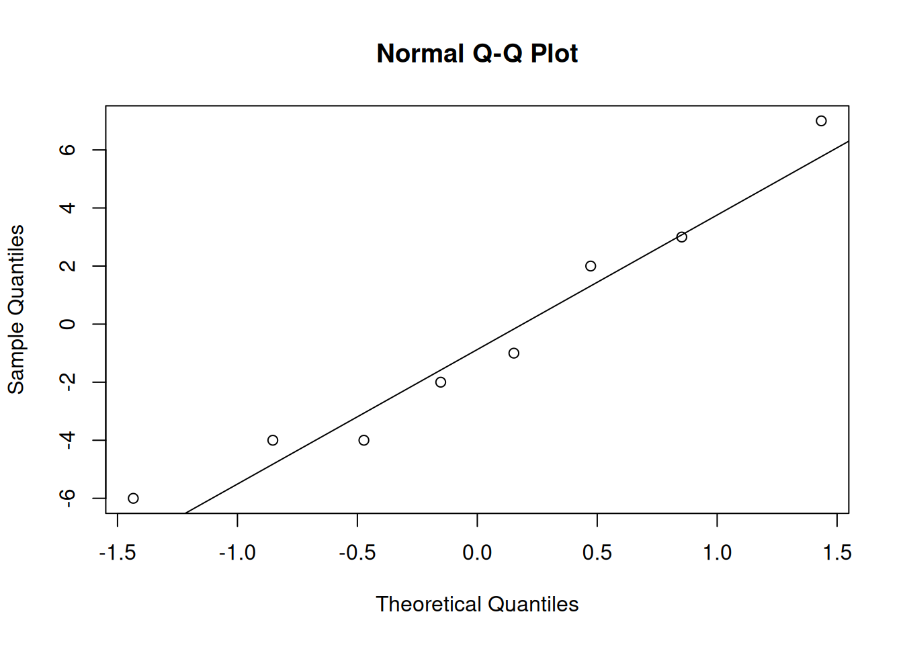

# Testing Paired Data

Chapter 9 covers several techniques for comparing two independent samples of data.  Now, we will discuss an example where the data has an additional paired structure.  Two groups that are paired are not independent, but we can take advantage of the structure when performing an analysis.

## Paired T test

Long periods of upper-arm elevation above 30 degrees is thought to be related to several musculoskeletal disorders.  Office workers who perform repetitive tasks are particularly vulnerable to this.  It is thought that varying work tasks over the course of a day might alleviate this problem. 

Eight office workers were given standard work tasks one day.  The next day, the same workers were all given varied work tasks.  For each day, the percentage of time that their upper-arm was below 30 degrees was recorded.  The data is as follows.

| Participant | 1  | 2  | 3  | 4  | 5  | 6  | 7  | 8  |
|:------------|:--:|:--:|:--:|:--:|:--:|:--:|:--:|:--:|
| Standard    | 81 | 87 | 86 | 59 | 66 | 70 | 73 | 92 |
| Varied      | 78 | 91 | 79 | 65 | 67 | 72 | 71 | 96 |

We can think of the data as being made up of two groups.  But we can also think of it as being made up of eight *pairs*.  Each participant has exactly one Standard and exactly one Varied observation.

:::: {.infobox .deff data-latex=""}
Two datasets of equal length are **paired** if each observation in one sample can be "paired" with an observation in the other sample.  The two observations in a pair a certain quality.
::::

We want to know if the varied work tasks change the percentage of "arm below 30 degrees" time, on average.  We can write hypotheses
$$H_0: \mu_{S}-\mu_{V} = 0\quad\quad\text{versus}
\quad\quad H_A: \mu_{S}-\mu_{V}\neq 0.$$ 

---

Let's begin by graphing the data.  When there is a paired structure, it is useful to connect paired observations together.

I'll plot the Standard and Varied data on separate sides of the graph, with the response variable on the y axis.


If the two groups were different, we would expect to see a systematic increase or decrease from Standard to Varied.  In our graph, there does not seem to be a very strong pattern.  Some lines go up, some go down, and some are about the same.

It does look like the Varied group has a somewhat higher center, so we need to perform a test to see if this is significant.

---

For hypotheses like
$$H_0: \mu_{S}-\mu_{V} = 0\quad\quad\text{versus}
\quad\quad H_A: \mu_{S}-\mu_{V}\neq 0,$$ 
we have learned the equal-variances T test, the Welch T test, and the bootstrap.  However, none of these methods are appropriate here, because a key assumption is violated.

The two-sample testing methods assume that all of the data points are independent, and furthermore assume that the two groups are independent.  This is not the case for paired data:

| Participant | 1  | 2  | 3  | 4  | 5  | 6  | 7  | 8  |
|:------------|:--:|:--:|:--:|:--:|:--:|:--:|:--:|:--:|
| Standard    | 81 | 87 | 86 | 59 | 66 | 70 | 73 | 92 |
| Varied      | 78 | 91 | 79 | 65 | 67 | 72 | 71 | 96 |

The observations 81 in the Standard group and 78 in the Varied group are both associated with participant 1.  This participant is exerting an external effect on these two data points.  Both the 81 and 78 are probably influenced by that particular worker's habits.  The same is true for the other seven pairs of data.

So, we cannot use any of the methods from chapter 9 in this context.  Instead, we're going to take advantage of the paired structure of the data to simplify the problem.

---

Our research question is about a difference in the overall means between Standard and Varied.  However, we can also think about this in terms of the *individual change* for each participant.  For each of the eight workers, we can calculate the difference in percentage of "low arm".

| Participant | 1  | 2  | 3  | 4  | 5  | 6  | 7  | 8  |
|:------------|:--:|:--:|:--:|:--:|:--:|:--:|:--:|:--:|
| Standard    | 81 | 87 | 86 | 59 | 66 | 70 | 73 | 92 |
| Varied      | 78 | 91 | 79 | 65 | 67 | 72 | 71 | 96 |
| Difference  | 3  | -4 | 7  | -6 | -1 | -2 | 2  | -4 |

A positive difference indicates that the varied work tasks reduced the percentage of "low arm" time. A negative difference indicates that the varied work tasks increased this percentage.

In R, we can quickly calculate the differences by subtracting the two individual data vectors.  R performs element-wise calculations, which is exactly what we want in this situation.


```r
standard <- c(81, 87, 86, 59, 66, 70, 73, 92)
varied <- c(78, 91, 79, 65, 67, 72, 71, 96)

diff <- standard - varied
diff
```

```
## [1]  3 -4  7 -6 -1 -2  2 -4
```


Instead of taking the average of each group, then finding the difference in means, we are taking the individual differences, then taking the average of those differences.  Instead of 
$$H_0: \mu_{S}-\mu_{V} = 0\quad\quad\text{versus}
\quad\quad H_A: \mu_{S}-\mu_{V}\neq 0$$ 
we can write
$$H_0: \mu_D = 0\quad\quad\text{versus}\quad\quad H_A: \mu_D \neq 0$$
where $\mu_D$ is the true mean difference between Standard and Varied.

We have reduced our problem to a matter of testing a single mean, which we can do with a T test.  A paired test is essentially the same as a one-sample T test, where the sample is the differences between paired groups.  When we evaluate the test assumptions and calculate a test statistic, we have to use the paired data.

---

Let $\bar{D}$ be the sample mean of $n$ differences and $S_d$ be the sample standard deviation of differences.   Then if $H_0$ is true,
$$T \;=\; \frac{\bar{D} - 0}{S_D/\sqrt{n}} \;\sim\; t_{n-1}$$
We use a t distribution with $n-1$ degrees of freedom as a null distribution for calculating a rejection region or p-value.

Note that $n$ refers to the number of pairs, not the total number of observations across all groups.

:::: {.infobox .exer data-latex=""}
Perform a paired T test on the office worker data, of hypotheses
$$H_0: \mu_D = 0\quad\quad\text{versus}\quad\quad H_A: \mu_D \neq 0.$$
Use $\alpha = 0.1$.

- Evaluate the necessary assumptions for performing a T test.

<span style="color:#8601AF">
For a T test, we need to have independence.  In this context, we have to assume that the eight pairs (the eight workers) are independent of each other.  We also need to have approximately normal data.  Since we are doing a paired T test, we will make a qq-plot of the *differences*.
</span>


```r
qqnorm(diff); qqline(diff)
```



<span style="color:#8601AF">
The data appears to be normal, so a T test is appropriate here.
</span>

- Calculate the test statistic $t_{obs}$.

<span style="color:#8601AF">
We first need to find the sample mean and standard deviation of the eight differences.
</span>


```r
mean(diff)
```

```
## [1] -0.625
```

```r
sd(diff)
```

```
## [1] 4.340425
```

<span style="color:#8601AF">
The observed test statistic is 
$$t_{obs} \;=\; \frac{\bar{D} - 0}{S_D/\sqrt{n}} \;\sim\; t_{n-1} \;=\; \frac{-0.625 - 0}{4.34/\sqrt{8}} \;=\; -0.407.$$
</span>

- Find a two-sided p-value or rejection region with the $t_{n-1}$ distribution.

<span style="color:#8601AF">
If the null hypothesis is true, then the statistic $-0.407$ was drawn from a t distribution with $n - 1 = 7$ degrees of freedom.  We can calculate a p-value by looking at the area on this t curve outside of -0.407, multiplied by 2 for our two-sided hypotheses.
</span>


```r
2*pt(-0.407, df = 7)
```

```
## [1] 0.6961654
```

We have a very large p-value of 0.696.  This is much larger than $\alpha = 0.1$ so we fail to reject the null.  There is no evidence that varying the work tasks substantially changes the upper-arm angle.
::::

---

:::: {.infobox .deff data-latex=""}
In general, a paired T test is performed on the differences between two paired groups.  It tests hypotheses
$$H_0: \mu_D = \mu_0 \quad\quad\text{versus}\quad\quad H_A: \mu_D \neq \mu_0.$$
(or a corresponding one-sided hypothesis).  The test statistic is 
$$T \;=\; \frac{\bar{D} - 0}{S_D/\sqrt{n}}.$$
The null distribution is a t distribution with $n-1$ degrees of freedom, where $n$ is the number of differences.  We find a rejection region or calculate a p-value according to the direction of the hypotheses.
::::

We can also do this in R with the `t.test` function.  We can enter just the differences, or enter both sets of data with `paired = T`.


```r
t.test(diff, mu = 0,
       conf.level = 0.9)
```

```
## 
## 	One Sample t-test
## 
## data:  diff
## t = -0.40728, df = 7, p-value = 0.696
## alternative hypothesis: true mean is not equal to 0
## 90 percent confidence interval:
##  -3.532367  2.282367
## sample estimates:
## mean of x 
##    -0.625
```

```r
t.test(standard, varied,
       mu = 0, paired = T,
       conf.level = 0.9)
```

```
## 
## 	Paired t-test
## 
## data:  standard and varied
## t = -0.40728, df = 7, p-value = 0.696
## alternative hypothesis: true mean difference is not equal to 0
## 90 percent confidence interval:
##  -3.532367  2.282367
## sample estimates:
## mean difference 
##          -0.625
```

:::: {.infobox .pond data-latex=""}
Recall how the office worker experiment was performed.

"Eight office workers were given standard work tasks one day.  The next day, the same workers were all given varied work tasks.  For each day, the percentage of time that their upper-arm was below 30 degrees was recorded."

What are some of the problems with this experimental design?  How might these issues interfere with our analysis?
::::

## Signed rank test

When working with paired data, the paired T test is the preferred tool.  But, it relies on the normality assumption.  We'll discuss several options for testing paired data while relaxing the normality assumption.

One option is to perform a one-sample bootstrap analysis on the differences, which we won't cover in detail.  Other options are the Wilcox test, and the sign test for the median.

---

The Wilcoxon signed rank test is a rank-based method that is similar to the rank sum test, but it applies to a single sample of data.  This test only requires the independence assumption (i.e. assuming the pairs are independent).

Let's demonstrate this test with the office worker data, with $\alpha = 0.1$.  Even though the differences are normal, the Wilcoxon test will still work.

We start by assigning ranks to the observed differences.  But instead of going from strictly smallest to strictly largest, we rank the differences by *absolute value*, or magnitude.

| Participant | 1   | 2     | 3   | 4   | 5   | 6     | 7     | 8     |
|:------------|:---:|:-----:|:---:|:---:|:---:|:-----:|:-----:|:-----:|
| Difference  | 3   | -4    | 7   | -6  | -1  | -2    | 2     | -4    |
| Rank        | (4) | (5.5) | (8) | (7) | (1) | (2.5) | (2.5) | (5.5) |

The point with the smallest magnitude is observation 5, which gets a rank of 1.  Then we see that observations 6 and 7 have the same magnitude (since the absolute values of -2 and 2 are both just 2).  Since these observations are tied for 2nd and 3rd place, they are each given a rank of 2.5.  We rank all eight data points up to the largest magnitude, which is a difference of 7.

We also need to remove any differences of 0, since they are neither positive nor negative.

When we used a rank-based method for two independent samples, we were comparing the ranks across two different groups.  Now, we are comparing the positive and negative ranks.  That is to say, we want to see whether the differences tend to be positive or negative.

---

Our hypotheses are:
\begin{align*}
H_0:& \text{ The two populations (Standard and Varied) are identical. } \\ \\
H_A:& \text{ The two populations have the same shape,} \\
&\text{ but one is shifted relative to the other.}
\end{align*}

If the negative differences have larger ranks, then that suggests a negative trend when moving from standard to varied work tasks.  If the positive differences have larger ranks, then that suggests a positive trend.

If the null were true and our Standard and Varied data came from the same population, the ranks would be assigned randomly.  Under the null, the smallest rank is equally likely to be positive or negative, the second smallest is equally likely to be positive or negative, etc.

The test statistic is based on comparing the observed ranks to the distribution of ranks if they were randomly assigned to the eight differences.

---

It isn't necessary to go into the details of this test.  Just like the rank sum test for independent groups, the p-value calculation is not feasible to do by hand, so we use the `wilcox.test` function in R.  We specify `paired = T`.


```r
standard <- c(81, 87, 86, 59, 66, 70, 73, 92)
varied <- c(78, 91, 79, 65, 67, 72, 71, 96)

wilcox.test(standard, varied, paired = T)
```

```
## Warning in wilcox.test.default(standard, varied, paired = T): cannot compute
## exact p-value with ties
```

```
## 
## 	Wilcoxon signed rank test with continuity correction
## 
## data:  standard and varied
## V = 14.5, p-value = 0.6737
## alternative hypothesis: true location shift is not equal to 0
```

We end up with a test statistic of 14.5 and a very large, non-significant p-value.  The warning isn't anything to worry about, it's just telling us that the test is not exact if there are tied obsrevations.

The conclusions from the Wilcoxon signed rank test are the same as those from the paired T test.  But, if normality holds, the T test is preferable.

## Median test

We can also apply a sign test for the median to the sample of differences.  This is very similar to the one-sample sign test we did in chapter 8, and also does not require normality.

The idea is that, if the Standard and Varied data is the same, then each difference is equally likely to be positive or negative.

| Participant | 1  | 2  | 3  | 4  | 5  | 6  | 7  | 8  |
|:------------|:--:|:--:|:--:|:--:|:--:|:--:|:--:|:--:|
| Standard    | 81 | 87 | 86 | 59 | 66 | 70 | 73 | 92 |
| Varied      | 78 | 91 | 79 | 65 | 67 | 72 | 71 | 96 |
| Difference  | 3  | -4 | 7  | -6 | -1 | -2 | 2  | -4 |

In thise case, we have three positive differences and five negative differences.

---

We are testing hypotheses
$$H_0: M = 0 \quad\quad\text{versus}\quad\quad H_A: M \neq 0$$
where $M$ is the true median difference.  Our test statistic, $B$, is the count of *positive* differences in our data, so we have $b_{obs} = 3$.

We use a binomial distribution as the null distribution for calculating a p-value.  Each difference is treated as an independent binary trial.  It is either positive, or negative.  Counting the positive differences is the same as counting the "successes" in our binomial process.

If the null is true, then each difference is equally likely to be positive or negative, and so the "success probability" for any individual point is 0.5.

The null distribution we use is $Binom(n, 0.5)$, or $Binom(8, 0.5)$ in this case.  Note that if there are any differences of 0, we must discard them and adjust our $n$ accordingly.

---

Recall that the p-value is calculated according to the direction of our hypotheses.
- If the alternative is $M < 0$, the p-value is $P(B \le b_{obs})$.

- If the alternative is $M > 0$, the p-value is $P(B \ge b_{obs})$. 

- If the alternative is $M \neq 0$, the p-value is 
$$2\times \min\Big(P(B \le b_{obs}), \;P(B \ge b_{obs})\Big).$$

:::: {.infobox .exer data-latex=""}
Complete the test of hypotheses
$$H_0: M = 0 \quad\quad\text{versus}\quad\quad H_A: M \neq 0$$
on the office worker data.  Use $\alpha = 0.1$ and a test statistic $b_{obs} = 3$.

<span style="color:#8601AF">
We have a two-sided hypothesis, which means we are looking for a difference between Standard and Varied in either direction.  So, we need to find the probability of being $\ge 3$ and the probability of being $\le 3$ on the $Binom(8, 0.5)$ distribution.
</span>


```r
sum(dbinom(0:3, 8, 0.5))
```

```
## [1] 0.3632813
```

```r
sum(dbinom(3:8, 8, 0.5))
```

```
## [1] 0.8554688
```

<span style="color:#8601AF">
We see that $P(B \le 3) = 0.363$ and $P(B \ge 3) = 0.855$.  Our two-sided p-value is
$$2\times \min(0.363, 0.855) \;=\; 2\times 0.363 \;=\; 0.726.$$
Our p-value is much larger than $\alpha = 0.1$, so we once again fail to reject the null.
</span>
::::

---

Notice that th e three tests covered in this chapter all came to the same conclusion about the office worker data.  But in general, *if the assumptions are met*, the T test is the preferred tool out of the three.

Why is this the case?  The T test is more powerful because it makes use of more of the information in the data.  The T test statistic is calculated with the specific values in our data.

The Wilcox rank test, however, makes use of less of the information in the data.  It is only concerned with the relative ranks of the data points.  The median test makes use of even less information.  The sign test for the median only cares abouut whether the data is positive or negative.

So, the T test is better at detecting a potential effect since it makes use of more of the information in the data.  This idea applies to other contexts as well, not just paired data.  For example, the Wilcox rank sum test for two independent samples is less powerful than the T test for two independent samples.

:::: {.infobox .pond data-latex=""}
What are some reasons that we might choose to perform a less powerful test?
::::


