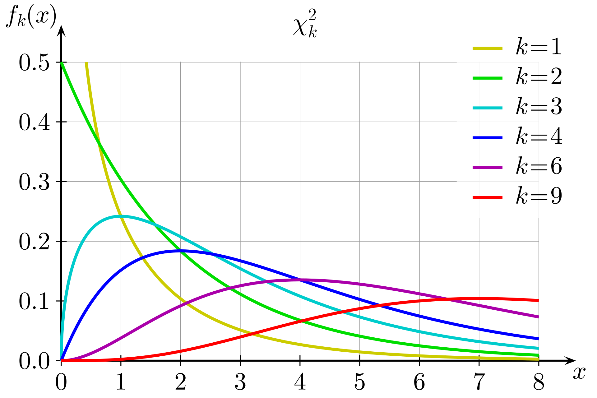

# Categorical Data Analysis


All of the methods we've discussed so far are applied to numeric data (possibly across multiple groups).  Now, we will discuss a method specific to categorical data.  

We actually sort of did this in chapters 8 and 9 with a proportion test.  A proportion test essentially tests a categorical variable with 2 categories, or levels.  If there are only 2 levels, we can recode the data as 0-1 and make use of numeric methods.

If we have a categorical variable with more than 2 levels, a proportion test will no longer work.

## Goodness-of-fit test

In general, when working with a categorical response variable, we want to check if we observe the different categories at the rates we expect.  For example, a bulk container of trail mix is advertised as having 25% peanuts, 20% M&Ms, 20% pecans, 20% almonds, and 15% raisins.

Suppose we took several scoops of trail mix and counted the contents:

| Peanuts | M&Ms | Pecans | Almonds | Raisins | Total   |
|:-------:|:----:|:------:|:-------:|:-------:|:-------:|
| 85      | 58   | 61     | 60      | 55      | 319     |

We want to check if the contents match the advertising.  If we wanteed to use a proportion test, we would have to separately check every single ingredient against its expected percentage.  85/319 versus 0.25, 58/319 versus 0.2, etc. Instead, we will develop a test to check all of the categories at once.

---

If the advertising were correct, what would we expect our sample of 319 to look like?  We would expect $0.25\times 319 = 79.75$ peanuts.  For this calculation, we ignore the observed count and multiply the total by the advertised value.  We would expect $0.25 \times 319 = 79.75$.

We can make a table of all of the *expected counts* under the assumption that the advertising is correct.

|          | Peanuts | M&Ms | Pecans | Almonds | Raisins | Total |
|:---------|:-------:|:----:|:------:|:-------:|:-------:|:-----:|
| Observed | 85      | 58   | 61     | 60      | 55      | 319   |
| Expected | 79.75   | 63.8 | 63.8   | 63.8    | 47.85   | 319   |

These expected counts add up to the same total as before.  We will compare the observed and expected counts to make a decision about our hypotheses in a chi-squared (chi pronounced "kai") goodness of fit test.  Formally, our null hypothesis is expressed in terms of a model on the population.  In this case we have, 
\begin{align*}
H_0: \;\; & \text{The true proportions match } (0.25, 0.2, 0.2, 0.2, 0.2, 0.15). \\
H_A: \;\; & \text{The true proportions do not match } (0.25, 0.2, 0.2, 0.2, 0.2, 0.15).
\end{align*}

The expected counts represent the case where $H_0$ is true.  We find evidence against $H_0$ by comparing the observed and expected counts for each category.  If the observed count is very different from the expected count, that is strong evidence against $H_0$ being true.

---

The chi-squared test statistic is called $\chi^2$, after the greek letter "chi".  It compares the squared differences between the counts for each category. We first calculate
$$\frac{(\text{Observed - Expected})^2}{\text{Expected}}$$
for each category.  For example,
$$\frac{(\text{85 - 79.75})^2}{\text{79.75}} \;=\; 0.346$$
is the contribution from the "peanuts" category.  The test statistic is computed by adding this quantity across all levels of our variable.
$$\chi^2 \;=\; \sum_{levels} \frac{(\text{Observed - Expected})^2}{\text{Expected}}$$
If the null hypothesis is true, then we expect this quantity to be small for all of the categories.

:::: {.infobox .exer data-latex=""}
Finish calculcating the chi-squared test statistic for the trail mix example.

<span style="color:#8601AF">
We take the difference (Observed - Expected) for each category, square it, then divide by Expected to standardize.  We then have to add this up for all five levels.
\begin{align*}
\chi^2_{obs} =\; & \frac{(85 - 79.75)^2}{79.75} +  \frac{(58 - 63.8)^2}{63.8} + \frac{(61 - 63.8)^2}{63.8} \\
&+ \frac{(60 - 63.8)^2}{63.8} + \frac{(55 - 47.85)^2}{47.85} \\ \\
= \; &  2.29
\end{align*}
</span>
::::

---

How do we use $\chi^2$ to gather evidence against the null?  If $H_0$ is true, then the differences between observed and expected counts should be small, and so $\chi^2$ should be a small positive number.  On the other hand, if there is a big difference between observed and expected counts, $\chi^2$ should be a large positive number.

A larger value of $\chi^2$ means we have stronger evidence against $H_0$, so we always use the positive direction when we conclude this test.  Formally, if $H_0$ is true, $\chi^2$ follows a **chi-squared** distribution.  This is a positive, continuous distribution with a long right tail.  Here is a visual from Wikipedia.



The exact shape depends on the degrees of freedom, which we need to provide.

---

Before we complete our test, we need to check that the necessary assumptions are met.  Like the proportion test, the chi-squared test is an approximate test based on the CLT.  In order for it to be accurate, we want to observe at least 5 items in each category.  This is certainly true for our data, so we are safe to use a chi-squared null distribution for our test statistic.

Let's figure out the degrees of freedom for our test.  When we were working with numeric data, the df was based on the number of observations.  In this context, it is  based on the number of *categories*.  The df is given by $\# levels - 1$.  There are 5 categories in the trail mix data, so we have 4 degrees of freedom.

The p-value for our test is the area above $\chi^2_{obs} = 2.29$ on the chi-squared curve with 4 degrees of freedom.  We can find this with the R command `pchisq`.


```r
pchisq(2.29, df = 4, lower.tail = F)
```

```
## [1] 0.6825903
```

With such a large p-value, there is no evidence that the trail mix contents are different from what is advertised.  Note that for this type of test, the p-value is always calculated by finding the area above the test statistic.  This is because larger test statistic values give us more evidence against the null.

---

:::: {.infobox .deff data-latex=""}
In general, a **chi-squared goodness of fit test** tests a single categorical variable.  The hypotheses are
\begin{align*}
H_0: \;\; & \text{The true proportions match a certain model.} \\
H_A: \;\; & \text{The true proportions do not match the model.}
\end{align*}
and the test statistic is
$$\chi^2 \;=\; \sum_{levels} \frac{(\text{Observed - Expected})^2}{\text{Expected}}.$$
The null distribution is a chi-squared distribution with $\# levels - 1$ degrees of freedom, and the p-value is the area above the test statistic on the null distribution.
::::

We can also complete this test automatically in R.  We provide the observed counts, but instead of expected counts, we provide the probabilities under the null.  The `chisq.test` command performs the test automatically.

There is a correction/adjustment that is sometimes made to the chi-squared test to correct some of the error introduced by approximation.  If we want R to match our by-hand work, we don't want to make this correction.


```r
# Observed counts
obs <- c(85, 58, 61, 60, 55)

# Keep expected counts as probabilities
exp <- c(0.25, 0.2, 0.2, 0.2, 0.15)

# Use chisq.test to perform test automatically
chisq.test(obs, p = exp, correct = FALSE)
```

```
## 
## 	Chi-squared test for given probabilities
## 
## data:  obs
## X-squared = 2.2905, df = 4, p-value = 0.6825
```


## One-sample proportion test

Let's look at another example.  Many university classes are offered to students across multiple years.  We might wonder, are freshmen and sophomores equally likely to attend lecture?  Our null hypothesis is that the population matches the model that the two groups are equally likely to attend class.
\begin{align*}
H_0: &\text{ Freshmen and sophomores are equally likely to attend.} \\
H_A: &\text{ Freshmen and sophomores are not equally likely to attend.}
\end{align*}

Let's look at the actual class attendance to see if it is consistent with $H_0$.  In a (fake!) class of 75 attendees, 39 are freshmen and 36 are sophomores.  Out of *all* of the enrolled students in class, 30.5% are freshmen and 69.5% are sophomores.

:::: {.infobox .exer data-latex=""}
Perform a chi-squared goodness of fit test on the freshmen and sophomore data, using $\alpha = 0.1$.

- What are the expected counts of freshmen and sophomores in the 75 attendees, if $H_0$ were true?

<span style="color:#8601AF">
If the null were true, then the distribution of freshmen and sophomores in class would match the overall distribution of 30.5% to 69.5%.  The expected count of freshmen is $75(0.305) = 22.875$ and the expected count of sophomores is $75(0.695) = 52.125$.
</span>

- Calculate the chi-squared test statistic.

<span style="color:#8601AF">
Here are the counts for the class attendance data.

|          | Freshmen | Sophomores | Total |
|----------|----------|------------|-------|
| Observed | 39       | 36         | 75    |
| Expected | 22.875   | 52.125     | 75    |

The chi-squared test statistic is 
$$\chi^2_{obs} \;=\; \sum_{levels}\frac{(\text{Obs } - \text{Exp})^2}{\text{Exp}} \;=\; \frac{(39-22.875)^2}{22.875} + \frac{(36-52.125)^2}{52.125} \;=\; 16.355.$$
</span>

- Identify the degrees of freedom and calculate a p-value to finish the test.

<span style="color:#8601AF">
The degrees of freedom for this test are given by the number of levels minus 1.  Since there are only two categories, we have 1 df, so we use $\chi^2_1$ as our null distribution.  Our p-value is the area above the observed test statistic of 16.355.
</span>


```r
pchisq(16.355, df = 1, lower.tail = F)
```

```
## [1] 5.251743e-05
```

<span style="color:#8601AF">
We get a very small p-value of $5.25\times 10^{-5}$, which is much smaller than $\alpha = 0.1$.  So, we reject the null hypothesis.  This data gives us evidence that freshmen and sophomores are not equally likely to attend class. 
</span>
::::

---

What if we performed this test as a proportion test?  Since there are only two categories, we can re-write our hypotheses in terms of $\pi_{Fr}$, the proportion of students who attend class who are freshmen. 

$$H_0: \pi_{Fr} = 0.305 \quad \text{versus} \quad H_A: \pi_{Fr} \neq 0.305$$

This pair of hypotheses is equivalent to the chi-squared hypotheses from before:
\begin{align*}
H_0: &\text{ Freshmen and sophomores are equally likely to attend.} \\
H_A: &\text{ Freshmen and sophomores are not equally likely to attend.}
\end{align*}

If freshmen and sophomores are equally likely to attend class, then the proportion of freshmen students in attendance must match the overall proportion of enrolled freshmen, which is 0.305. 

If the proportion of freshmen students in attendnace is different from 0.305, then that means freshmen are either more or less likely to attend class compared to sophomores.

---

The one-sample proportion Z test is covered in chapter 8.  Out of 75 students in attendance, 39 of them were freshmen, giving us an observed Z test statistic of 
$$z_{obs} \;=\; \frac{\hat{p} - \pi_0}{\sqrt{\frac{\pi_0(1-\pi_0)}{n}}} \;=\; \frac{(39/75) - 0.305}{\sqrt{\frac{0.305(1-0.305)}{75}}} \;=\; 4.044$$
The Z test statsitic is equal to the square root of the chi-squared test statistic.  $\sqrt{16.355} = 4.044$.  Now, let's calculate a two-sided Z test p-value.


```r
2*pnorm(4.044, lower.tail = F)
```

```
## [1] 5.254692e-05
```

The p-value is the same as the observed p-value for the chi-squared goodess of fit test.  Thus, the two methods are equivalent for this set of data.

:::: {.infobox .deff data-latex=""}
A chi-squared goodness of fit test with 1 degree of freedom (two levels of the categorical variable) is equivalent to a one-sample proportion Z test.  We have
$$z_{obs}^2 \;=\; \chi^2_{obs}$$
and equivalent p-values based on the corresponding null distributions.
::::

The chi-squared goodness of fit test generalizes the one-sample proportion test, since the chi-squared test can handle categorical variables with more than two levels.  If we were comparing the observed and expected counts of freshmen, sophomores, *and* juniors in attendance, we would not be able to use a proportion test.

However, the proportion test can handle one-sided alternatives.  If we had a question like "Freshmen are more likely to attend class than sophomores", we would not be able to use a chi-squared test.  The chi-squared test is inherently two-sided.

## Independence test

The goodness-of-fit test is used to analyze a single categorical variable.  There is another type of chi-squared test that can be used to test the relationship between two categorical variables.

A sample of 250 students majoring in business and a sample of 500 business executives were asked: "Should corporations become more directly involved with social issues?"  The two categorical variables are the group and the response.

If those two groups (students and executives) are independent, then the distribution of responses across the two groups should be about the same.  If we know whether someone is a student or an executive, does that change what type of answer they will give to this question?

---

|            | Yes | No  | Unsure | Total |
|:-----------|:---:|:---:|:------:|:-----:|
| Executives | 345 | 135 | 20     | 500   |
| Students   | 222 | 20  | 8      | 250   |
| Total      | 567 | 155 | 28     | 750   |


Under the null hypothesis, the variables are not related, and we assume executives and students give the same type of responses.  We can write this formally as a statement of the proportion of each answer type.
$$H_0: \pi_{E, Yes} = \pi_{S, Yes},\quad \pi_{E, No} = \pi_{S, No},\quad \pi_{E, Unsure} = \pi_{S, Unsure}$$ 
This is equivalently expressed in terms of independence.
$$H_0: \text{ the two categorical variables are independent.}$$
These two null hypotheses say exactly the same thing.  If the variables are independent, then that would mean the probability of "Yes", "No", and "Unsure" would have to be the same across both executives and students.

---

Like the previous test, the table above shows the observed counts from the people that were surveyed.  We need to calculate the expected counts under the null.  This is easiest to do by considering the expected *probability* of each specific category.

If the variables are independent, what is $P(\text{Student AND Yes})$? For independent events, we can find the probability of both happening by multiplying the individual probabilities.
$$P(\text{Student AND Yes}) \;=\; P(\text{Student})P(\text{Yes}) \;=\; \frac{250}{750}\cdot \frac{567}{750} \;=\; 0.252.$$
Under the null assumption of independence, 25.2% of the 750 respondents should fall in the "Student + Yes" category.  Thus the expected count is $0.252\times 750 = 189$.

This calculation simplifies to 
$$\text{Expected count} \;=\; P(\text{Student})P(\text{Yes})\cdot \text{Total} \;=\; \frac{250}{750}\cdot \frac{567}{750}\cdot 750 \;=\; \frac{250\times 567}{750}.$$
So, to find the expected count of a particular cell in the table, we take the row total times the column total, divided by the overall total.

:::: {.infobox .exer data-latex=""}
Finish calculating the expected counts for the survey data.

<span style="color:#8601AF">
\begin{align*}
\text{Executives, Yes } &= \frac{500 \times 567}{750} = 378 \\ \\
\text{Executives, No } &= \frac{500 \times 155}{750} = 103.33 \\ \\
\text{Executives, Unsure } &= \frac{500 \times 28}{750} = 18.67 \\ \\
\text{Students, No } &= \frac{250\times 155}{750} = 51.67 \\ \\
\text{Students, Unsure } &= \frac{250\times 28}{750} = 9.33
\end{align*}
</span>
::::

---

The table of observed and epxected counts is given below. Note that if we add up expected counts, the row and column totals all stay the same.

|            | Yes       | No           | Unsure     | Total |
|------------|:---------:|:------------:|:----------:|:-----:|
| Executives | 345 (378) | 135 (103.33) | 20 (18.67) | 500   |
| Students   | 222 (189) | 20 (51.67)   | 8 (9.33)   | 250   |
| Total      | 567       | 155          | 28         | 750   |

Our chi-squared independence test statistic is still based on the squared difference between the observed and expected counts.  Since we are working with two variables, we need to take a sum over all *cells*, or each combination of the two variables.  The test statistic is 
$$\chi^2 \;=\; \sum_{cells} \frac{(\text{Observed - Expected})^2}{\text{Expected}}.$$
In this example, we would need to add up six terms.  The observed chi-squared test statistic is
\begin{align*}
\chi^2_{obs} &= \sum_{cells} \frac{(\text{Observed counts} - \text{Expected counts})^2}{\text{Expected counts}} \\ \\ 
\chi^2_{obs} &= \frac{(345-378)^2}{378} + \frac{(135-103.33)^2}{103.33} + \cdots = 38.042
\end{align*}

The relationship between $\chi^2_{obs}$ and the null hypothesis is the same.  A larger test statistic corresponds to a bigger difference between observed and expected counts, which means we have stronger evidence against the null of independence.

---

The degrees of freedom for the chi-squared null distribution are based on the number of levels of *both* categorical variables.  It is given by $(\# columns − 1)\times(\# rows − 1)$.

We have 3 possible responses, and 2 groups of people, so the df is (3 − 1)(2 − 1) = 2.

Now, let's complete our test, with $\alpha = 0.05$.  Our p-value is the area above 38.042 on a chi-squared curve with 2 df.


```r
pchisq(38.042, df = 2, lower.tail = F)
```

```
## [1] 5.486365e-09
```

We observe a very small p-value, and so we reject $H_0$.  We have evidence that the two categorical variables are related.  In other words, business executives and students tend to answer this question differently.

---

:::: {.infobox .deff data-latex=""}
In general, a **chi-squared independence test** is used to test whether two categorical variables are related.  The hypotheses are
\begin{align*}
H_0: \;\; & \text{The two variables are independent.} \\
H_A: \;\; & \text{The two variables are related.}
\end{align*}
and the test statistic is
$$\chi^2 \;=\; \sum_{cells} \frac{(\text{Observed - Expected})^2}{\text{Expected}}.$$
The null distribution is a chi-squared distribution with $(\# columns − 1)\times(\# rows − 1)$ degrees of freedom, and the p-value is the area above the test statistic on the null distribution.
::::

---

We can also perform this type of test with R's `chisq.test`, but we need to set up our data in an object called a **matrix**.  A matrix is how R represents a two-way table such as the one we set up for executives' vs students' responses.

We put a vector of all of the numbers in the `matrix` function, then specify the dimensions with `nrow` and `ncol`.  We then specify how we want the matrix to be filled in.  In my vector, I put the three executive counts followed by the three student counts, so I want to fill the matrix in by each row.


```r
survey <- matrix(c(345, 135, 20, 222, 20, 8),
                 nrow = 2, ncol = 3, byrow = T)

survey
```

```
##      [,1] [,2] [,3]
## [1,]  345  135   20
## [2,]  222   20    8
```

Then, we can put our matrix into `chisq.test`.  We don't need to specify expected counts or probabilities, since R can calculate them from the observed values.


```r
chisq.test(survey, correct = F)
```

```
## 
## 	Pearson's Chi-squared test
## 
## data:  survey
## X-squared = 38.041, df = 2, p-value = 5.488e-09
```


## Two-sample proportion test

The chi-squared goodness of fit test is related to the one-sample proportion Z test.  Similarly, the chi-squared independence test is related to the two-sample proportion Z test. 

Recall the sex versus handedness example we studied in notes 9.  Several male and female participants were asked to indicate their dominant hand.  We can organize the results in a two-way table:

| Sex    | Left | Right | Total |
|:------:|:----:|:-----:|:-----:|
| Female | 12   | 9     | 21    |
| Male   | 23   | 31    | 54    |
| Total  | 35   | 40    | 75    |

Our research question was, "does handedness differ according to sex", or "do females and males show the same proportion of left-handedness"?  We saw an observed Z test statistic of 1.134 and a p-value of 0.257.

---

Our hypotheses for the two-sample proportion test were
$$H_0: \pi_{FL} - \pi_{ML} = 0\quad\quad\text{versus}\quad\quad H_A: \pi_{FL} - \pi_{ML} \neq 0$$ 
But we can equivalently express the hypotheses in terms of independence between sex and handedness.
\begin{align*}
H_0: & \text{ Sex and handedness are independent.} \\
H_A: & \text{ Sex and handedness are related.}
\end{align*}

If sex and handedness are independent, then knowing a person's sex tells us nothing about their probability of being left handed (and vice versa).  So, independence implies $\pi_{FL} - \pi_{ML} = 0$.

On the other hand, if sex and handedness are related, then that means the probability of being left-handed must be different for males and females.  This implies $\pi_{FL} - \pi_{ML} \neq 0$.

Thus, the two pairs of hypotheses are equivalent.  The second pair implies a chi-squared independence test should be used.

---

The expected counts under the null are found based on the totals.  There are 75 total participants, with 35 left-handed participants and 21 female participants.  So, the expected number of female left-handed participants under the null is
$$\frac{35\times 21}{75} \;=\; 9.8.$$

:::: {.infobox .exer data-latex=""}
The full table of observed and expected counts is

| Sex    | Left      | Right     | Total |
|:------:|:---------:|:---------:|:-----:|
| Female | 12 (9.8)  | 9 (11.2)  | 21    |
| Male   | 23 (25.2) | 31 (28.8) | 54    |
| Total  | 35        | 40        | 75    |

- Complete the $\chi^2$ independence test with $\alpha = 0.05$.

<span style="color:#8601AF">
The observed chi-squared test statistic is  \begin{align*}
\chi^2_{obs} &= \sum_{cells}\frac{(\text{Observed - Expected})^2}{\text{Expected}} \\
&= \frac{(12-9.8)^2}{9.8} + \frac{(9-11.2)^2}{11.2} + \frac{(23-25.2)^2}{25.2} + \frac{(31 - 28.8)^2}{28.8} \\
&= 1.286
\end{align*}
The degrees of freedom are $(\# columns − 1)\times(\# rows − 1) = (2-1)(2-1) = 1$ and the p-value is 0.257.  With a large p-value, we fail to reject the null.  We have no evidence that sex and handedness are related.
</span>


```r
pchisq(1.286, df = 1, lower.tail = F)
```

```
## [1] 0.2567864
```


- Compare the results to $z_{obs} = 1.134$ and the Z test p-value 0.257.

<span style="color:#8601AF">
The observed chi-squared test statistic is the square of the observed Z test statistic.  $1.134^2 = 1.286$.  Both tests returned a p-value of 0.257, which means they give the same evidence against the null.  The two tests are equivalent.
</span>

::::

:::: {.infobox .deff data-latex=""}
A chi-squared independence test with 1 degree of freedom (a $2\times 2$ table) is equivalent to a two-sample proportion Z test.  We have
$$z_{obs}^2 \;=\; \chi^2_{obs}$$
and equivalent p-values based on the corresponding null distributions.
::::

---

The mathematical reason for the two tests being equivalent is the fact that the square of a standard normal RV is a chi-squared RV with 1 degree of freedom.  So
$$Z^2 \;=\; \chi^2_1.$$
Under the null hypothesis, 1.134 is a realization of the standard normal, and $1.134^2 = 1.286$ is a realization of the chi-squared with 1 degree of freedom.

The chi-squared test is more general, because it can handle categorical variables with more than two levels, such as the executives versus students example.  But the Z proportion test can handle one-sided alternatives, while the chi-squared cannot.


